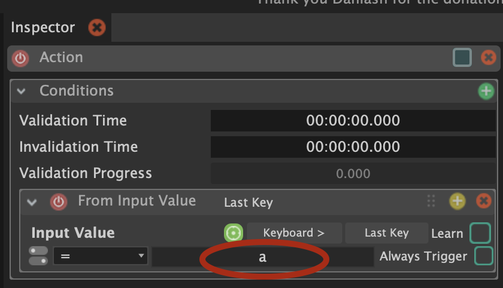
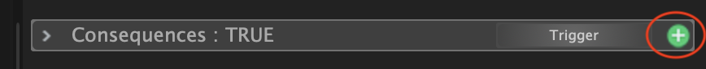
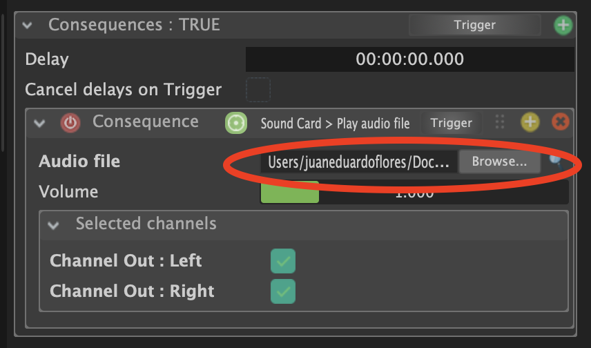
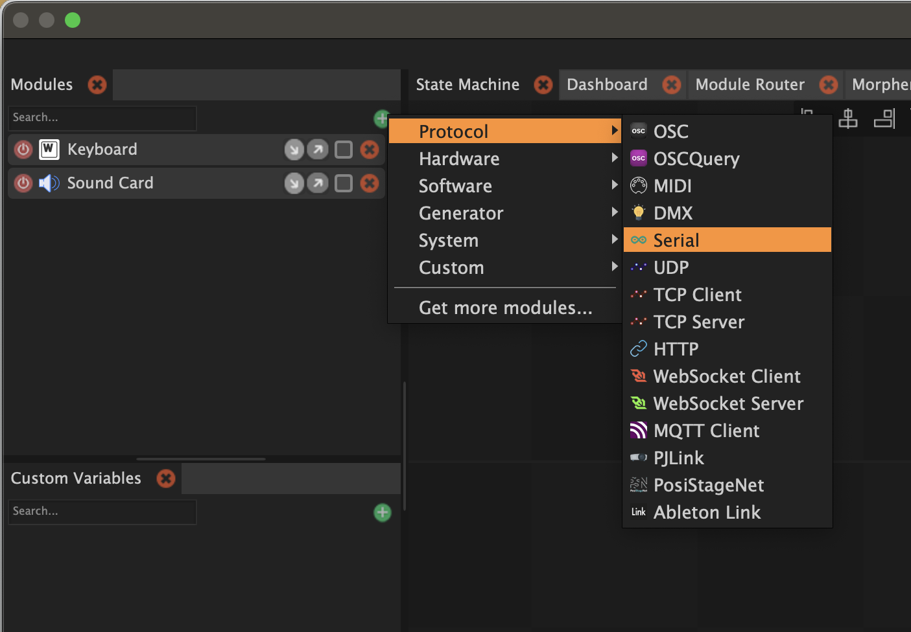
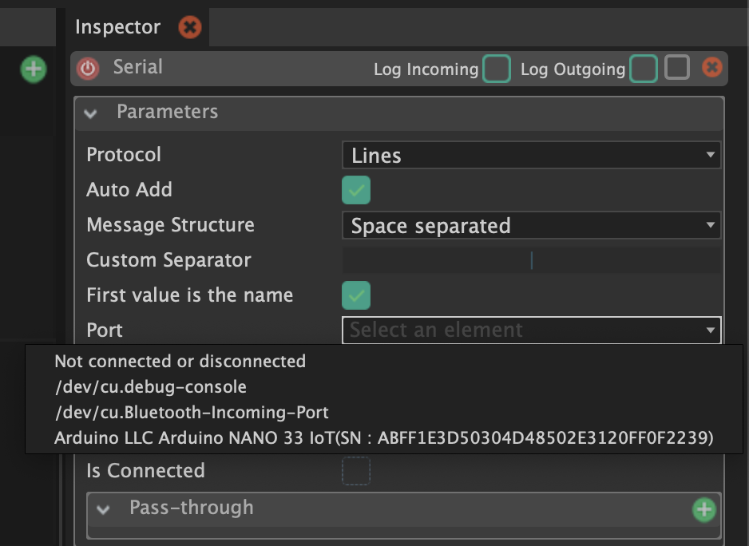
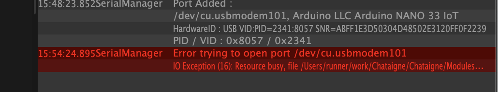
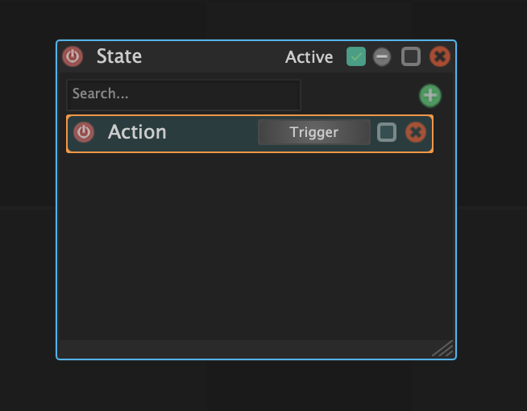
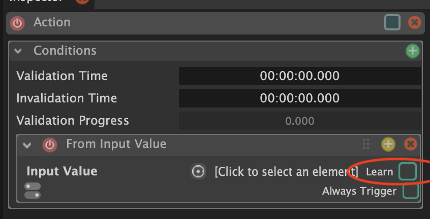

# Chataigne

## Intro

Philsophy statement from the website:

> Chataigne is a free, open-source software made with one goal in mind : create a common tool for artists, technicians and developers who wish to use technology and synchronize software for shows, interactive installations or prototyping.
It aims to be as simple as possible for basic interactions, but can be easily extended to create complex interactions.

<div class="uk-margin" style="padding: 30px; width: 100%;">
<ul class="uk-child-width-1-3@m uk-child-width-1-4@l uk-child-width-1-2@s uk-grid-small uk-grid-match" uk-grid="masonry: pack">

<li style="width: 50%; margin: auto; padding-left: 0;">
<div>
<a href="https://benjamin.kuperberg.fr/chataigne/en">
<div class="uk-card-small uk-card-default uk-card-body uk-box-shadow-xlarge" style="background: #E6A749">
<div class="uk-card-small uk-card-default uk-card-body uk-box-shadow-xlarge">
<h4>Chataigne Website</h4>
<div style="display: inline">

<span class="uk-label" style="background-color: #E6A749">Website</span>
</div>
</div>
</a>
</div>
</li>

</ul>
</div>

### Getting Started Tutorial

After installing the software, and upon opening it for the first time, you should be greeted with a little tutorial. It will walk you through on how to play an audio file using a keyboard stroke. Go ahead and follow it.

In the inspector window, you can specify a key that will trigger a **consequence**.

The keypress is our input (That Chataigne is listening for), and our **consequence** is our programmed result of that interaction.



Right below this, is the consequence section.

As the tutorial shows, you can add a consequence by pressing on the "+" button.



Select:

**+** > **Sound Card** > **Play Audio File**

Now select the audio file you want to play:



---

If you can successfully play an audio file with your selected key, then we can move on to using an arduino digital input.

### Serial Module

Add another module called "Serial":



### Minimal Arduino Sketch

Upload this sketch to your Arduino:

```arduino
int digitalSensor;

void setup() {
  pinMode(2, INPUT);
  Serial.begin(115200);
}

void loop() {
  digitalSensor = digitalRead(2);
  Serial.print("A ");
  Serial.println(digitalSensor, DEC);
  delay(10);
}
```

After it is finished, quit Arduino and go back to Chataigne.

With the module selected, find the port drop down menu in the inspector window:



Select the port that your Arduino is connected to.

<blockquote class="info">
<span class="uk-label">Note</span>
<p>Only one app can be connected to Arduino port at a time, which is why it is important to make sure Arduino is closed.</p>
<p>If you don't, you might see this error message:</p>


</blockquote>

Click the action state again:



And navigate to the inspector window:



