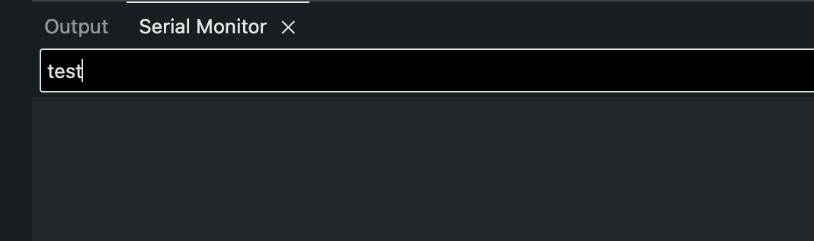
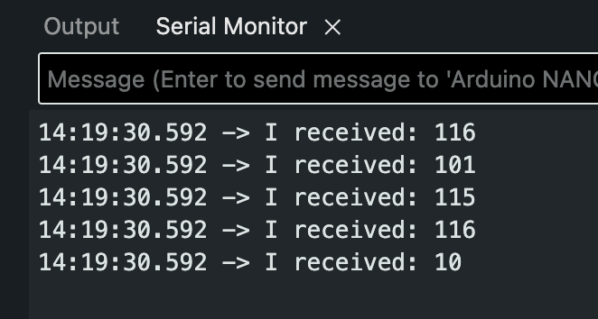

# Keyboard

testdfe

## Intro

First of all, keep in mind the official Arduino Documenation for a more complete reference:

<div class="uk-margin" style="padding: 30px; width: 100%;">
<ul class="uk-child-width-1-3@m uk-child-width-1-4@l uk-child-width-1-2@s uk-grid-small uk-grid-match" uk-grid="masonry: pack">

<li style="width: 50%; margin: auto; padding-left: 0;">
<div class="uk-transition-toggle">
<a href="https://docs.arduino.cc/language-reference/en/functions/usb/Keyboard/">
<div class="uk-card-small uk-card-default uk-card-body uk-box-shadow-xlarge  uk-transition-scale-up" style="background: #7fcbcd; opacity: 100;">
<div class="uk-card-small uk-card-default uk-card-body uk-box-shadow-xlarge">
<h4>Keyboard</h4>
<div style="display: inline">

<span class="uk-label" style="background-color: #7fcbcd">Docs</span>
</div>
</div>
</div>
</a>
</div>
</li>

</ul>
</div>

Let's locate one of the built-in examples.

Go to:

**File** > **Examples** > **09.USB** > **Keyboard** > **KeyboardSerial**

```arduino
#include "Keyboard.h"

void setup() {
  // open the serial port:
  Serial.begin(9600);
  // initialize control over the keyboard:
  Keyboard.begin();
}

void loop() {
  // check for incoming serial data:
  if (Serial.available() > 0) {
    // read incoming serial data:
    char inChar = Serial.read();
    // Type the next ASCII value from what you received:
    Keyboard.write(inChar + 1);
  }
}
```

---

## KeyboarSerial Code Breakdown

### The Keyboard Library

Notice the line:

```arduino
#include "Keyboard.h"
```

This means we are using the `Keyboard` library. If not installed, locate it using the library manager.


---

### Initializing Keyboard Control

The function `Keyboard.begin()` is inside setup() to start the process.

```arduino
void setup() {
  // initialize control over the keyboard:
  Keyboard.begin();
}
```

### Read Incoming Serial Data

`Serial.available()` is a function used to know when a message has been received and stored.

When you write a message in this text box and press enter, arduino receives it and stores it into its memory until Serial.read() is used.



Serial.available() simply returns the number of bytes of that stored data.

---

Using the example from the arduino documentation of `Serial.available()`,

```arduino
void loop() {
  // reply only when you receive data:
  if (Serial.available() > 0) {
    // read the incoming byte:
    int incomingByte = Serial.read();

    // say what you got:
    Serial.print("I received: ");
    Serial.println(incomingByte, DEC);
  }
}
```

Sending a message of "test" and pressing enter results in the incoming Byte data returning:



This makes sense because the data is being printed using `Serial.println()` using a base10 format, which means it is returning the ascii code associated with each letter.

Using a text to ASCII code converter shows the same result where: 

- t: `116`
- e: `101`
- s: `115`
- t: `116`
- (new line): `10`

<blockquote class="info">
<span class="uk-label">Note</span>
<p>In Arduino programming,
**DEC** is a pre-defined constant used to specify that a value should be treated or displayed in the decimal (base 10) format.</p>
<p>It is used in the second parameter of `Serial.println()`</p>
```arduino
Serial.println(val, format)
```

<p>It is DEC by default.</p>
</blockquote>

---

Now that we know about ASCII codes and how a minimal program that reads incoming serial data works, we can understand the last part of the `KeyboardSerial.ino` example.

### Keyboard write()

The `Keyboard.write()` function sends a keystroke to your computer as if a user has physically pressed a keyboard key.

It expects either a letter (**char** data type):

```arduino
Keyboard.write('A');
```

Or an ascii code (**int** data type):

```arduino
Keyboard.write(65);
```

<blockquote class="info">
<span class="uk-label">Note</span>
<p>65 is the ASCII code for `A`.</p>
<p>Check out a table with each character with its corresponding ASCII code.</p>
<a>Ascii-Code.com</a>

</blockquote>

<blockquote class="warning">
<span class="uk-label uk-label-warning">Warning</span>
<p>A value that has single quotes `''` is known as a char data type.</p>
<p>Check out the Arduino Documentation:
<a href="https://docs.arduino.cc/language-reference/en/variables/data-types/char/">Char</a>
</p>
</blockquote>


---


```arduino
    // read incoming serial data:
    char inChar = Serial.read();
    // Type the next ASCII value from what you received:
    Keyboard.write(inChar + 1);
```

<blockquote class="info">
<span class="uk-label">Note</span>

<p>It may be confusing, but 1 is being added to a char data type. Since a char has an ASCII representation, you can perform arithmetic.</p>
<p>From the Char Arduino Documentation:</p>
<blockquote>
This means that it is possible to do arithmetic on characters, in which the ASCII value of the character is used (e.g. A + 1 has the value 66, since the ASCII value of the capital letter A is 65). 
</blockquote>
</blockquote>

In theory, sending a serial message to Arduino in the form of a letter, will result in Arduino simulating the key press of the letter that is one value higher of the one received (in the ASCII table). For example: Typing `A` and pressing enter will result in Arduino simlulating the keypress of `B`.

---

Try it! Type in the Serial Monitor and see it be replaced with a B when you press enter.

## Simulate Key Press with a Button

We can modify the code to simulate a key press when receiving a `HIGH` state of a digitalInput (button/switch).

```arduino
#include "Keyboard.h"

void setup() {
  // open the serial port:
  Serial.begin(9600);
  // initialize control over the keyboard:
  Keyboard.begin();
}

void loop() {
  int buttonState = digitalRead(2);
  if (buttonState == HIGH) {
    Keyboard.write('A');
  }
  delay(10);
}
```

<blockquote class="warning">
<span class="uk-label uk-label-warning">Warning</span>
<p>Be careful with this library!</p>
<p>If you have the Arduino looping very quickly (without delay it can be 100s of thousands of times per second!), then it can potentially hijack your computer until you disconnect the USB.</p>
<p>This can easily lead to unwanted things with a range in severity. :(</p>

<p>The delay(10) is used for a little protection.</p>
</blockquote>

---

## Using Special Keys and Keyboard Modifiers (Shift, Ctrl, etc)

Check out the Arduino documentation for this: <a href="https://docs.arduino.cc/language-reference/en/functions/usb/Keyboard/keyboardModifiers/">Keyboard Modifiers and Special Keys</a>

What if you wanted to control a game that uses special keys or modifiers?

Here I will use the classic Google Dino Run as an example to be played with an Arduino: (<a href="https://trex-runner.com/">Link to Dinosaur T-Rex Game</a>)


---

According to the description, the up arrow key is used to jump, and the down arrow key is used to crouch.

In the Arduino Documentation, it tells us that we can use the const `KEY_UP_ARROW` and `KEY_DOWN_ARROW` for these keys.

I modified to code to include one more button:

```arduino
#include "Keyboard.h"

void setup() {
  // open the serial port:
  Serial.begin(9600);
  // initialize control over the keyboard:
  Keyboard.begin();
}

void loop() {
  int upbuttonState = digitalRead(2);
  int downbuttonState = digitalRead(3);

  if (upbuttonState == 1) {
    Keyboard.write(KEY_UP_ARROW);
  }
  if (downbuttonState == 1) {
    Keyboard.write(KEY_DOWN_ARROW);
  }

  delay(10);
}
```
