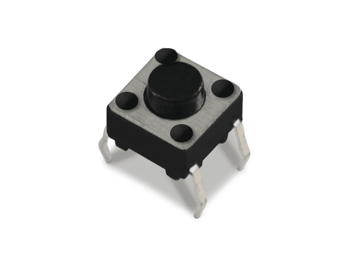
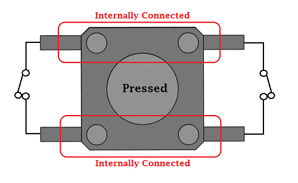
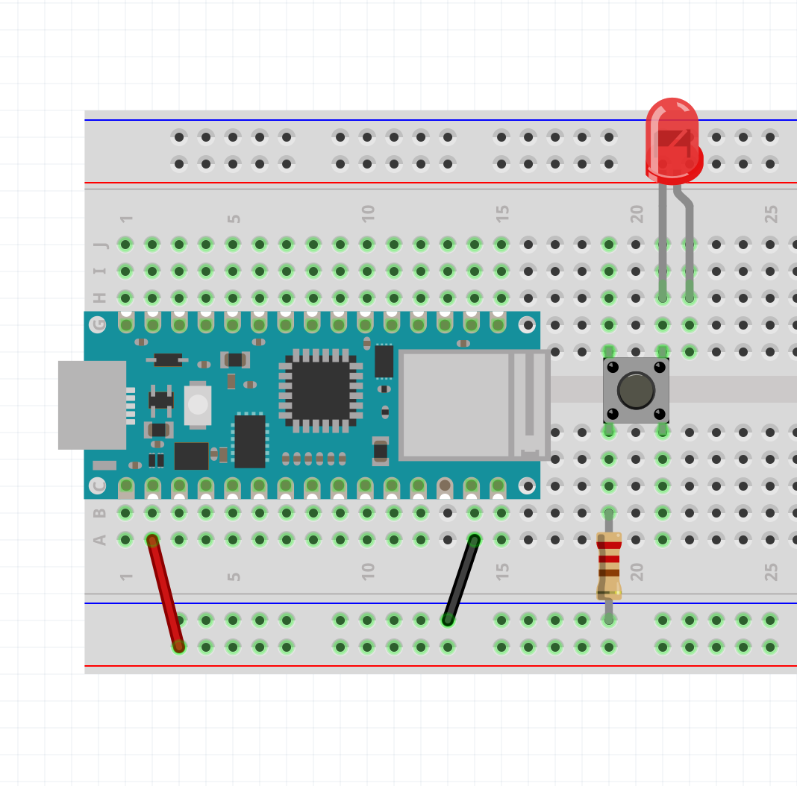
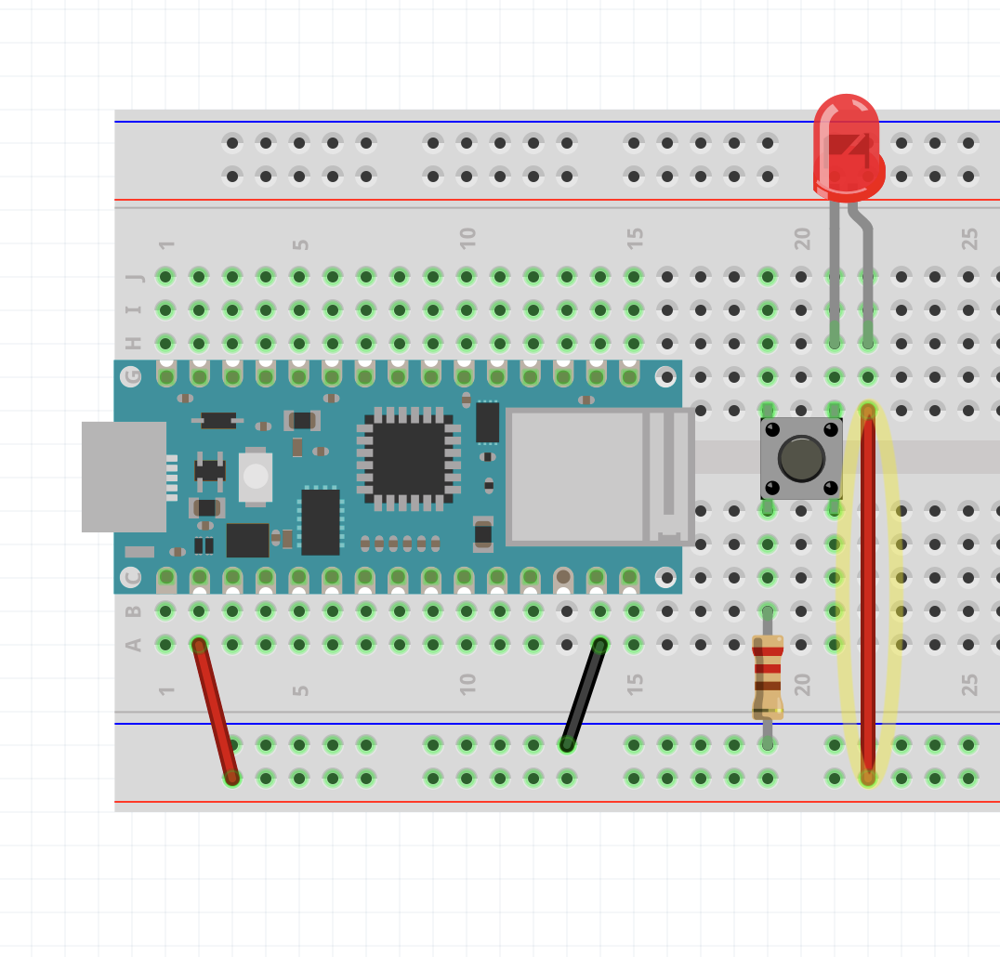
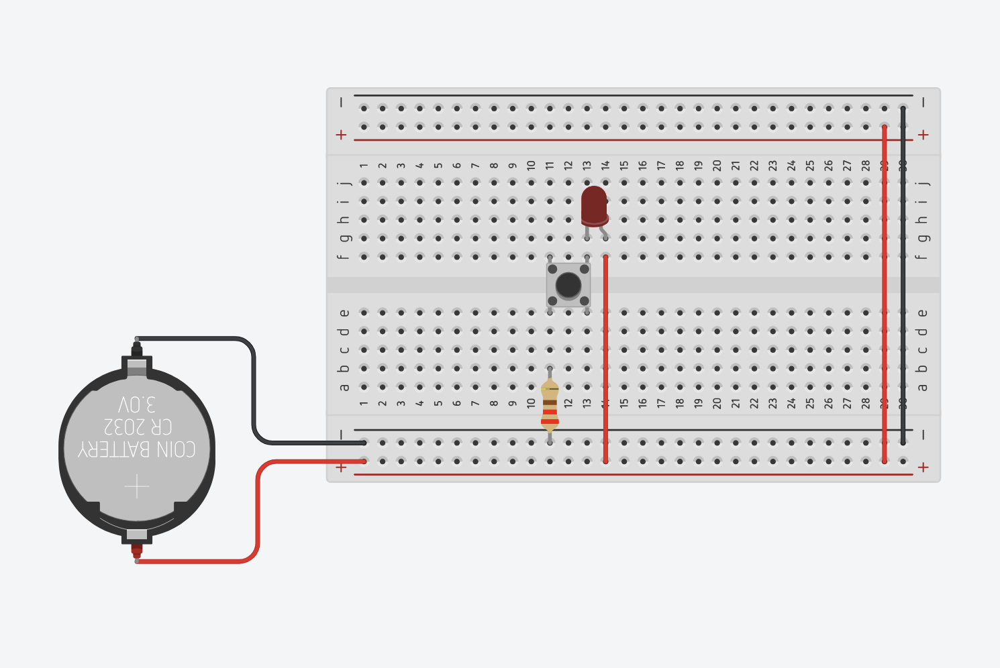
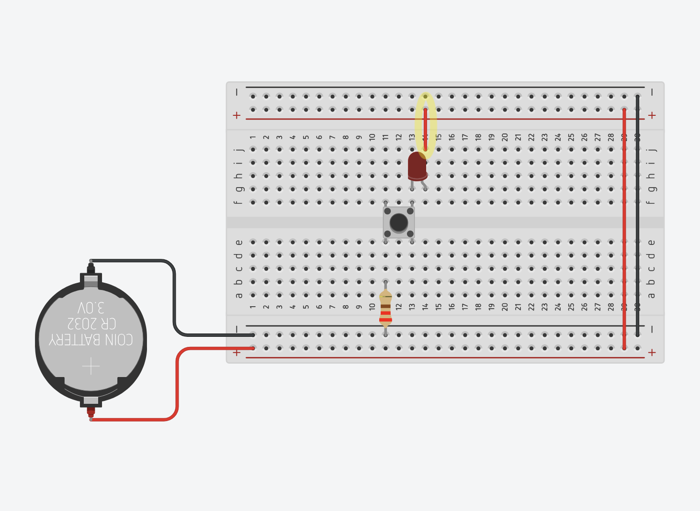

# Button

## How does a button work?

The button is just a simple way of completing or breaking a circuit with the simple act of "pushing" or "pressing" a button.

You could just manually join or unjoin two bare wires together to do this, but a button makes this convenient.

Often electronics kits come with a cheap button that looks like this:

</img>

But it can take many forms and sizes.

</img>

Generally, the pinout looks something like this:

</img>

Here is a screenshot in Fritzing to show that the pins in red are connected whether the button is pressed or not. Same with the blue pins.

</img>

---

## Circuit Demonstration

Let's do a circuit that turns an LED on when we press the button without any programming.

</img>

First I connect the button so that it crosses over the middle of the breadboard. It might be easier to think of this middle line as a river, and the button as a bridge. Also notice that if you were to squish the button like a bug, the legs spread out to resemble more like a bridge.

Next I placed an LED on one side of the button, with one leg (the cathode) connected to the right side of the bridge.

On the left side of the bridge I placed the current limiting resistor for the LED. This is connected to ground.

</img>

The last step would be to connect the positive rail to the **anode**.

Pressing the button should now light up the LED. This is because when you press the button, you are **completing the circuit**. When you release, you are **breaking** the circuit.

</img>

By the way, because we have power going through each side of the power rails, an alternative way of wiring this is like this:

</img>

Do you see why this completes the circuit?

---

## The Button Sketch

Go to:

**File** > **Examples** > **02.Digital** > **Button**

This is `Button.ino`.

Of course we should always look at the link provided in the block comment:

[https://www.arduino.cc/en/Tutorial/BuiltInExamples/Button](https://www.arduino.cc/en/Tutorial/BuiltInExamples/Button)

</img>

It is using the UNO, but the wiring is pretty much the same.

We are connecting one side of the switch to (+) (In our case, 3.3V).

</img>

And the other side to a 10k Ohm Resistor.

<blockquote class="warning">
Warning

The images show a resistor with color bands of a 220 ohm resistor, but it should be 10k.

</blockquote>

</img>

</img>

This other side of the button is ALSO connected to digital pin 2.

</img>

Lastly, the other side of the resistor is connected to **Ground**.

</img>

Pressing the button should turn on the built-in LED. You can confirm this by connecting an LED to pin 13 like how we did in the Blink example.

---

## In TinkerCAD

In TinkerCAD, it comes with some premade circuits with the Arduino Code.

You can find it in the dropbar menu on the right hand side:

</img>

This is the Button example:

</img>

Redrawn to fit in a breadboard like we did with the Nano:

</img>

To find the code editor:

</img>

The first thing you will see is a block code editor similar to the [Scratch Programming Language](https://scratch.mit.edu/).

</img>

To go to the text version of the code, like what we would see in the Arduino IDE. Select "Text" from this dropbar menu:

</img>

You can enter the **Button** example here: 

</img>

And click "Start Simulation" to see if it works.

