# Button

## The Button Sketch

Go to:

**File** > **Examples** > **02.Digital** > **Button**

This is `Button.ino`.

Take a look at the block comment, the grayed out text at the top of the sketch:

```arduino
/*
  Button

  Turns on and off a light emitting diode(LED) connected to digital pin 13,
  when pressing a pushbutton attached to pin 2.

  The circuit:
  - LED attached from pin 13 to ground through 220 ohm resistor
  - pushbutton attached to pin 2 from +5V
  - 10K resistor attached to pin 2 from ground

  - Note: on most Arduinos there is already an LED on the board
    attached to pin 13.

  created 2005
  by DojoDave <http://www.0j0.org>
  modified 30 Aug 2011
  by Tom Igoe

  This example code is in the public domain.

  https://docs.arduino.cc/built-in-examples/digital/Button/
*/
```

It describes what the sketch does. It will turn on the built-in LED when a button (connected to pin 2) is pressed.

Notice also that there is a link at the bottom of it that leads to the arduino documentation:

```bash
https://docs.arduino.cc/built-in-examples/digital/Button/
```

<p><a href="https://www.arduino.cc/en/Tutorial/BuiltInExamples/Button">Arduino Button Sketch: Official Arduino Documentation</a></p>

---

They graciously provide a nice wiring diagram and schematic that shows how a button is connected to pin 2.

<div>
</img>
</div>

Their example uses the popular Arduino Uno, but the wiring for the nano is the same. You just need to reference the pinout sheet.

<blockquote class="info">
<span class="uk-label">Note</span>
<p>
Reminder that the pinout sheet can be found on the Arduino tab of this website!
</p>
<p>Here is the link: <a target="_blank" href="https://docs.arduino.cc/resources/pinouts/ABX00027-full-pinout.pdf">pinout sheet</a></p>
</blockquote>

We are connecting one side of the switch to (+) (In our case, 3.3V).

<div>
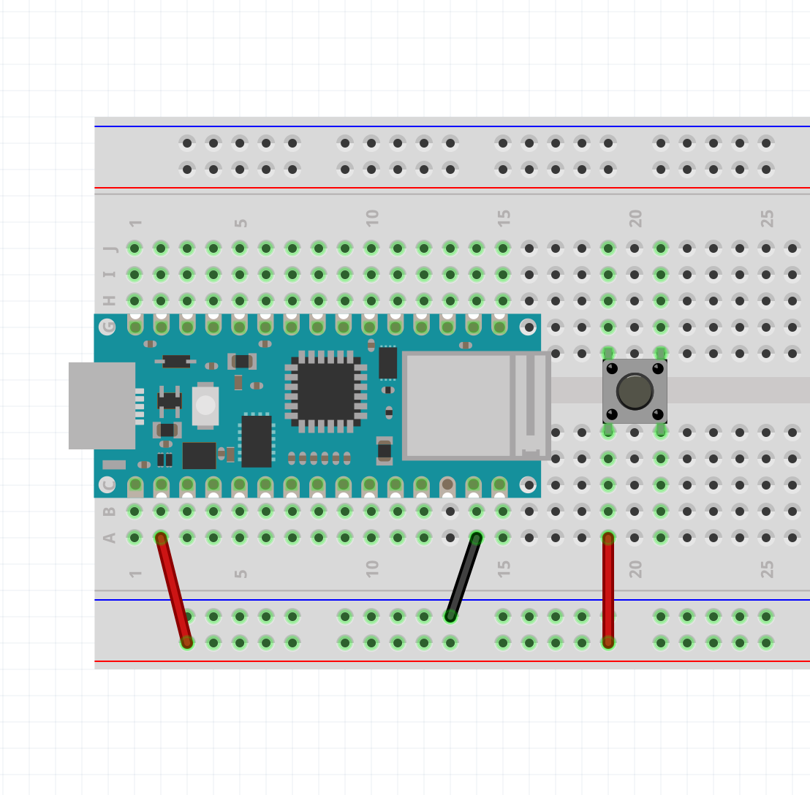</img>
</div>

And the other side to a 10k ohm Resistor.

<blockquote class="warning">
<span class="uk-label uk-label-warning">Warning</span>
<p>The following images show a resistor with color bands of a 220 ohm resistor, but it should be 10k.</p>
</blockquote>

<div>
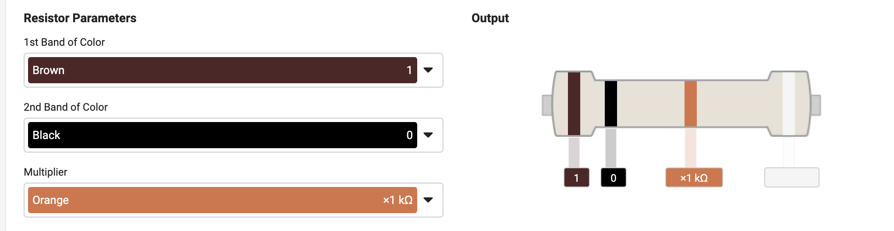</img>
</div>

<div>
</img>
</div>

This other side of the button is ALSO connected to digital pin 2.

<div>
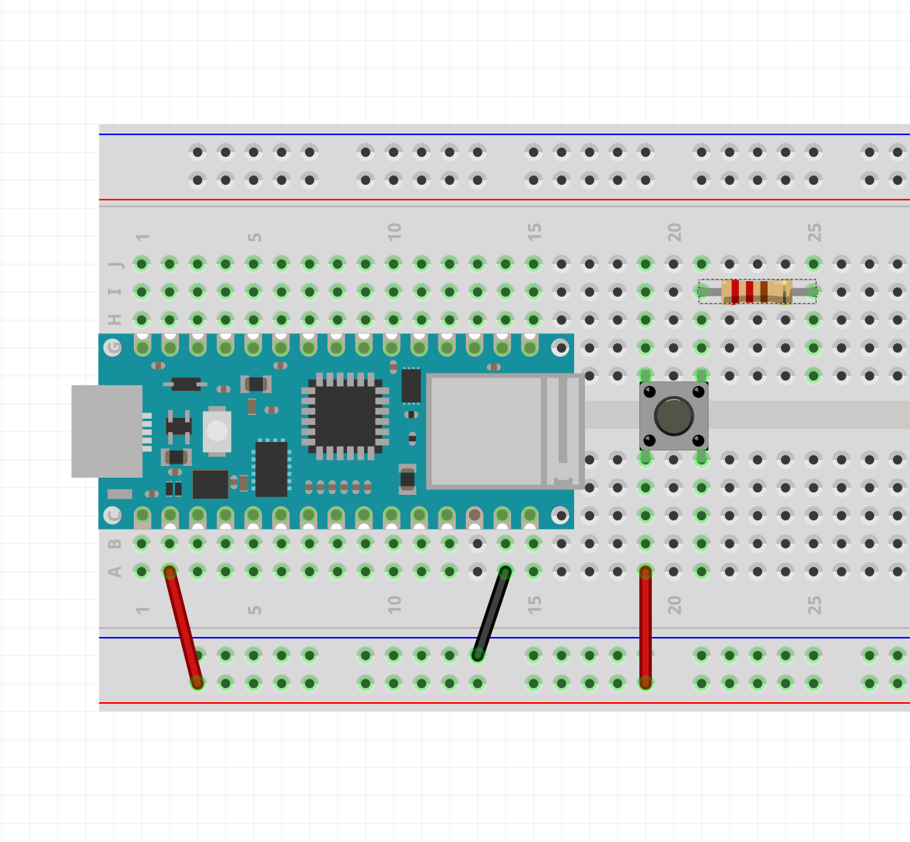</img>
</div>

Lastly, the other side of the resistor is connected to **Ground**.

<div>
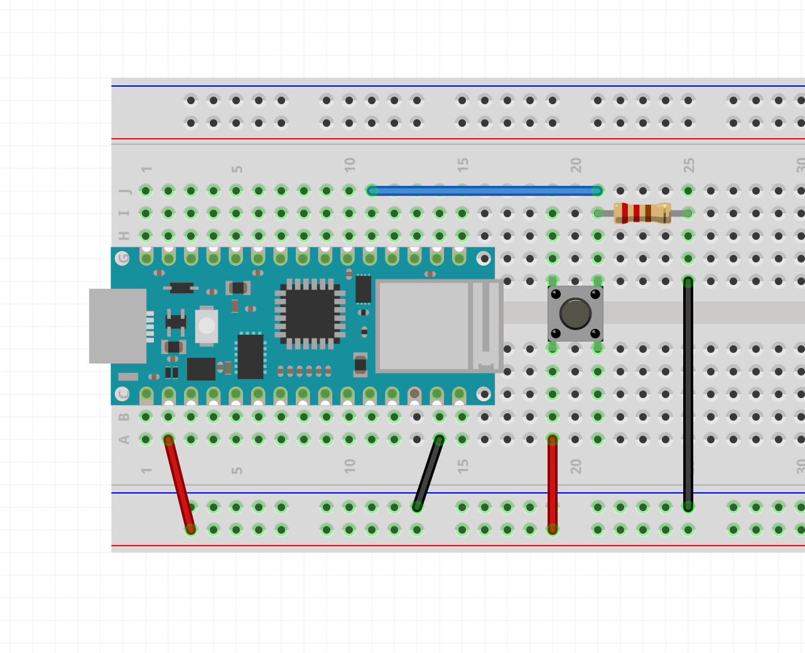</img>
</div>

Pressing the button should turn on the built-in LED. You can confirm this by connecting an LED to pin 13 like how we did in the _Blink_ example. The LED will only be on so long as the button is PRESSED.

### Pull-Down Resistor

So why is there a 10k resistor in the wiring diagram? This is called a **pull-down resistor**. It won't make complete sense now, but the resistor is "pulling down" the input to a steady state of LOW or 0V. Without it, the input is unreliable.

Again, [makeabilitylab](https://makeabilitylab.github.io/physcomp/arduino/buttons.html) does a good explanation of this and **pull-up** resistors.

### In TinkerCAD

In TinkerCAD, it comes with some premade circuits with the Arduino Code.

You can find it in the dropbar menu on the right hand side:

<div>
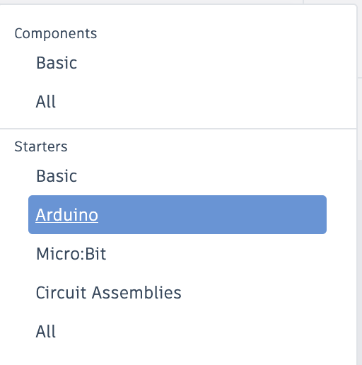</img>
</div>

This is the Button example:

<div>
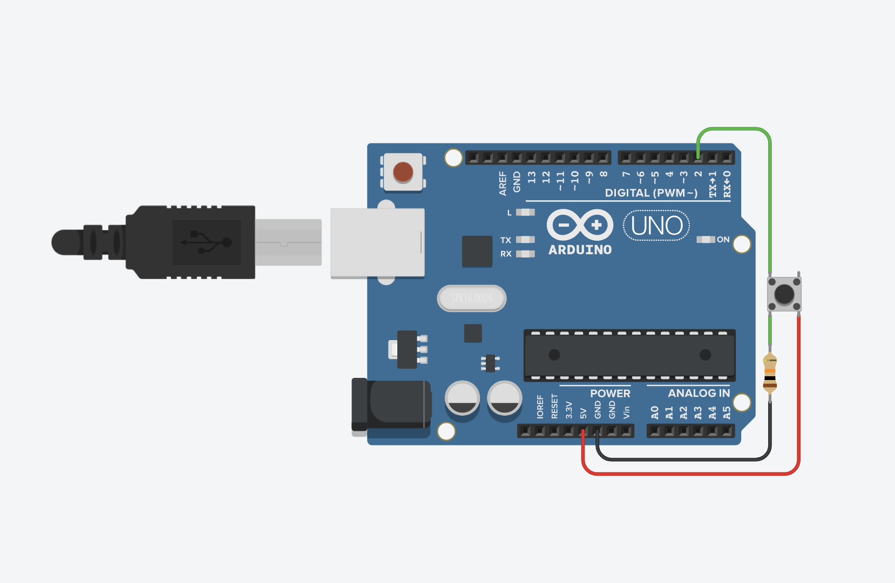</img>
</div>

Redrawn to fit in a breadboard like we did with the Nano:

<div>
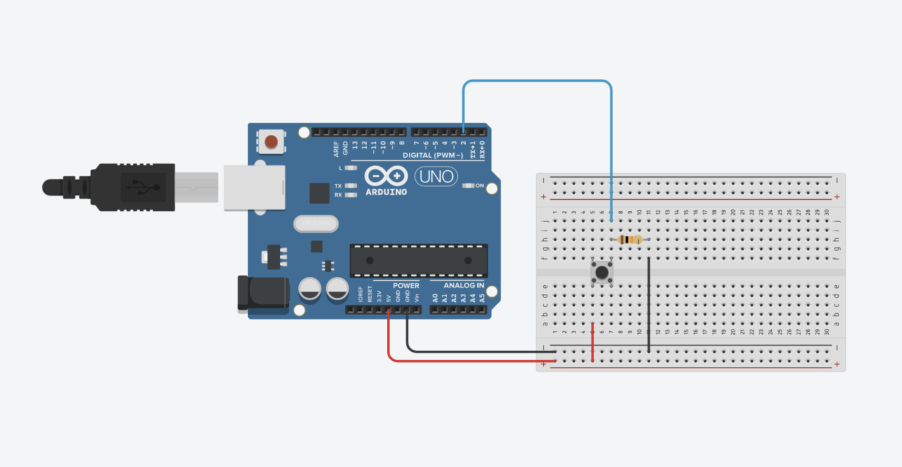</img>
</div>

To find the code editor:

<div>
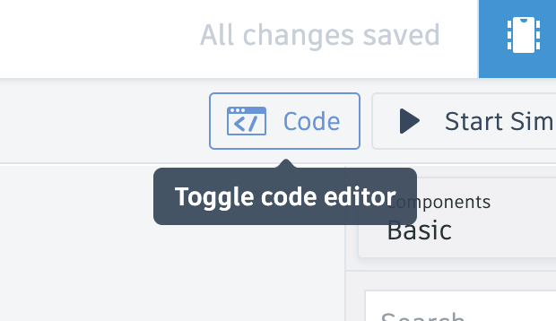</img>
</div>

The first thing you will see is a block code editor similar to the [Scratch Programming Language](https://scratch.mit.edu/).

<div>
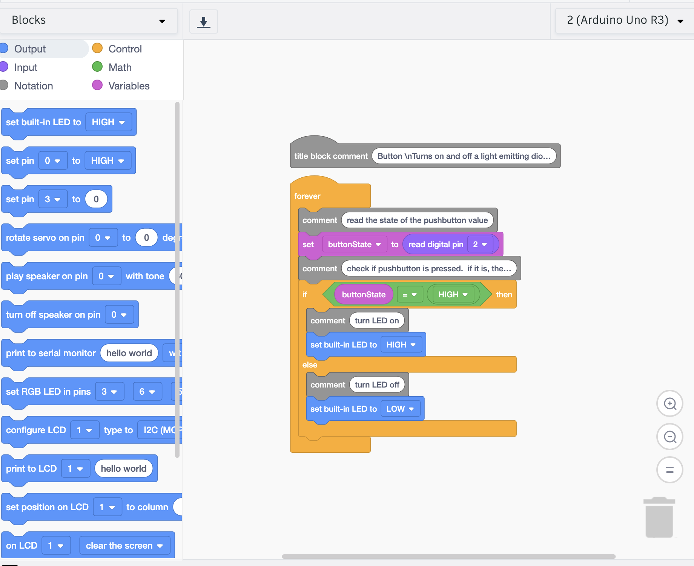</img>
</div>

To go to the text version of the code, like what we would see in the Arduino IDE. Select "Text" from this dropbar menu:

<div>
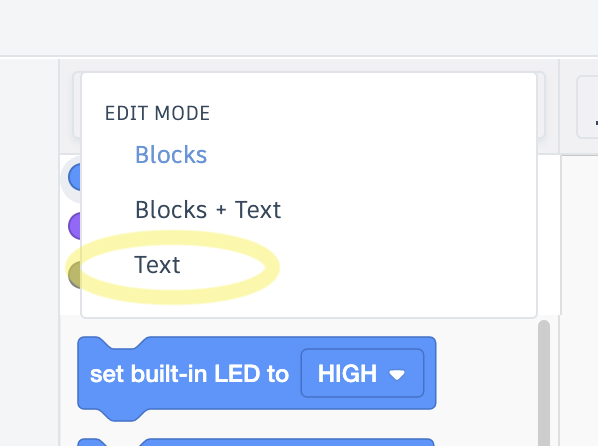</img>
</div>

You can enter the **Button** example here: 

<div>
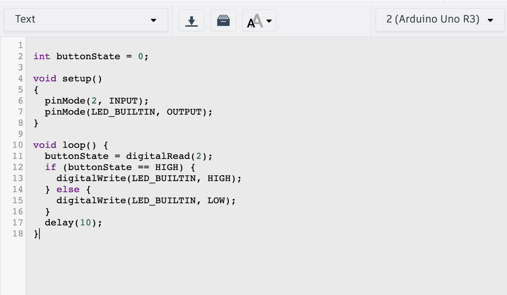</img>
</div>

And click "Start Simulation" to see if it works by pushing the button.

### Sketch Breakdown

#### Constants

In this sketch we have two statements that introduce a new keyword called `const`.

```c
const int buttonPin = 2;  // the number of the pushbutton pin
const int ledPin = 13;    // the number of the LED pin
```

`const int buttonPin` means that `buttonPin` will remain **constant** and it is of type `int`. It is not a variable because in no moment will it change in the duration of the program running. It is a **constant**, not a variable.

The advantage of doing this is for readability and the way the board handles it is different. The IDE will also throw out an error if you try to change `buttonPin`, for example.

Next, we have an actual variable called `buttonState` that will hold the value of the button state (Is it pressed or not? `HIGH` or `LOW`?).

#### setup()

In the `setup()` function, everything should be straightforward. `ledPin` (_13_) is configured as an `OUTPUT`, and `buttonPin` (_2_) is configured as an `INPUT`.

```c
void setup() {
    // initialize the LED pin as an output:
    pinMode(ledPin, OUTPUT);
    // initialize the pushbutton pin as an input:
    pinMode(buttonPin, INPUT);
}
```

#### loop()

The first thing we do in the `loop()`, is to read the state of the push button by using the function `digitalRead()`.

##### digitalRead()

```c
// read the state of the pushbutton value:
buttonState = digitalRead(buttonPin);
```

`digitalRead()` only takes one parameter, the pin number that is being used as an input.

#### if statements, conditional statements

The remaining part of the `loop()` introduces something called a **conditional statement**.

```c
if (buttonState == HIGH) {
    // turn LED on:
    digitalWrite(ledPin, HIGH);
} else {
    // turn LED off:
    digitalWrite(ledPin, LOW);
}
```

This block of code translated to english is this:

**If** <span style="color: blue;">button is pressed</span> (buttonState is `HIGH`), _then_ <span style="color: blue">turn the led on</span> (`HIGH`),

**else** <span style="color: blue;">if it is NOT pressed</span> (buttonState is NOT `HIGH`), _then_ <span style="color: blue;">turn the led off</span> (`LOW`)

**If** the condition in the parentheses is TRUE, then it does everything inside the following curly brackets. **else** is the exception case. If it is not TRUE, then it must be FALSE, and everything in the last curly brackets is done.

This is the condition that is checked:
```
buttonState == HIGH
```

The double equals sign (`==`) means `equals to`. If buttonState `equals to` HIGH, then... do this -> { }

This is different from the single equal sign (`=`) that is used to assign a variable a value. A single `=` does not mean `equals to`, it means `is assigned the value of..`.

We will explore **if statements** more in the next exercise: [Dice Roller Challenge](../dice_roller/dice_roller.html)

<ul uk-accordion style='pading-bottom: 5vh'> <li class='uk-open'>
<a id='code-file' class='uk-accordion-title' href='#'>Button (Full Sketch)</a>
<div class='uk-accordion-content' style='padding-bottom:20px; margin-bottom:20px'>

```c
// constants won't change. They're used here to set pin numbers:
const int buttonPin = 2;  // the number of the pushbutton pin
const int ledPin = 13;    // the number of the LED pin

// variables will change:
int buttonState = 0;  // variable for reading the pushbutton status

void setup() {
    // initialize the LED pin as an output:
    pinMode(ledPin, OUTPUT);
    // initialize the pushbutton pin as an input:
    pinMode(buttonPin, INPUT);
}

void loop() {
    // read the state of the pushbutton value:
    buttonState = digitalRead(buttonPin);

    // check if the pushbutton is pressed. If it is, the buttonState is HIGH:
    if (buttonState == HIGH) {
        // turn LED on:
        digitalWrite(ledPin, HIGH);
    } else {
        // turn LED off:
        digitalWrite(ledPin, LOW);
    }
}
```

</div>

---

## Misc. Switches

There are other types of switches that are worth mentioning.

### Tilt Switch

<div>
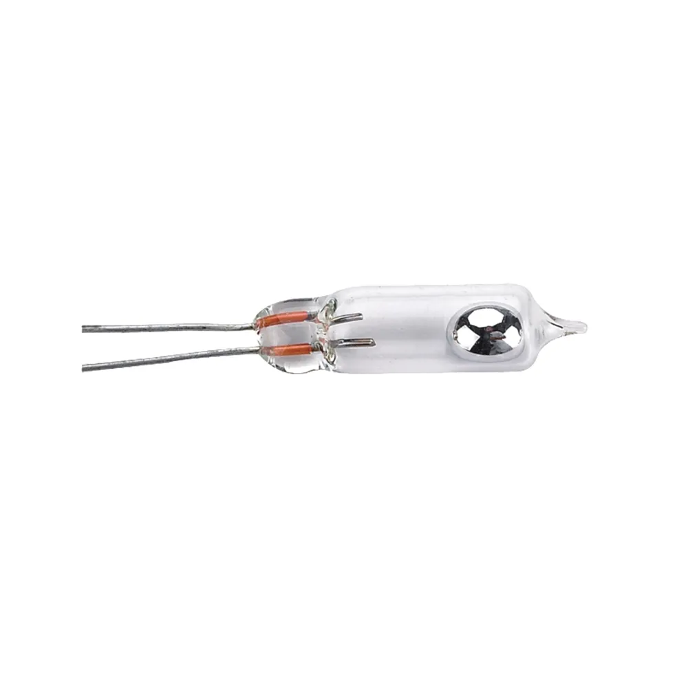</img>
</div>

A tilt switch is a switch that completes the circuit depending on its orientation to the force of gravity.

<div>
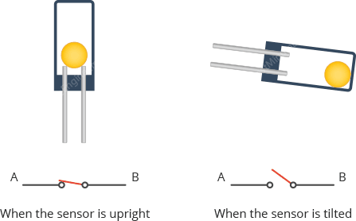</img>
</div>

The thing inside could be a metallic ball or a bit of mercury.

### Reed Switch

<div>
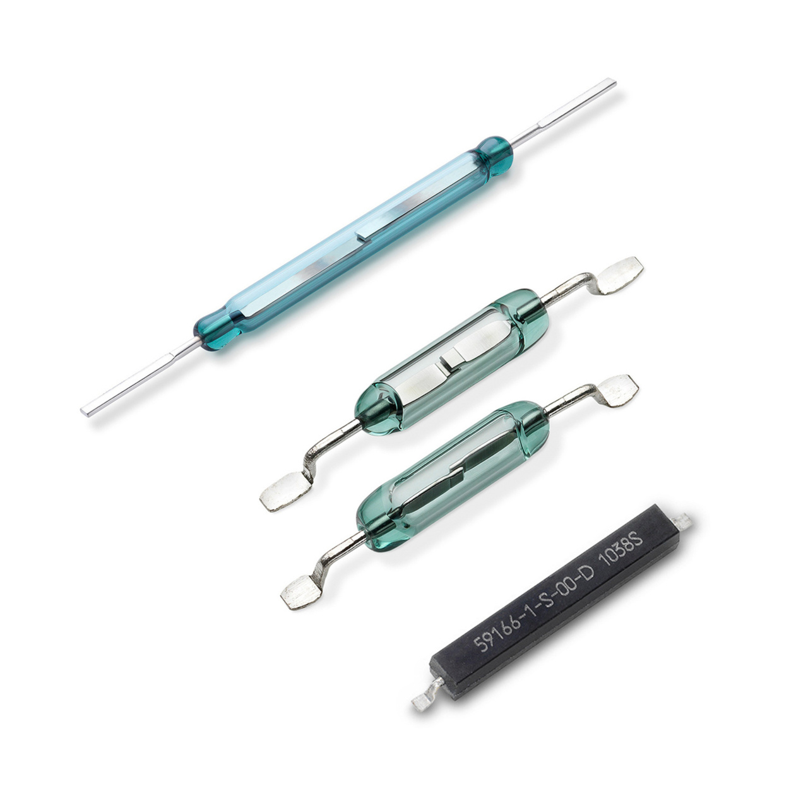</img>
</div>

A reed switch closes when a magnet is near it.

<div>
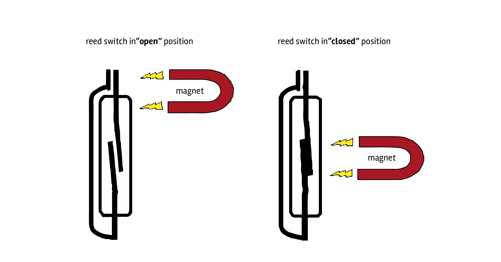</img>
</div>

## Terminology

- constants (`const`)
- digitalRead()
- pull-down and pull-up resistors
- momentary vs toggle switch
- conditional statements (`if`, `else`)
- `==` vs `=`, `equals to` vs. `is assigned the value of`
- internally connected legs

## Supplementary Material

ITP NYU course that walks through using a button as a digital input.

<iframe title="vimeo-player" src="https://player.vimeo.com/video/374066875?h=c54de2b878" width="640" height="360" frameborder="0" referrerpolicy="strict-origin-when-cross-origin" allow="autoplay; fullscreen; picture-in-picture; clipboard-write; encrypted-media; web-share"   allowfullscreen></iframe>

Tim Hunkin Youtube Channel:

Overview of different types of switches, deconstruction, and technical description of how they work:

<iframe width="560" height="315" src="https://www.youtube.com/embed/bno0HeQfxrU?si=qRmrIMbGkNz8tAaW" title="YouTube video player" frameborder="0" allow="accelerometer; autoplay; clipboard-write; encrypted-media; gyroscope; picture-in-picture; web-share" referrerpolicy="strict-origin-when-cross-origin" allowfullscreen></iframe>
