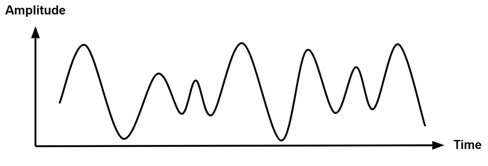
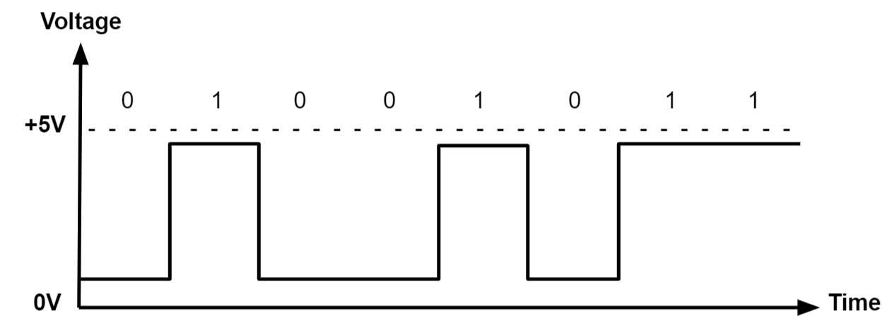

# Fade and Intro to PWM

## Intro

Locate the official Arduino Documentation for a more complete reference:

<div class="uk-margin uk-grid-small uk-child-width-expand@s" style="padding: 30px; width: 100%;">
<ul class="uk-child-width-1-3@m uk-child-width-1-4@l uk-child-width-1-2@s uk-grid-small uk-grid-match" uk-grid>

<li style="width: 45%; margin: auto; padding-left: 0;">
<div class="uk-transition-toggle">
<a target="_blank" href="https://docs.arduino.cc/built-in-examples/basics/Fade/">
<div class="uk-card-small uk-card-default uk-card-body uk-box-shadow-xlarge  uk-transition-scale-up" style="background: #7fcbcd; opacity: 100;">
<div class="uk-card-small uk-card-default uk-card-body uk-box-shadow-xlarge">
<h4>Fade</h4>
<div style="display: inline">

<span class="uk-label" style="background-color: #7fcbcd">Docs</span>
</div>
</div>
</div>
</a>
</div>
</li>

</ul>
</div>

Locate the example.

Go to:

**File** > **Examples** > **01.Basics** > **Fade**

### The Idea

The Fade example is one of the most basic examples intended to teach you how to use `analogWrite()`. Before we used digital output (`digitalWrite()`), to power an LED with either 3V or 0V. With analog output, we can power things with anything in between 0V and 3V. So instead of just turning an LED fully on or fully off (2 possible states), we will be able to change the brightness with 256 possible values (8-bit resolution). This uses something called **Pulse Width Modulation** (PWM).

The sketch description says:

<blockquote>
This example shows how to fade an LED on pin 9 using the analogWrite()
function.

<p></p>

The analogWrite() function uses PWM, so if you want to change the pin you're using, be sure to use another PWM capable pin. On most Arduino, the PWM pins are identified with a "~" sign, like ~3, ~5, ~6, ~9, ~10 and ~11.
 </blockquote>

## Pulse Width Modulation

<div class="uk-margin uk-grid-small uk-child-width-expand@s" style="padding: 30px; width: 100%;">
<ul class="uk-child-width-1-3@m uk-child-width-1-4@l uk-child-width-1-2@s uk-grid-small uk-grid-match" uk-grid>

<li style="width: 45%; margin: auto; padding-left: 0;">
<div class="uk-transition-toggle">
<a target="_blank" href="https://docs.arduino.cc/learn/microcontrollers/analog-output/">
<div class="uk-card-small uk-card-default uk-card-body uk-box-shadow-xlarge  uk-transition-scale-up" style="background: #7fcbcd; opacity: 100;">
<div class="uk-card-small uk-card-default uk-card-body uk-box-shadow-xlarge">
<h4>Basics of PWM</h4>
<div style="display: inline">

<span class="uk-label" style="background-color: #7fcbcd">Docs</span>
</div>
</div>
</div>
</a>
</div>
</li>

</ul>
</div>

According to the documentation:

<blockquote>
Pulse Width Modulation, or PWM, is a technique for getting analog results with digital means. Digital control is used to create a square wave, a signal switched between on and off. 
</blockquote>


A PWM signal is actually square wave that is happening very fast. With this quick speed, if one full cycle (`T`) of the square wave is on half the time (and off half the time), we get a result of half of the operating voltage (3.3V). The "on time" of the square wave is called the **pulse width**. By changing the pulse width (the amount of time the square wave is on vs off), we can change the output voltage.

An averaging of voltage is happening.

<div class="uk-text-center">
**With a 50% duty cycle:**

`analogWrite(127)`

3.3V * 0.5 =  1.65V

**With a 25% duty cycle:**

`analogWrite(64)`

3.3V * 0.25 = 0.825V

**With a 75% duty cycle:**

`analogWrite(191)`

3.3V * 0.75 = 2.475V
</div>

---

Remember the difference between analog and digital signals:

<div class="uk-text-center">
**Analog**
<p>A continuous signal.</p>

</div>

<div class="uk-text-center">
**Digital**
<p>Represents an analog signal with a sequence of discrete values, typically using binary code (0s and 1s)</p>

</div>

## Code Breakdown

### Declaring our Variables

```arduino
int led = 9;         // the PWM pin the LED is attached to
int brightness = 0;  // how bright the LED is
int fadeAmount = 5;  // how many points to fade the LED by
```

### The Setup Function

```arduino
void setup() {
  // declare pin 9 to be an output:
  pinMode(led, OUTPUT);
}
```

### The Loop Function

```arduino
void loop() {
  // set the brightness of pin 9:
  analogWrite(led, brightness);

  // change the brightness for next time through the loop:
  brightness = brightness + fadeAmount;

  // reverse the direction of the fading at the ends of the fade:
  if (brightness <= 0 || brightness >= 255) {
    fadeAmount = -fadeAmount;
  }
  // wait for 30 milliseconds to see the dimming effect
  delay(30);
}
```

## Further Material

### Video Tutorials

Intro to PWM using an Arduino Uno:

<p style="text-align: center; padding-top: 30px;">
<iframe width="100%" height="315" src="https://www.youtube.com/embed/TWGdfFVlroo?si=qYzmKRsL8Q8F3LWd" title="YouTube video player" frameborder="0" allow="accelerometer; autoplay; clipboard-write; encrypted-media; gyroscope; picture-in-picture; web-share" referrerpolicy="strict-origin-when-cross-origin" allowfullscreen></iframe>
</p>

<iframe width="100%" height="315" src="https://www.youtube.com/embed/X8dHbdhnGKY?si=8kZkaZoMtDCemE2X" title="YouTube video player" frameborder="0" allow="accelerometer; autoplay; clipboard-write; encrypted-media; gyroscope; picture-in-picture; web-share" referrerpolicy="strict-origin-when-cross-origin" allowfullscreen></iframe>
