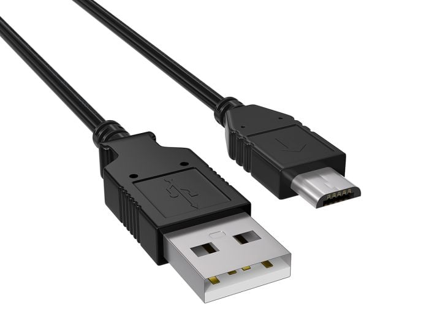
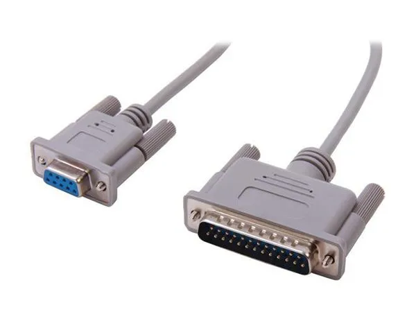
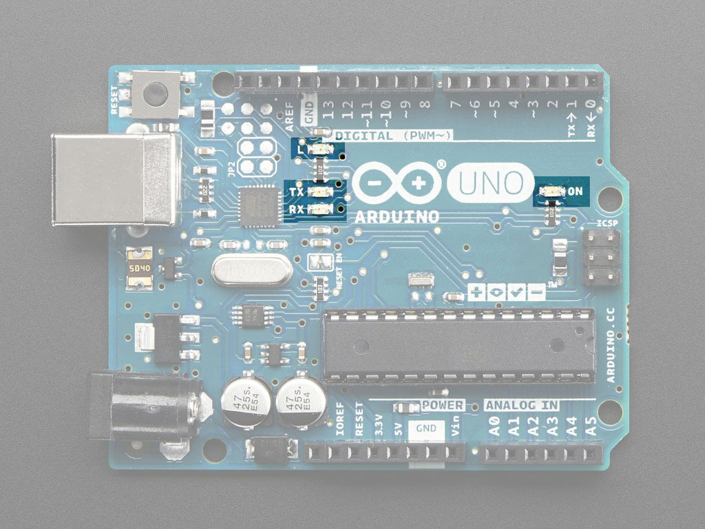
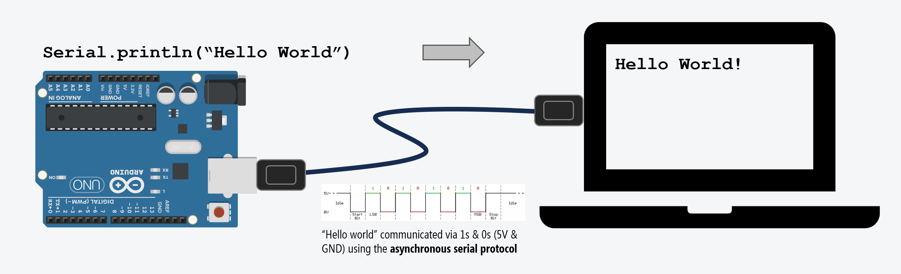
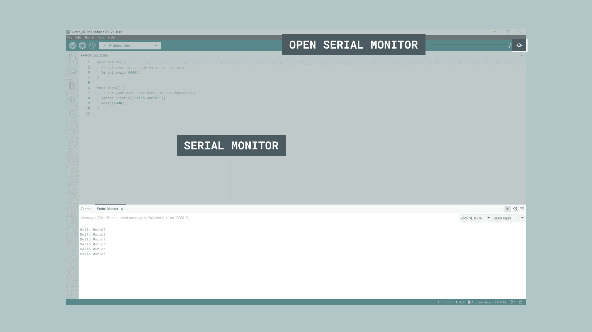
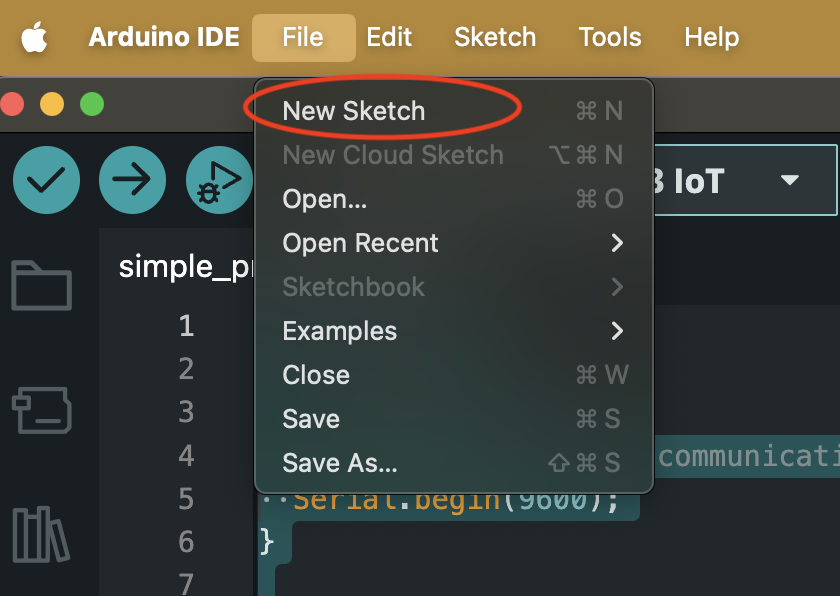
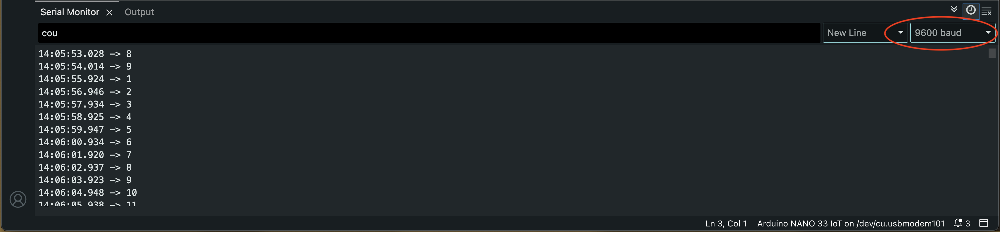

# Serial Monitor

## What is it? Where is it?

First, think back to when we were learning the Arduino software graphical user interface (GUI). To upload our code we learned how to make sure of two things:

###### 1.) How to select the correct board that we are using

###### 2.) How to make sure we are connected to the correct <strong>port</strong> that our Arduino is connected to.

##### What it is

The port that we are connected to is the <strong>"Serial Port"</strong>. The serial port is used to achieve a communication between the computer and the Arduino board using a process called "Serial Communication". You can think of it as both your computer and your Arduino board having a conversation, where they take turns sending messages to each other.

<strong>Serial Cables</strong>

<div class="uk-column-1-2">
<p>Serial cables today (USB)</p>
<p></img></p>
<p>Serial cables back then (RS-422)</p>
<p></img></p>
</div>

You can actually see some visual feedback of the communication by looking at some board's RX and TX LEDs. The RX LED blinks when the board is <strong>(r)eceiving</strong> information from the computer, and the TX LED blinks when the board is <strong>(t)ransmitting</strong> information to the computer.

<p></img></p>

<p></img></p>

To see the actual messages the Arduino is <strong>sending</strong> to our computer, we use the <strong>Serial Monitor</strong>.

##### Where it is

The Serial Monitor can be accessed by clicking on the magnifying glass icon in the top right corner of the Arduino IDE, and the Serial Monitor window will pop up on the bottom of the screen.

<p></img></p>


---

### Serial Port

<blockquote class="info">
<span class="uk-label">Note</span>

<p>Check out the official Arduino documentation on the Serial Monitor:
<a href="https://docs.arduino.cc/software/ide-v2/tutorials/ide-v2-serial-monitor/">Serial Monitor: Arduino Documentation</a>
</p>

<p><strong>Makeabilitylab</strong> has a more in-depth post about the serial monitor.</p>

<p>
Check it out here:
<a href="https://makeabilitylab.github.io/physcomp/communication/serial-intro.html ">Intro the Serial Monitor</a>
</p>

<p>How to use Debug with Serial:
<a href="https://makeabilitylab.github.io/physcomp/arduino/serial-print.html#step-3-open-serial-monitor-in-the-arduino-ide">Debugging with Serial</a>
</p>
</blockquote>

---

## A Minimal Arduino Sketch to Print to the Serial Monitor

For this sketch, we don't need to add any components. All we need is a USB connection to our Arduino board.

Copy this code into your Arduino IDE:

```arduino
int count = 0;

void setup() {
  // initialize serial communication at 9600 bits per second:
  Serial.begin(9600);
}

// the loop routine runs over and over again forever:
void loop() {
  // print out the current count
  Serial.println(count);
  // increment the count by 1
  count = count + 1;
  // pause the program for 1 second
  delay(1000);
}
```

Make sure you create a new sketch.

`File -> New Sketch`

<p></img></p>

The default new sketch looks like this:

```arduino
void setup() {
  // put your setup code here, to run once:

}

void loop() {
  // put your main code here, to run repeatedly:

}
```

But just Ctrl + A to select all and delete using backspace. (Cmd + A for MacOS) 

Then paste the code above into the Arduino IDE using Ctrl + V. (Cmd + V for MacOS)

---


## Sketch Breakdown

<p></p>

#### Our count variable

```arduino
int count = 0;
```

I am defining a variable called `count` of type `int` (integer) and initializing it with the value of `0`.

We will be changing the value of `count` in the `loop()` function. Starting with incrementing it by `1` each time the loop() happens.

We will be printing the value of `count` to the Serial Monitor.

#### Initialize Serial Communication in setup()

To use the serial port for communication, we first need to initialize it in the `setup()` function using `Serial.begin()`.

<blockquote class="warning">
<span class="uk-label" style="color:black; background:#fac100">Warning</span>

<p>Remember that in programming, everything is case sensitive. serial.begin() will not be recognized by Arduino, it has to be Serial.begin().</p>
</blockquote>


```arduino
void setup() {
    // initialize serial communication at 9600 bits per second:
    Serial.begin(9600);
}
```

<blockquote class="info">
<span class="uk-label">Note</span>

<p>Click this link to see the Arduino documentation of: <a href="https://docs.arduino.cc/language-reference/en/functions/communication/serial/begin/">Serial.begin()</a></p>
</blockquote>

#### Baud Rate

Worrying about baud rate is a bit out of scope for this class, but it is important to know that both the Arduino and the Serial Monitor need to be set to the same baud rate in order to communicate properly.

<p></img></p>

Take note of the drop down menu on the top right of the Serial Monitor window. It is set to 9600 baud by default, which is the same as what we set in our code using `Serial.begin(9600);`.

As long as these are matching, it should work as expected.

From makeabilitylab explanation: <a href="https://makeabilitylab.github.io/physcomp/communication/serial-intro.html#baud-rate">https://makeabilitylab.github.io/physcomp/communication/serial-intro.html#baud-rate</a>

> The baud rate specifies how fast data is sent over serial, which is expressed in bits-per-second (bps). For communicating with a computer, the Arduino docs recommend: 300 bps, 600, 1200, 2400, 4800, 9600, 14400, 19200, 28800, 38400, 57600, or 115200. Both devices—in this case, the Arduino and the computer—need to be set to the same baud rate to communicate.

#### Serial.println()

##### Print out text (Strings)

When you are printing out text to the serial monitor, you are printing out a string of characters. In programming, we call this a `String`.

<blockquote class="info">
<span class="uk-label">Info</span>

<p></p>
</blockquote>

```arduino
void loop() {
    // print out text to the Serial Monitor
    Serial.pring("Hello World");
}
```
