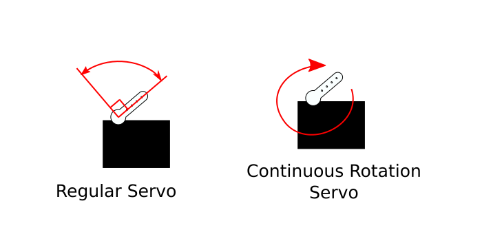
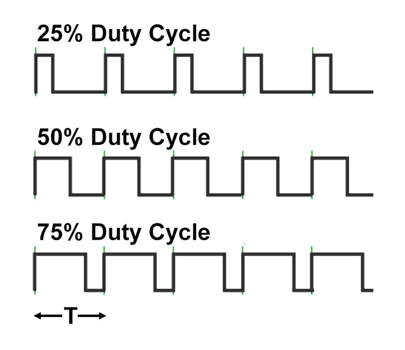

# Sweep

## Intro

First of all, keep in mind the official Arduino Documentation for a more complete reference:

<div class="uk-margin" style="padding: 30px; width: 100%;">
<ul class="uk-child-width-1-3@m uk-child-width-1-4@l uk-child-width-1-2@s uk-grid-small uk-grid-match" uk-grid="masonry: pack">

<li style="width: 50%; margin: auto; padding-left: 0;">
<div class="uk-transition-toggle">
<a target="_blank" href="https://docs.arduino.cc/learn/electronics/servo-motors/">
<div class="uk-card-small uk-card-default uk-card-body uk-box-shadow-xlarge  uk-transition-scale-up" style="background: #7fcbcd; opacity: 100;">
<div class="uk-card-small uk-card-default uk-card-body uk-box-shadow-xlarge">
<h4>Servo Motor Basics</h4>
<div style="display: inline">

<span class="uk-label" style="background-color: #7fcbcd">Docs</span>
</div>
</div>
</div>
</a>
</div>
</li>

</ul>
</div>

This will involve using the **Servo library**. Make sure it is installed. If not, locate it in the library manager. (<a target="_blank" href="https://docs.arduino.cc/software/ide-v2/tutorials/ide-v2-installing-a-library/">Don't know how to install a library?</a>)

Now, let's locate the built-in example.

Go to:

**File** > **Examples** > **Servo** > **Sweep**

## The Servo Motor

**What is a servo motor?**

Earlier we have used a vibration motor which is a simple DC motor with an unbalanced, eccentric weight attached to the shaft. A DC motor shaft will turn if supplied a constant DC voltage (like from a 9V battery).

A servo motor is a specialized motor designed for **precise control** of rotary motion. There are two type of servo motors that I would like to point out:

- **Positional (Standard Rotation)**: Control angle position with a range limit of 180 degrees.
- **Continuous Rotation**: Control speed with a limit of only being able to turn in one direction. It can turn a full 360 degree rotation continuously.



<iframe width="100%" height="315" src="https://www.youtube.com/embed/XrEN1oszq_Y?si=-p6DCq-V1enld0YW" title="YouTube video player" frameborder="0" allow="accelerometer; autoplay; clipboard-write; encrypted-media; gyroscope; picture-in-picture; web-share" referrerpolicy="strict-origin-when-cross-origin" allowfullscreen></iframe>

Both types look exactly the same, and are both powered using a **Pulse Width Modulation (PWM)** signal.

Check out the Fade example post for a refresher on PWM.

<div class="uk-margin" style="padding: 30px; width: 100%;">
<ul class="uk-child-width-1-3@m uk-child-width-1-4@l uk-child-width-1-2@s uk-grid-small uk-grid-match" uk-grid="masonry: pack">

<li style="width: 50%; margin: auto; padding-left: 0;">
<div class="uk-transition-toggle">
<a target="_blank" href="../../Arduino/fade/fade.html">
<div class="uk-card-small uk-card-default uk-card-body uk-box-shadow-xlarge  uk-transition-scale-up" style="background: #7fcbcd; opacity: 100;">
<div class="uk-card-small uk-card-default uk-card-body uk-box-shadow-xlarge">
<h4>Fade and Intro to PWM</h4>
<div style="display: inline">

<span class="uk-label" style="background-color: #7fcbcd">Arduino Example</span>
</div>
</div>
</div>
</a>
</div>
</li>

</ul>
</div>

## Minimal Example

```c
#include <Servo.h>

Servo myservo;  // create servo object to control a servo

void setup() {
  myservo.attach(9);  // attaches the servo on pin 9 to the servo object
}

void loop() {
  myservo.write(180);  // tell servo to go to position in variable 'pos'
}
```

#### Breakdown

---

```c
#include <Servo.h>
```

To include the library, you have to write this statement. `#include` is written followed by the name of the file that has the code of the library written. This `Servo.h` file is the servo library. It is surrounded by these angle brackets.

Abound `#include`: <a target="\_blank" href="https://www.arduino.cc/reference/en/language/structure/further-syntax/include/">From the Arduino Website</a>

--- 

```c
Servo myservo;  // create servo object to control a servo
```

For this library, there is an object called Servo, and it is given the variable name `myservo`. 

> The Arduino language is an **Object-Oriented Programming** language. An object is similar to a data type, except that it is a *data structure*. It is more of a defined thing with certain defined attributes. For example, an object called Human might have properties such as age, height, name, etc. and can perform actions like `human.walk()`, `human.sleep()`, `human.eat()`. 
> 
> In this Servo library, there is an object defined called Servo that has the properties of a servo motor, with actions like `attach()` and `write()`.

---

```c
myservo.attach(9);  // attaches the servo on pin 9 to the servo object
```

As said in the comment, this line tells Arduino that this servo is connected to pin 9.

---

```c
myservo.write(180);  // tell servo to go to position in variable 'pos'
```

The `write()` method changes the position of the servo and takes an angle between 0 - 180 degrees.

#### Play Around

Try changing the number in `write()` to see where the servo moves.

## The Full Sweep Example

```arduino
#include <Servo.h>

Servo myservo;  // create Servo object to control a servo
// twelve Servo objects can be created on most boards

int pos = 0;    // variable to store the servo position

void setup() {
  myservo.attach(9);  // attaches the servo on pin 9 to the Servo object
}

void loop() {
  for (pos = 0; pos <= 180; pos += 1) { // goes from 0 degrees to 180 degrees
    // in steps of 1 degree
    myservo.write(pos);              // tell servo to go to position in variable 'pos'
    delay(15);                       // waits 15 ms for the servo to reach the position
  }
  for (pos = 180; pos >= 0; pos -= 1) { // goes from 180 degrees to 0 degrees
    myservo.write(pos);              // tell servo to go to position in variable 'pos'
    delay(15);                       // waits 15 ms for the servo to reach the position
  }
}
```

### Breakdown

#### Variables

A variable is defined to store the angle position.

```arduino
int pos = 0;    // variable to store the servo position
```

#### The Loop Function

```arduino
void loop() {
  for (pos = 0; pos <= 180; pos += 1) { // goes from 0 degrees to 180 degrees
    // in steps of 1 degree
    myservo.write(pos);              // tell servo to go to position in variable 'pos'
    delay(15);                       // waits 15 ms for the servo to reach the position
  }
  for (pos = 180; pos >= 0; pos -= 1) { // goes from 180 degrees to 0 degrees
    myservo.write(pos);              // tell servo to go to position in variable 'pos'
    delay(15);                       // waits 15 ms for the servo to reach the position
  }
}
```

This sketch is using a **for loop**.

<div class="uk-margin" style="padding: 30px; width: 100%;">
<ul class="uk-child-width-1-3@m uk-child-width-1-4@l uk-child-width-1-2@s uk-grid-small uk-grid-match" uk-grid="masonry: pack">

<li style="width: 50%; margin: auto; padding-left: 0;">
<div class="uk-transition-toggle">
<a target="_blank" href="https://docs.arduino.cc/language-reference/en/structure/control-structure/for/">
<div class="uk-card-small uk-card-default uk-card-body uk-box-shadow-xlarge  uk-transition-scale-up" style="background: #7fcbcd; opacity: 100;">
<div class="uk-card-small uk-card-default uk-card-body uk-box-shadow-xlarge">
<h4>For Loop</h4>
<div style="display: inline">

<span class="uk-label" style="background-color: #7fcbcd">Docs</span>
</div>
</div>
</div>
</a>
</div>
</li>

</ul>
</div>

The structure of a for loop is this:

```arduino
for (initialization; condition; increment) {
    // statement(s);
}
```

There are three things that need to be specified within the parantheses `()`.

**initialization**

You need to initialize a variable with a starting value. `i` is used often by convention. This is like a setup function as it happens first and only happens once.

**condition**

Each time through the loop, a condition is tested. If it is *true*, then whatever is within the curly brackets is executed.

**increment**

After each loop, the variable defined in the initalization section is incremented by a certain amount.

---

So in our example:

```arduino
for (pos = 0; pos <= 180; pos += 1) { // goes from 0 degrees to 180 degrees
    // the code executed if true
}
```

<br>

<div class="uk-text-center">

**`pos = 0`**

The `pos` variable starts with a value of 0.

**`pos <= 180`**

The condition: Checks to see if `pos` is **less than or equal to** 180.

**`pos += 1`**

If the condition is true: Executes whatever is within the curly brackets of the loop, and `pos` is incremented by 1.
</div>

--

(The loop repeats until the condition is false, which is when `pos` reaches the value of 181. 181 is no longer less than or equal to 180)

We then exit the for loop and continue.

The second for loop is the same except `pos` is given an initial value of 180, the condition checks to see if `pos` is **greater than or equal to** 0, and then **decrements** pos if true (decreases the value by 1).

## Further Material

### NYU ITP Physical Computing Video on Servo Control

<div style="padding:56.25% 0 0 0;position:relative;"><iframe src="https://player.vimeo.com/video/372278570?badge=0&amp;autopause=0&amp;player_id=0&amp;app_id=58479" frameborder="0" allow="autoplay; fullscreen; picture-in-picture; clipboard-write; encrypted-media; web-share" referrerpolicy="strict-origin-when-cross-origin" style="position:absolute;top:0;left:0;width:100%;height:100%;" title="Analog Output - Servo"></iframe></div><script src="https://player.vimeo.com/api/player.js"></script>
