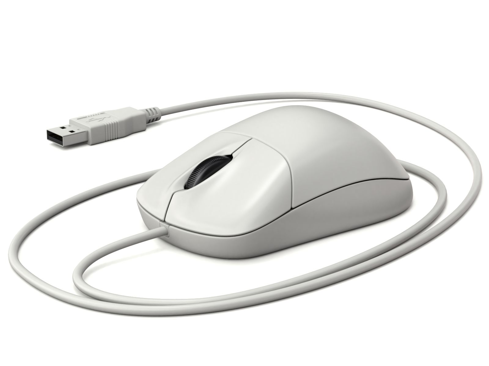
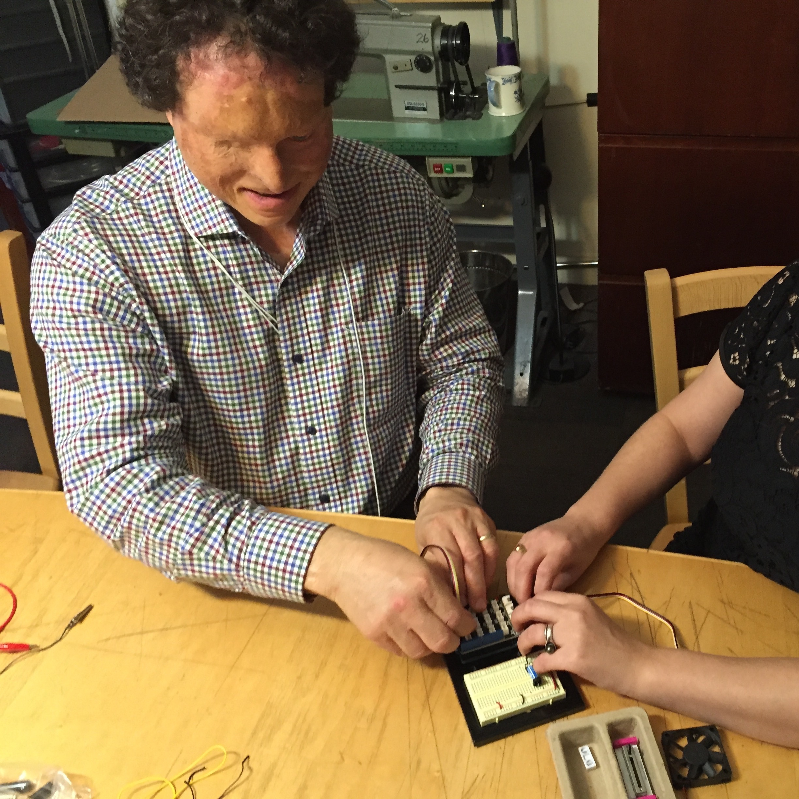

## Midterm Assignment: Creative Interface
<!-- .slide: class=".uk-width-1-1 uk-height-large" -->  

Note:

---

#### Interface: Formal Definition

<!-- .slide: class="uk-column-1-2 uk-column-divider uk-vertical-align-middle" -->  

When it comes to hardware, interfaces are the physical and interactable means that bridge the communication gap between humans and computers. Typical examples are on our computers:

---

#### 

<!-- .slide: class="uk-column-1-2 uk-column-divider uk-vertical-align-middle" -->  

</img>

Keyboard

</img>

Mouse

---

#### 

Typically they are made with the goal of "enhancing" user experience; to facilitate our goals.

---

#### The Assignment

In an art context, we can stretch the definition of what an interface can be.

---

#### What if we made an interface for people with disabilities?

What if we made an interface for someone who could not see?

</img>

---

#### What if we made an interface for people with disabilities?

What if we made an interface for someone who could not see?

</img>

<a href="https://www.diyability.org/">DIYAbility</a>

--- 

#### What if we made an interface for people with disabilities?

</img>

<a href="https://www.diyability.org/">DIYAbility</a>

--- 

#### What if we made an interface for people with disabilities?

What if it was for someone without hands, the ability to hear, the ability to speak?

---

#### What if we made something that was not for humans?

What if it was for animals?

---

#### What if we made something that was not for humans?

What if it was for animals? for plants?

---

#### What if we made something that was not for humans?

What if it was for animals? for plants? for physical phenomena?  

For light, for the wind?

---

#### What if we made something that was not even useful at all?

What if it was just for fun?

---

#### What if we made something that was not even useful at all?

What if it was just for fun? for play?

---

#### What if we made something that was not even useful at all?

What if it was just for fun? for play?

for aesthetics?

---

#### What if we made something that was not even useful at all?

What if it was just for fun? for play?

for aesthetics? for a pointless task?

---

