# Intro to TinkerCAD

## What is TinkerCAD?

TinkerCAD is a web based design tool. It can do 3D design, but we are going to be interested in using it to build and simulate circuits as a way to introduce the basics of electronics.

<video width="100%" height="360px" autoplay loop muted>
  <source src="https://ibles-content.tinkercad.com/static/tinkercad/marketing/circuits/hero-circuits-720.mp4" type="video/mp4" />
  Your browser does not support the video tag.
</video>

Below is an embed of the TinkerCAD circuit project that I will edit in class. Feel free to interact with it or open it.

---

<iframe width="725" height="453" src="https://www.tinkercad.com/embed/dlR74SGKKF7?editbtn=1" frameborder="0" marginwidth="0" marginheight="0" scrolling="no"></iframe>

<blockquote class="info">
Note

TinkerCAD is owned by Autodesk, which also provides software like Fusion, EAGLE, and Maya.

</blockquote>

---

## The Simplest Circuit

The simplest circuit is made of three parts:

- A power supply (The Source)
- Something that is being powered (The Load)
- A path for electrons to travel (The Electrical Conductor)

### The Source

A **power supply** is what is supplying electrical energy. This can be a battery, which converts chemical energy into electrical energy.

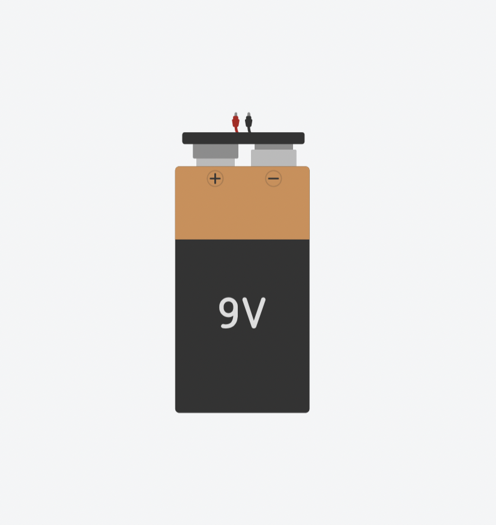</img>

### The Load

A **load** is what is consuming that electrical energy. This can transform into another type of energy like light, motion, and heat. 

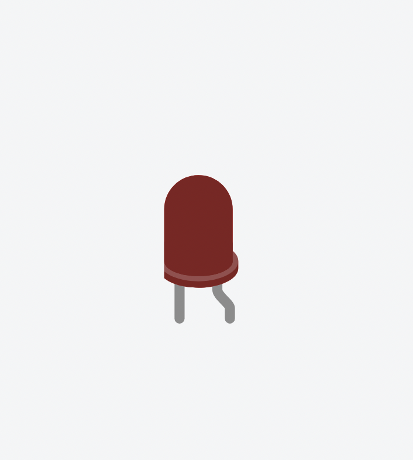</img>

### Electrical Conductor

An **electrical conductor** is made of a material that allows the free movement of electrons. When connected to a battery, electrons are pushed through this path. This is usually a metal like copper.

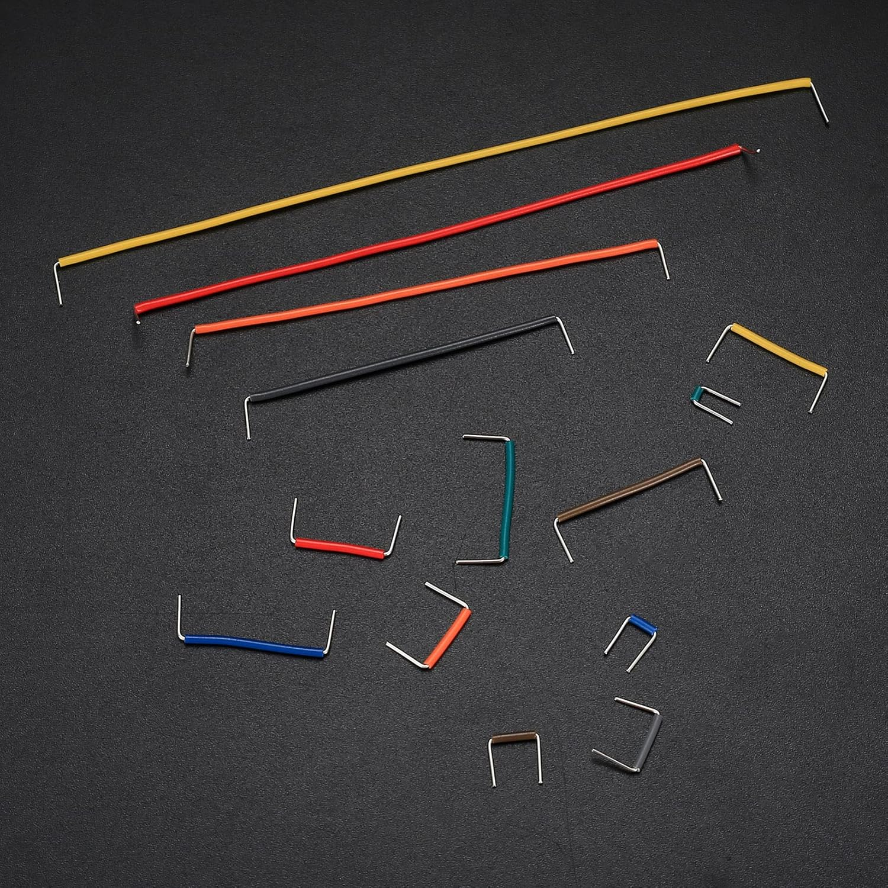</img>

## Open Circuit vs. Closed Circuit

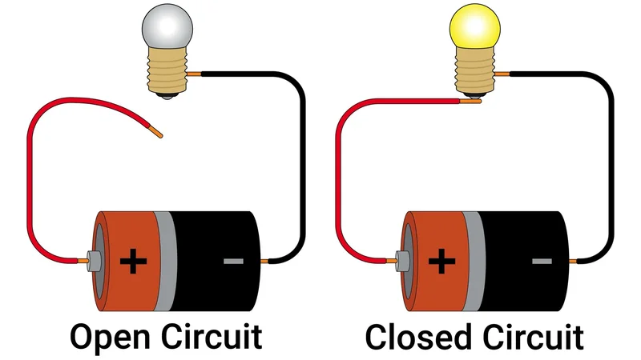</img>

Now that we understand these three components, we need to understand what actually "completes" the circuit.

In order to actually have electrons travel, we must **close** the loop back to the source (the battery).

## Short Circuit

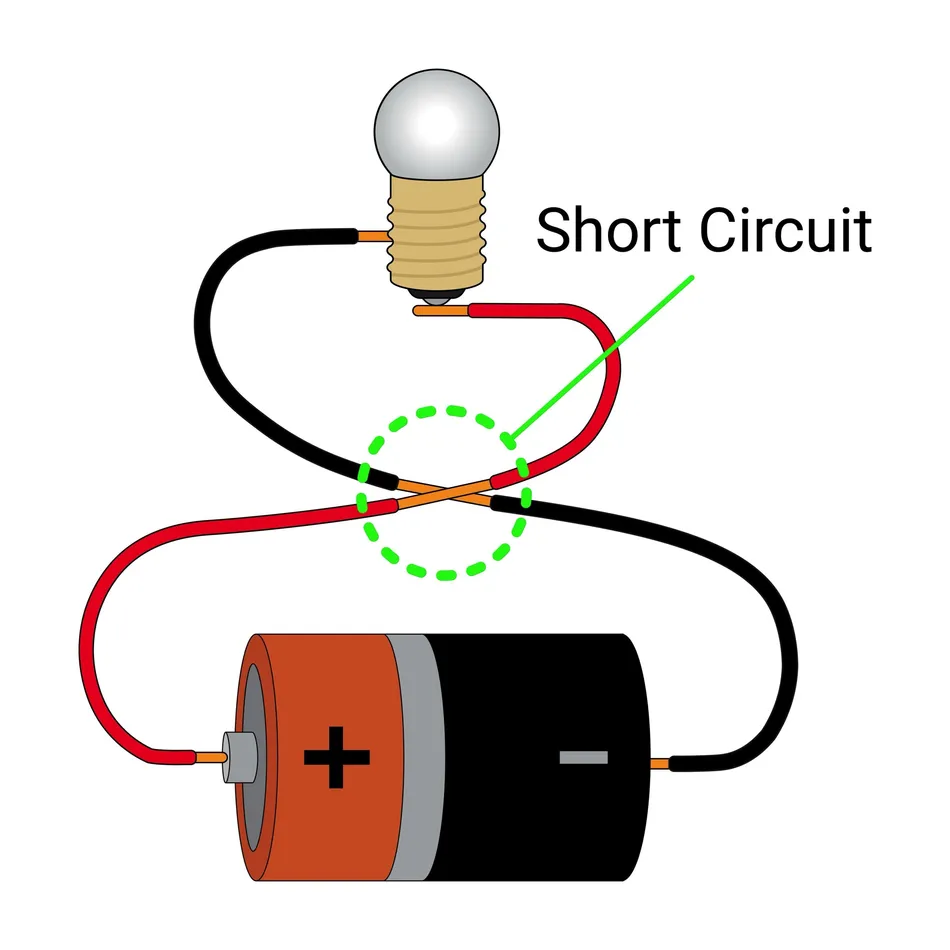</img>

We already saw what happens when a circuit is *broken* (an open circuit). A **short circuit** is the opposite kind of problem.

Instead of no path, there's an *extra* path — one that skips over the load entirely and connects the two wires directly to each other.

Since a plain wire has almost no resistance, current rushes through it all at once instead of flowing through the load the way it's supposed to.

This isn't just a "the LED won't light up" problem — a short can drain a battery fast, and in a real circuit it can make the wires hot enough to be a fire hazard. That's why "don't let the wires touch" is a rule you'll hear a lot when building circuits.

---

## Building the Simple Circuit in TinkerCAD

Before you can start building circuits, you do have to make an account. Once you do, you can start creating by clicking on the "+ Create" button. Click on the "Circuits" option and you can start building.

</img>

The first thing to notice is that all the basic components are conveniently available to us on the right hand side.

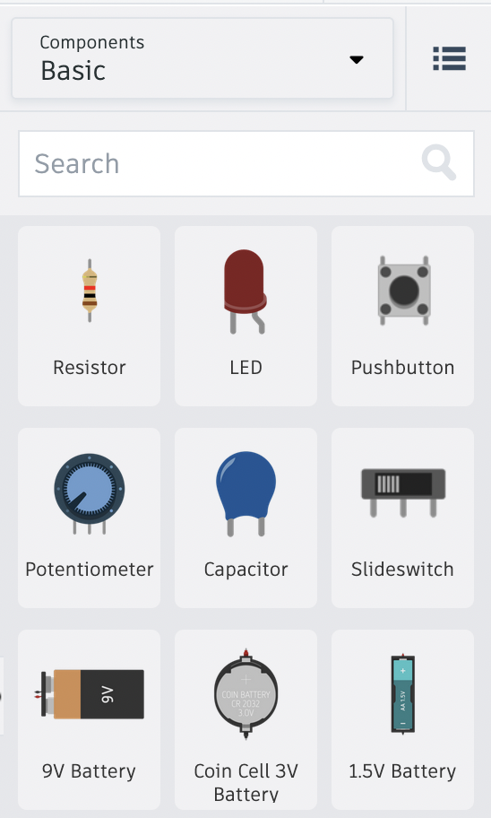</img>

Clicking on any of them will place it on your cursor until you put it down on the "canvas". Grab an LED and place it down somewhere. Once you do, you might notice that a window pops up. Here you can change some of the properties of this component. For example, with an LED, you can change its color.

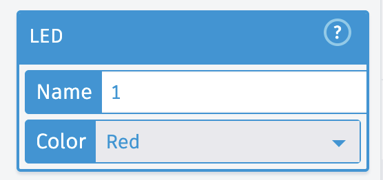</img>

Next, try using the search bar and type battery. Doing so will give you three main options.

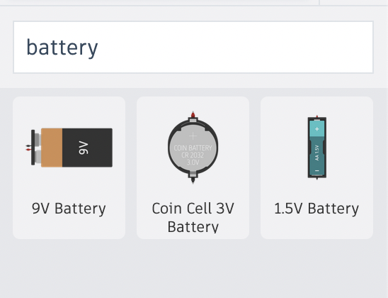</img>

Grab the 3V battery and set it near the LED. Try clicking on one of the terminals</strong> are the electrical contacts that are used to connect to a load. They are either positive (+) or negative (-).">terminals and attach the wire that just appeared to one of the legs of the LED.

If you see it attach successfully do the same with the other side.

If both sides are connected it looks like we have a closed circuit. In theory the LED should light up.

<blockquote class="info">
Note

You can bend the wire to your liking by clicking anywhere on the canvas, but make sure that it ends at the connection point that you want.

</blockquote>

### Start a Simulation

Click "Start Simulation" to start the simulation. You can also press Spacebar. **Once it starts, you cannot make any edits**. It will "simulate" a circuit meaning that it will work similarly to the real world. The image of the LED should light up.

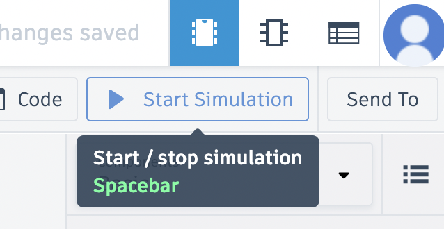</img>

If this is your first time building a circuit, then it is 50% likely that your LED does not appear to be on. It should look like the following image. (I am using a yellow LED here, but you can use any color you want. The important part is that it lights up.)

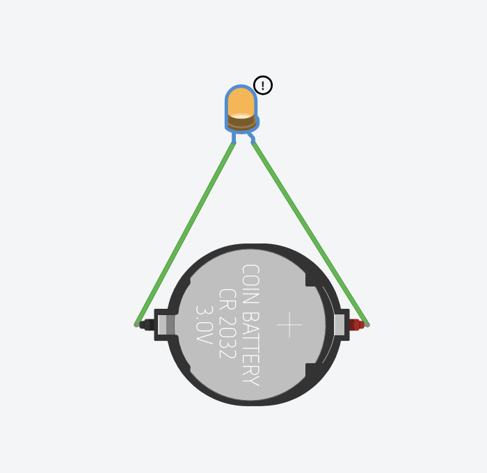</img>

If it is not on, it is because the terminals of the battery need to be connected to the 'correct' leg. This introduces the concept of **polarity**.

## LEDs

### LED Polarity

LED stands for **<mark>Light-Emitting Diode</mark>**. A **diode** is another basic component. 

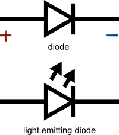</img>

The short explanation is that it is a component that only allows electrical current to pass in **one direction**. It is like a one way street. So just like a battery, it has a **positive** and a **negative** side.

In other words, the LED, diode, and battery all have **polarity**. This means that positive goes to positive and negative goes to negative.

LEDs and diodes both work in a similar way, with the only difference being that an LED is a diode that emits light when powered.

#### Leg Length

The most common way to determine which leg is which, is by seeing the length of the legs. The longer leg is the positive, which is called the **anode**. The shorter leg is the negative which is called the **cathode**.

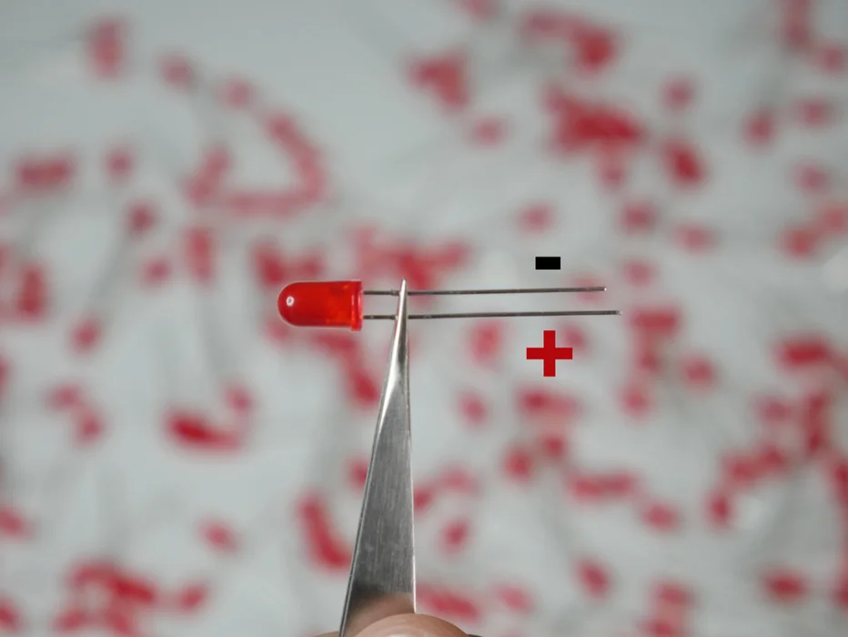</img>

#### Flat Side / Notch

Another way to tell is by seeing which side of the LED has a flat side. This side would be the negative.

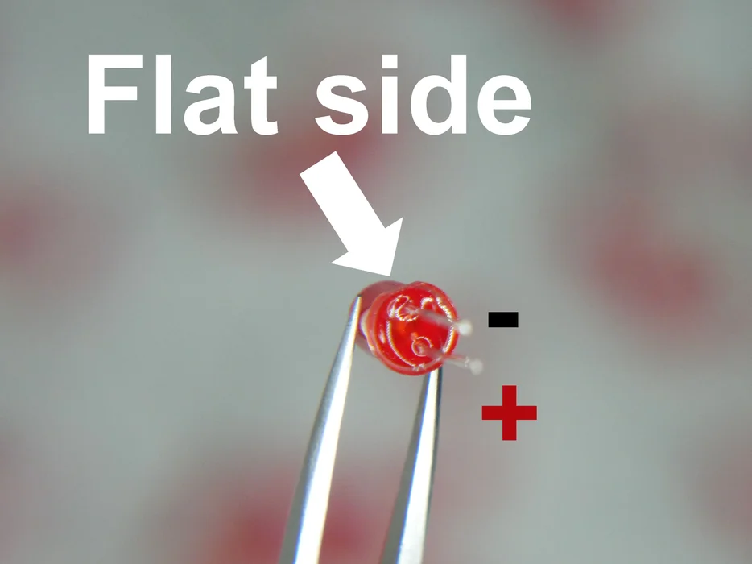</img>

#### Plate

The last way to tell is by looking inside the LED. There are two sectioned plates. The bigger one is the negative side.

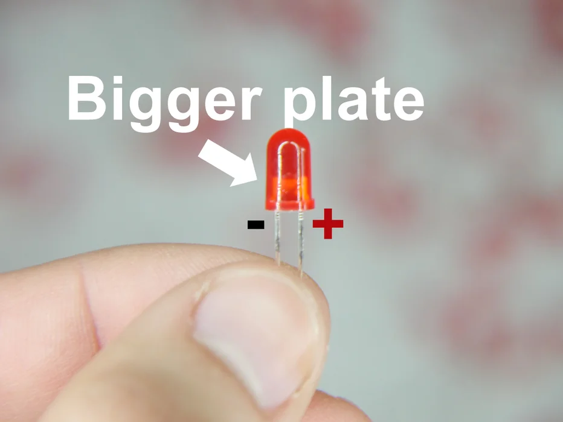</img>

## Protecting the LED

With this information let's go back to TinkerCAD. Hovering over one of the LED legs will reveal what it is.

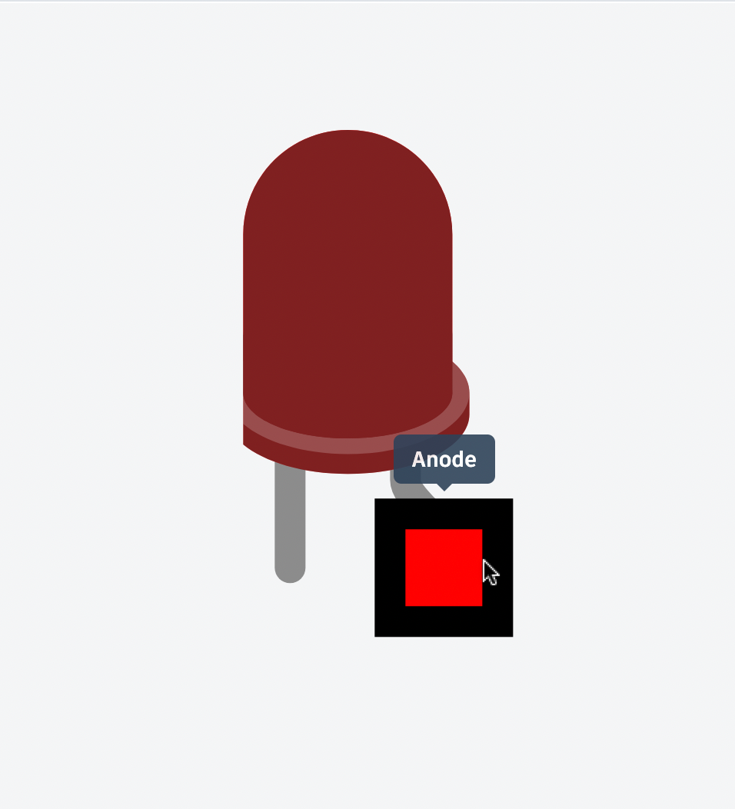</img>

I know **anode** means positive, so I will connect it to the positive **terminal** of the coin cell battery.

<blockquote class="success">
Tip

I will change the wire colors to match the **red** and **black** to match the **positive** and **negative**. This does not affect the circuit in any way but it is good practice to keep this convention consistent so that you can visually digest better what is going on.

</blockquote>

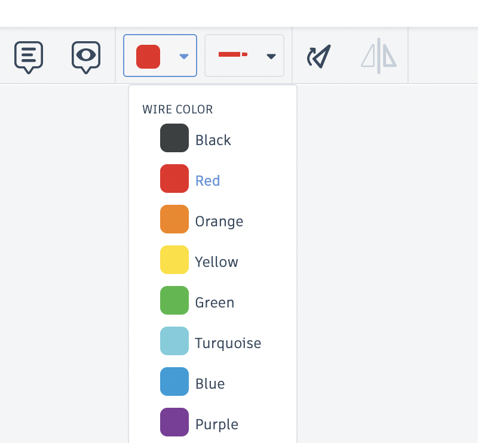</img>

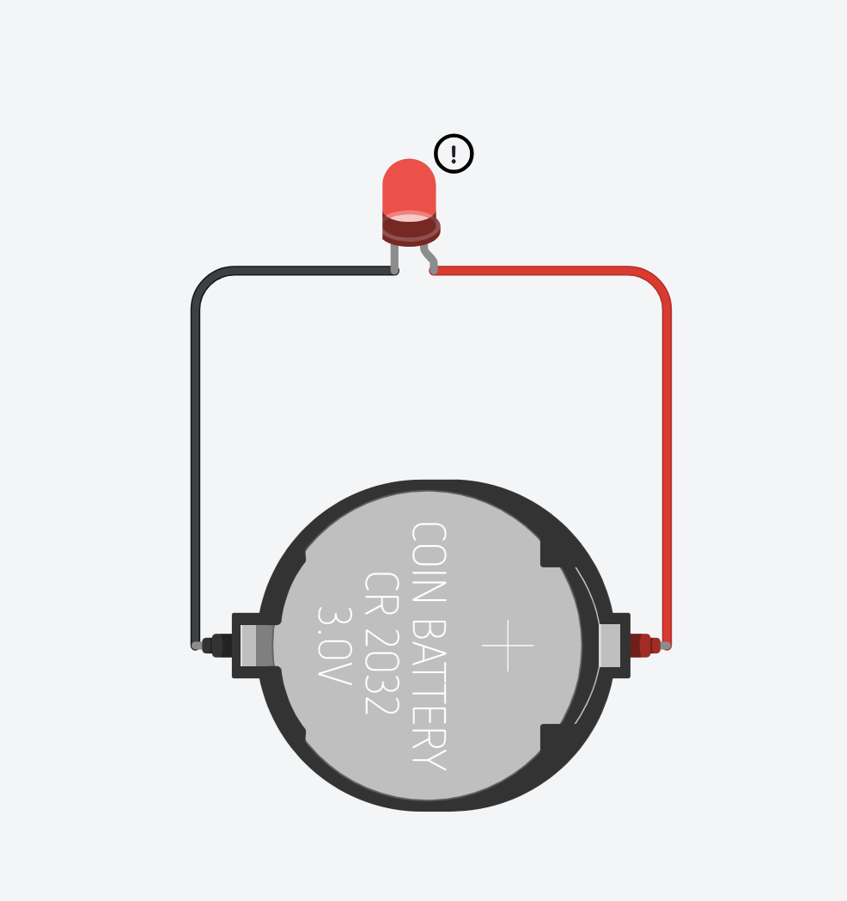</img>

The LED should work now, but there appears the be a warning icon next to the lit LED. Hovering over it reveals a message.

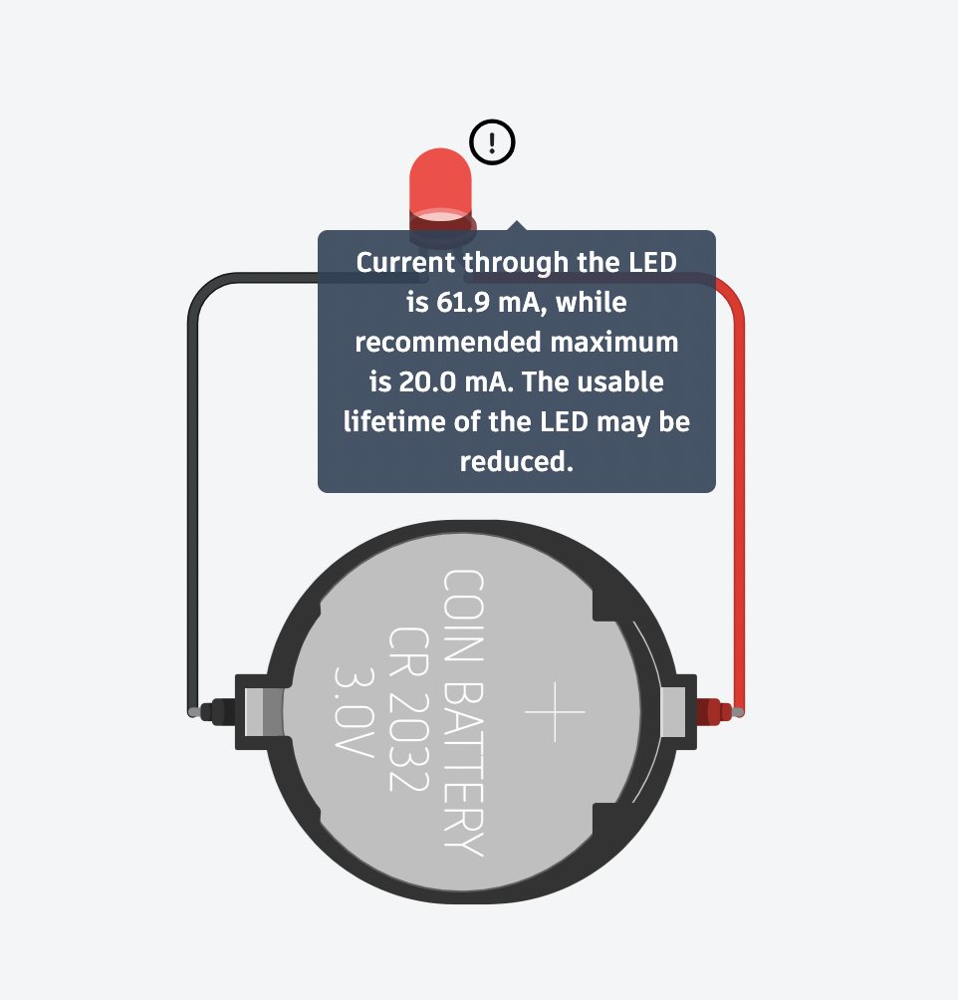</img>

It says:

> Current through the LED is 61.9mA, while recommended maximum is 20.0 mA. The usable lifetime of the LED may be reduced.

It is telling us that something called current is more than the recommended maximum. There is a lot to unpack here, but i'll cut to the chase. An LED is usually paired with a resistor, another basic component.

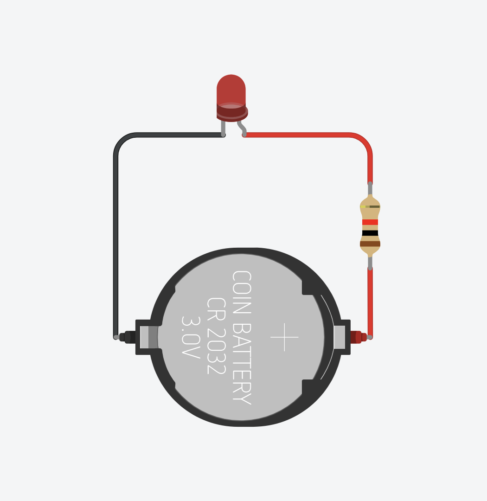</img>

Now the LED is on and the warning is gone, which is what we want, but in order to understand why this thing called a resistor is needed we need to understand a little bit about how electricity works.

## Voltage, Current, and Resistance

A useful way to picture electricity is water moving through a hose:

- **Voltage** is like water pressure — how hard the water is being pushed.
- **Current** is like the flow rate — how much water is actually moving through per second.
- **Resistance** is like how narrow the hose is — a narrower hose holds back more water for the same pressure.

<!-- TODO: insert water/hose analogy image here -->

An LED doesn't resist current very much on its own. So when you connect it straight to a battery, the battery just keeps pushing as much current through as it can — which is exactly what you saw in the warning earlier: **61.9mA** flowing through, when the LED is only rated for **20mA**. Too much current burns through an LED the same way too much water pressure would burst certain pipes.

A **resistor** does what it sounds like — it *resists* the flow of current. Adding one in the path pinches that flow back down. In the above example, it pinches it to a safe amount, the same way pinching a hose slows the water down.

<blockquote class="info">
Note

LEDs have a "voltage threshold". To put it simply, there is a minimum amount of voltage required for current to flow and for it to emit light. This threshold value varies between different color LEDs. For a typical red LED, it is usually around 1.8V, meaning that it needs a power source that can supply higher than that.

</blockquote>

---

<blockquote class="warning">
Warning

Before I attempt to note down some of the basics of electronics, know that this takes time to learn. Knowing the how and why of things is definitely useful, satisfying, and recommended. Unfortunately (or fortunately) with our time limitation it is impossible to go into it in depth, and is not really the point of the class anyway. It can be a little dull, tedious, and overwhelming. Because this is an art class and we are artists and designers, we mostly want to start making things happen and get our ideas from our heads into the world, and ponder about what our creations are doing. I think it's important to minimize the stress as much as possible and create an environment where you feel comfortable working in this area.

Trying to speed teach this material has been attempted many times in different classrooms around the world. Thankfully we can compare notes and get a sense of the different philosophies.

If you find yourself feeling hungry or curious for more information, I can provide some external resources that can possibly point you in the right direction.

<ul>
<li>
<a href="https://makeabilitylab.github.io/physcomp/electronics/">
Makeability Lab
</a> - A website made by Jon E. Froehlich, a computer science professor at the University of Washington.</li>
<li>
<a href="https://itp.nyu.edu/physcomp/lessons/electronics/electricity-the-basics/">ITP Physical Computing</a> - The course website made for NYU's ITP Physical Computing class.</li>
</li>
</ul>
</blockquote>

## Terminology

### Key Terms

- **Source (Power Supply)** — What supplies electrical energy to a circuit, such as a battery.
- **Load** — What consumes electrical energy, converting it into another form like light, motion, or heat.
- **Electrical Conductor** — A material, usually a metal like copper, that allows electrons to move freely along a path.
- **Open Circuit** — A break in the path that stops current from flowing.
- **Closed Circuit** — A complete, unbroken loop that lets current flow all the way back to the source.
- **Short Circuit** — An unintended low-resistance path that skips the load, causing a current surge.
- **Polarity** — Having a positive side and a negative side, where current can only flow one particular way.
- **Diode** — A component that only allows current to pass in one direction.
- **LED (Light-Emitting Diode)** — A diode that emits light when current passes through it.
- **Anode** — The positive leg (or side) of a diode or LED.
- **Cathode** — The negative leg (or side) of a diode or LED.
- **Terminal** — The point on a component, like a battery, where a wire connects.
- **Resistor** — A component that resists the flow of current, often used to protect other components like LEDs.
- **Voltage** — The "pressure" pushing electricity through a circuit.
- **Current** — The rate at which electricity flows through a circuit.
- **Resistance** — How much a material or component resists the flow of current.

### Units of Measurement

- Volts; (V); For Electromotive Force  
- Amps ; (A); For Current  
- Ohms; (Ω); For Resistance  

<table class="uk-overflow-auto uk-table uk-table-divider uk-table-justify uk-table-middle" style="padding:70px"; margin:auto;> <thead> <tr> <th>Quantity</th> <th style="padding:20px">Symbol</th> <th>Unit of Measurement</th style="padding:30px;"> <th>Unit abbreviation</th> </tr> </thead> <tbody> <tr> <td>Current</td> <td>I<math xmlns="http://www.w3.org/1998/Math/MathML"><mi>I</mi></math></td> <td>Ampere (or Amp)</td> <td>A</td> </tr> <tr> <td>Voltage</td> <td>V<math xmlns="http://www.w3.org/1998/Math/MathML"><mi>V</mi></math></td> <td>Volt</td> <td>V</td> </tr> <tr> <td>Resistance</td> <td>R<math xmlns="http://www.w3.org/1998/Math/MathML"><mi>R</mi></math></td> <td>Ohm</td> <td>Ω</td> </tr> </tbody> </table>

