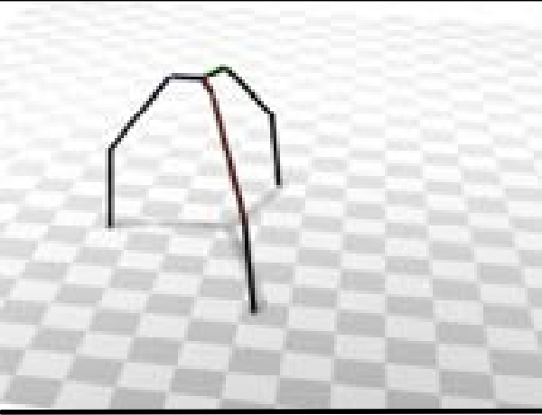
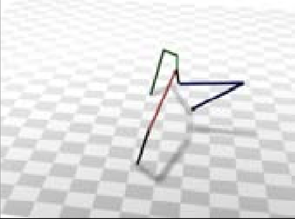
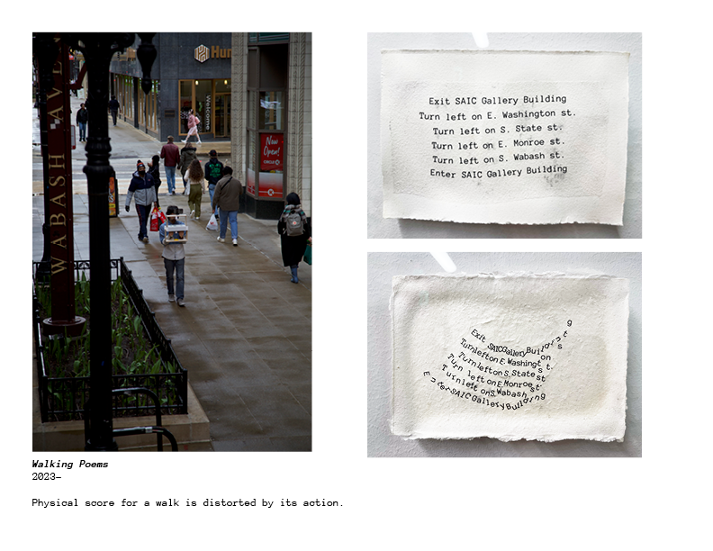
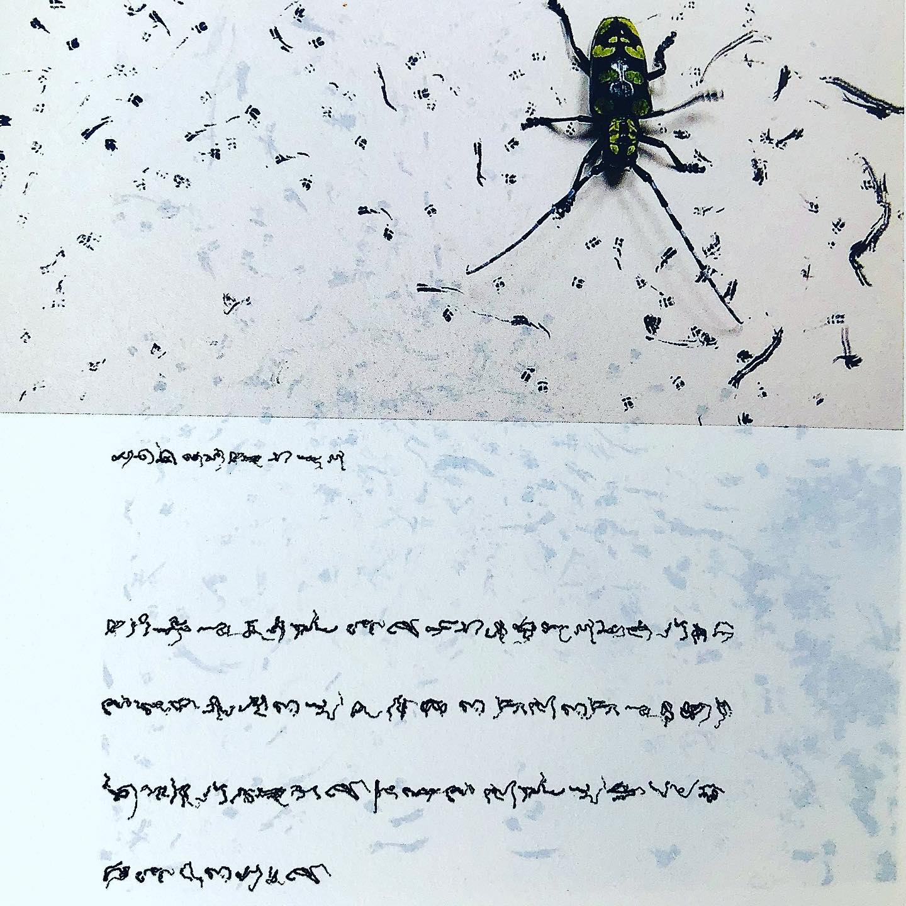

# Drawing Robot Assignment

<iframe width="100%" height="315" src="https://www.youtube.com/embed/0n3dIO6u9yU?si=hZc9bBy1VWHiNDGo&amp;controls=0" title="YouTube video player" frameborder="0" allow="accelerometer; autoplay; clipboard-write; encrypted-media; gyroscope; picture-in-picture; web-share" referrerpolicy="strict-origin-when-cross-origin" allowfullscreen></iframe>

## Summary

You will design and build your own drawing machine: a small robot, built around your soldered vibration-motor circuit (from the [Soldering Workshop](../../Workshops/Soldering_Workshop/soldering_workshop.html)), whose job is to **make marks**. The circuit is the skeleton. Think of it as making a functional sculpture. Your job is to add the body, and then the personality, that turns it not only into a tool for generative drawing, but also as a potential art object. Each student is asked to incorporate a found object/material to add to its meaning. 

### Timeline

::: {.timeline}
- **September 14** — Soldering Workshop and Lab Tour
- **September 16** — Finalize soldering circuit with coin battery holders. Start building the body.
- **September 21** — Finalize construction and plan drawing/instructions.
- **September 23** — Drawing Bot Showcase
:::

### Requirements

- [x] Completion of the functional circuit
- [x] Incorporation of a [found object/material](#the-found-objectmaterial) to the body of the drawing bot.
- [x] A [written instruction](#writing-the-formal-generative-drawing-instructions) for the completion of a drawing with the drawing bot.
- [x] Participation in the Drawing Bot Showcase. We will execute our instructions with our bots live in front of the class. Each drawing is limited to 5 minutes.
- [x] Are.na [Documentation](#documentation): Take pictures of your bot progression and final design in a new channel called "Drawing Bot". It should include pictures of your physical machine, the designed instructions for a drawing, and a picture of the final image.

## The Assignment

### **Constructing the Body Phase**

The first part is explained step by step in the [Soldering Workshop](../../Workshops/Soldering_Workshop/soldering_workshop.html).

You will solder the vibration motor, the coin cell battery holder, and an optional LED to a perforated board that will come in your soldering kit. 

The perfboard will be a good foundation to build from. You can attach more material with hot glue, tape, rubber bands, or more soldered joints.

Simple construction supplies will be provided, and it's up to you to brainstorm and build out your design. With the goal of the assignment in mind, the rest is up to you.

::: {.announcement type="tip"}
For the most satisfying results:

- The contact points between the bot and the paper should have as little friction as possible. Should have at least 3 contact points and take weight distribution into account. **Look at section below for reference**.
- The overall weight should be as light as possible to promote movement.
- The mark making utensil should be thick and dark for best visual results. Also take into account its weight and tip friction.
- Sometimes adding a little bit of weight on the tip of the utensil can increase the legibility of the marks.
:::

#### Contact Point and Balance:

Look at this example of a structure with good balance.

::: {.balance-example}

:::

Now look at a bad example that will lead to weight leaning on one side that might cause the bot to fall.

::: {.balance-example}

:::

Another way to think about this: Trace a triangle between your bot's contact points. A triangle close to equilateral spreads weight evenly across its base. A triangle with a long hypotenuse and two points close together could lead to instability. 

::: {.triangle-comparison}

::: {.triangle-good}
<svg viewBox="0 0 200 180" xmlns="http://www.w3.org/2000/svg">
<polygon points="100,20 20,160 180,160" fill="rgba(44,63,137,0.08)" stroke="#2c3f89" stroke-width="4" stroke-linejoin="round"/>
<circle cx="100" cy="20" r="7" fill="#f3c95b" stroke="#2c3f89" stroke-width="2"/>
<circle cx="20" cy="160" r="7" fill="#f3c95b" stroke="#2c3f89" stroke-width="2"/>
<circle cx="180" cy="160" r="7" fill="#f3c95b" stroke="#2c3f89" stroke-width="2"/>
</svg>

**Good**

Roughly equilateral. Weight is centered and evenly shared between contact points.
:::

::: {.triangle-bad}
<svg viewBox="0 0 260 180" xmlns="http://www.w3.org/2000/svg">
<polygon points="20,15 65,95 250,155" fill="rgba(197,75,59,0.08)" stroke="#c54b3b" stroke-width="4" stroke-linejoin="round"/>
<circle cx="20" cy="15" r="7" fill="#f3c95b" stroke="#c54b3b" stroke-width="2"/>
<circle cx="65" cy="95" r="7" fill="#f3c95b" stroke="#c54b3b" stroke-width="2"/>
<circle cx="250" cy="155" r="7" fill="#f3c95b" stroke="#c54b3b" stroke-width="2"/>
</svg>

**Bad**

Large hypotenuse and two points are close together.
:::

:::

#### The Found Object/Material

I ask that everyone bring a small found object/material. It can be from your home, or from out on the street. It can be an everyday item, or it can be trash, but I ask that thought be placed on the selection. **This selection will impact greatly how we look and think about this object**, and makes the conversation much more interesting.

### **Exploration Period**

A big part of this assignment is exploring the range of motion that results from adding or removing parts from your machine. 

Iterate through the possible movements and mark-making types. Think of this as exploring a new autonomous paintbrush: experiment with different mark-making, colors, textures, etc.

Play with the possibilities and choose a direction as you approach a final design.

### **Research Period**

It's also important to know examples of past artists' work — see the Inspiration section below to get an idea, and do your own research.

### **Execution Period**

#### Writing the Formal Generative Drawing Instructions

Once you've reached a final design and gotten to know your machine, it's time to start designing some limitations to carry out a generative drawing.

Think about how to limit range, time constraints, starting/ending positions, adding physical blocks for fencing, whether it's anchored to a fixed point like a leashed dog, swapping colors, etc. Be creative.

Instructions can be as strict or as loose as you'd like. It can be mundane steps like a cooking recipe, or a more poetic, performative interpration. (Look at the [Performance Scores](#performanceevent-scores) section.)

::: {.announcement type="tip"}
Everyone will be given a regular A7 sheet of paper for the Robot Drawing Showcase on September 23rd for the final drawing. Paper will also be provided for experimentation during the class before.
:::

Just keep in mind that you will be asked to execute these instructions, with any defined limitations in class on September 23rd.

**You are limited to 5 minutes.** Which means, it shouldn't last longer than 5 minutes.

---

## Documentation

This assignment is documented in three parts:

- Your constructed drawing machine (and any work-in-progress images)
- The instructions to carry out a drawing
- The final drawing

Make a new channel in your Are.na account called "Drawing Machine Assignment". This is where you will dump all this documentation.

## Inspiration & Examples

### Performance/Event Scores

- [Pablo Helguera](https://intermsofperformance.site/keywords/score/pablo-helguera)
- [George Brecht: Event Scores at MoMA](https://www.moma.org/collection/works/135401)
- [Make an Event Score: Inspired by Yoko Ono](https://alliesullberg.substack.com/p/lets-make-an-event-score)
- [17 Event Score Examples](https://jacket2.org/commentary/alison-knowles-17-event-scores-where-they-happened)

### Juan Flores: Walking Poems

### Stanley Brouwn

<a href="https://www.are.na/travess-smalley/stanley-brouwn-this-way-brouwn-1960-1964">Stanley Brouwn: This Way Brouwn</a>

</img>

---

### Yukinori Yanagi

<a href="https://www.annshafer.com/annshaferblog/can-an-ant-be-an-artist">Yukinori Yanagi: Wandering Position</a>

</img>

---

### Sol LeWitt: Wall Drawings

</img>

> Within a 6' square, 10,000 straight lines, drawn with pencil at random. Within a 6' circle, 10,000 not straight lines drawn with pencil at random.

---

### Yoko Ono:

</img>

Lighting Piece: <a href="https://www.walkerart.org/collections/artwork/yoko-ono-lighting-piece-light-a-match-and-watch-till-it-goes-out-1955-1995/">link</a>

---

<iframe width="100%" height="315" src="https://www.youtube.com/embed/ZrR_1x6lhMo?si=z8b9j_OC8qrpnAoa" title="YouTube video player" frameborder="0" allow="accelerometer; autoplay; clipboard-write; encrypted-media; gyroscope; picture-in-picture; web-share" referrerpolicy="strict-origin-when-cross-origin" allowfullscreen></iframe>

**Organized by AIGA at Harlem School for the Arts, animated by littleBits**

> Generative art refers to art that in whole or in part has been created with the use of an autonomous system. In discussing generative art and its principles, participants are challenged to invent their own drawing bots.

---

### Insect Writing

### Generative Systems

</img>

<a href="https://www.lerandom.art/editorial/demystifying-generative-systems">Demystifying Generative Systems</a>

---

### Niklas Roy: Robot Factory

<a href="https://www.niklasroy.com/robotfactory/">niklasroy.com/robotfactory</a>

<iframe src="https://www.niklasroy.com/robotfactory/" width="100%" height="500"></iframe>
