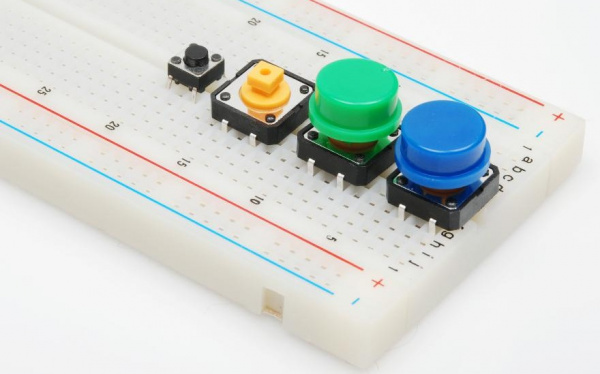
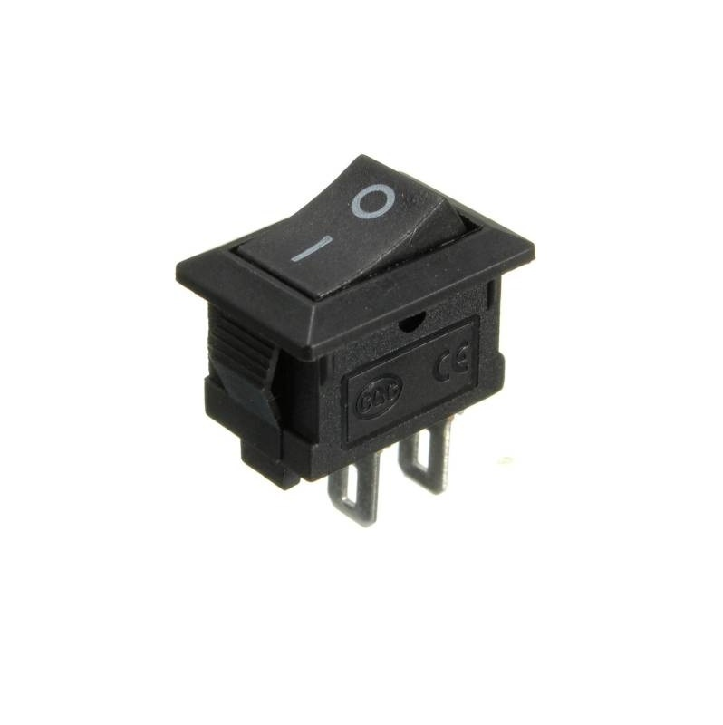
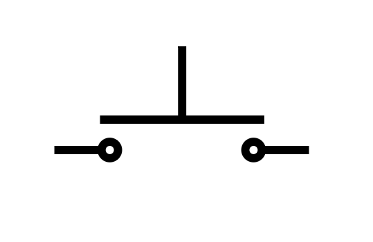
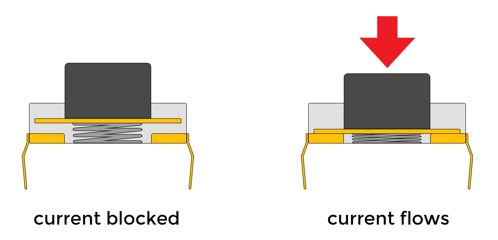
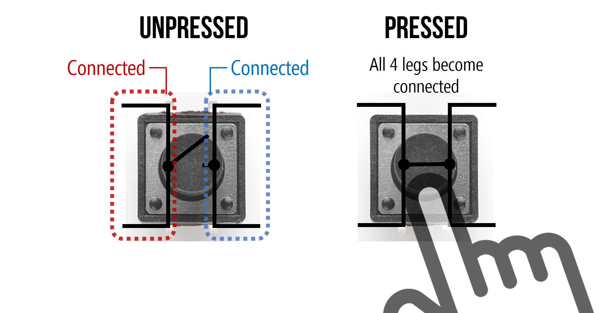
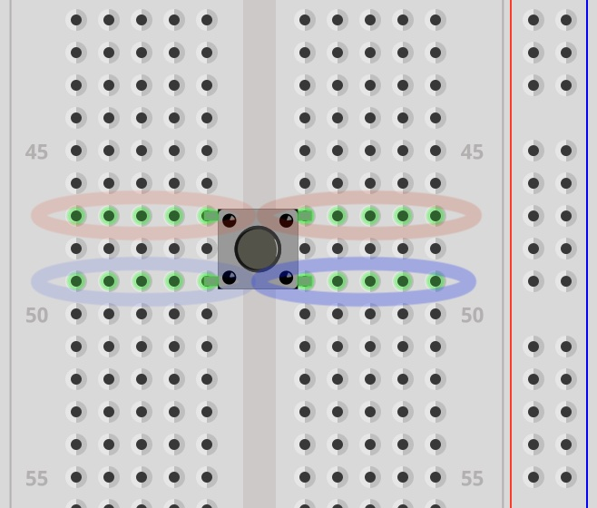

# Button

## How does a switch or button work?

The button is just a simple way of completing or breaking a circuit with the simple act of "pushing" or "pressing" a button.

A switch is a way toggling one of two states.

Toggle buttons also exist.

You could just manually join or unjoin two bare wires together with your hands to do this, but a button is a convenient way to interface (interact) with a circuit.

Often electronics kits come with a cheap tactile button that looks like this:

</img>

But it can take many forms and sizes.

</img>

<iframe width="100%" height="400" src="https://www.youtube.com/embed/DMy6fn-m9IQ?si=StYh7fPUy1V23g-7&amp;controls=0" title="YouTube video player" frameborder="0" allow="accelerometer; autoplay; clipboard-write; encrypted-media; gyroscope; picture-in-picture; web-share" referrerpolicy="strict-origin-when-cross-origin" allowfullscreen></iframe>
And a case that would cover the look of those buttons:

</img>

---

## Pinout

### Switches

First it might help to explain that a button is essentially a push **switch**.

The schematic symbol for a generic switch is intuitive. It represents a wire that is either broken or not broken. 

The following shows a switch symbol that shows that it is **open**. Current _CANNOT_ pass through the wire.

</img>

This symbol shows the switch **closed**, meaning that the circuit is not broken. Current _CAN_ pass through the wire.

</img>

This is how an On-Off switch works. It is a **toggle** switch.

</img>

### Toggle vs. Push

Try interacting with the switch in this simulation showing a simple led-resistor circuit with a generic switch. (You may need to click the "RUN / Stop" button)

<iframe style="padding-top:25px;" id="circuitFrame" src="../../../CircuitJS/circuitjs.html?ctz=CQAgjCAMB0l3BWcMBMcUHYMGZIA4UA2ATmIxAUgoqoQFMBaMMAKADcRsEUQAWOTtxBo8UMf2pUp0BCwDOgniIoZCw-GKoAzAIYAbOXRZhCPBKvWjza-lR4ATOroCuegC4M9de+E1RYrABOKjYCXDy2YmDwLEA" width="800" height="550" uk-responsive></iframe>

The next simulation is using a push switch instead (push button). Notice the difference.

<iframe style="padding-top:25px;" id="circuitFrame" src="../../../CircuitJS/circuitjs.html?ctz=CQAgjCAMB0l3BWcMBMcUHYMGZIA4UA2ATmIxAUgoqoQFMBaMMAKADcRsEUQAWOTtxBo8UMf2pUp0BCzCEeCDIWH4KyvgJ4ATOgDMAhgFcANgBcGJutvBjpkVgCd1K-lS483YsPBYBnQR4RF1VRKggzRyM6FiA
" width="800" height="550" uk-responsive></iframe>

As you can see, the circuit is complete ONLY so long as the button is pressed. It is a **momentary** switch.

The schematic symbol for a push button looks a bit different but makes sense when you think about it.

</img>

The two wires on the left and right are connected when the plate above them is pushed down.

</img>

### The button legs

The button has 4 pins which makes this a bit confusing. It's still a single switch, but both sides of the 'wire' are accessible through a pair of legs instead of one.

</img>

<i>illustration from makeabilitylab showing the internally connected legs</i>

Below is a screenshot in Fritzing to show that the pins in red are connected whether the button is pressed or not. Same with the blue pins. They are **internally connected**.

</img>

This means that when you press the button, the red and blue pins are connected together. It might seem hard to orient the button to know which pins are internally connected. If you extend the legs as if the button was a squished bug on a flat surface, the legs point away from the button. The legs that follow the same line are internally connected. It should also look like an 'H' or part of a railroad track.

The makeability blog post on [buttons](https://makeabilitylab.github.io/physcomp/arduino/buttons.html) is pretty good in explaining this.

Also look at sparkfun electronics post: [link](https://learn.sparkfun.com/tutorials/button-and-switch-basics/all)

---

