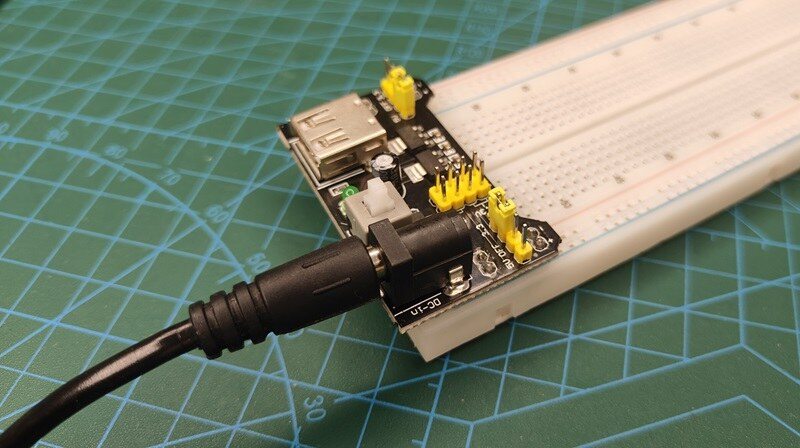
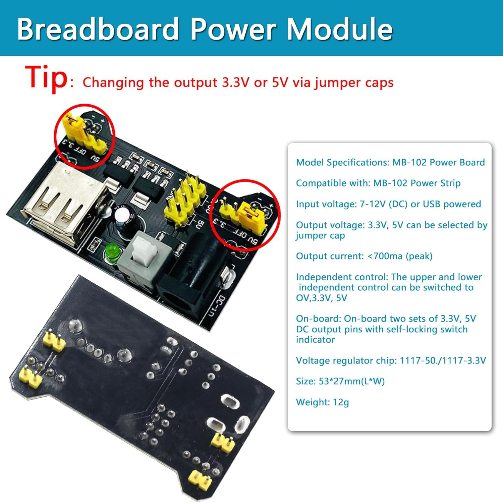
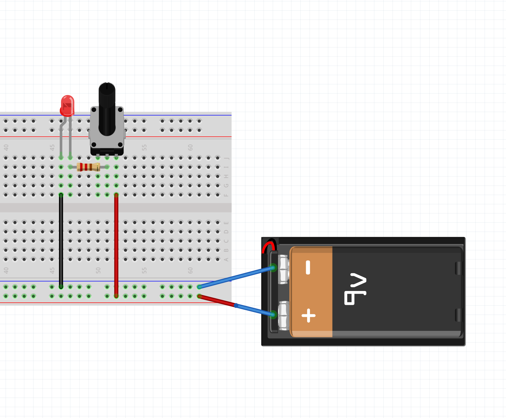
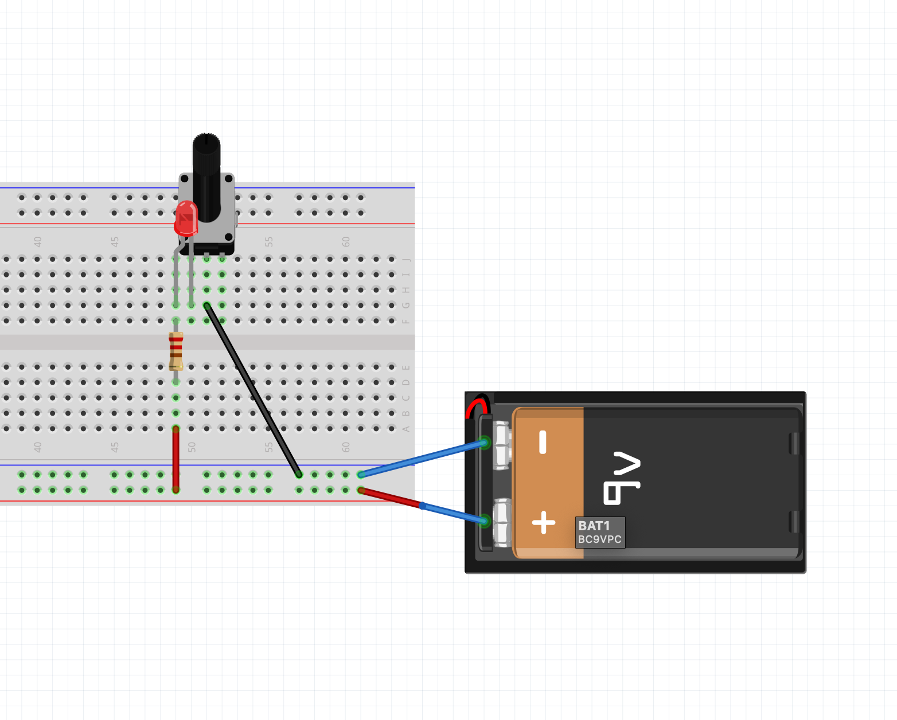
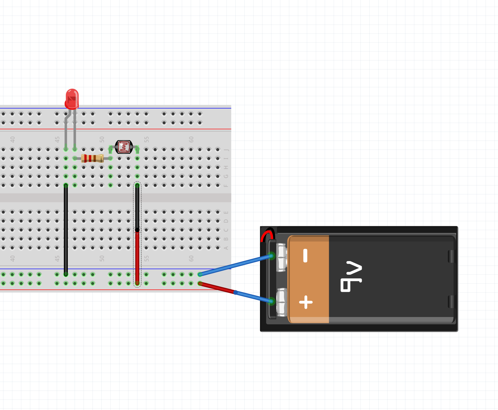

# Breadboard Circuits Workshop

## Summary

This is our first time building on a **breadboard**, so we can put circuits together without soldering. We'll get to know the parts in our new electronics kit, power the breadboard, and build three quick circuits: an LED dimmed by a **potentiometer**, an LED controlled by a **light sensor**, and a **buzzer** with a volume knob.

The potentiometer and the light sensor are both **variable resistors**: parts whose resistance changes, which changes how much current flows. In the next workshop, the [DIY Pressure Sensor](../Velostat_Workshop/velostat_workshop.html), we'll make our own variable resistor out of Velostat and drop it into the same circuit.

### Steps

[We will go over the steps together as a class].

1. Get to know the breadboard.
2. Power the breadboard with the 9V adapter and the power supply module.
3. Dim an LED with a **potentiometer**.
4. Control an LED with light using a **photoresistor** (light sensor).
5. Make sound with a **buzzer**, and use the potentiometer as a volume knob.

## Tools & Materials

From your **electronics kit**:

- **830-point breadboard**
- **Breadboard power supply module** (the small board with the barrel jack, USB port and on/off button)
- **9V 1A power adapter** (plugs into the wall and into the power module)
- **LED** (any color)
- **220Ω resistor** (bands: red, red, brown)
- **Potentiometer** (the small blue knob)
- **Photoresistor** (the small disc with a squiggly line on top)
- **Active buzzer** (the small black cylinder with a sticker on top)
- **Jumper wires**

## Part 1: The Breadboard

A breadboard lets you connect components by pushing their legs into holes. Underneath the holes are metal strips that connect certain holes together.

- **Terminal strips (the middle):** each short row of 5 holes is connected. The rows on either side of the center gap are **not** connected to each other.
- **Power rails (the long edges):** each long line marked **+** (red) or **–** (blue) is connected along the whole side of the board. We'll put power on **+** and ground on **–**.
- On some 830-point boards the power rails are split in the middle. If the lines on the edge have a gap halfway down, the two halves are **not** connected. Bridge the gap with a jumper wire if you need both halves.

Two components are connected when their legs are in the **same row** (or the same rail).

The Makeability Lab has a good visual guide: [Breadboards](https://makeabilitylab.github.io/physcomp/electronics/breadboards.html).

## Part 2: Powering the Breadboard

The power supply module takes the 9V from the adapter and turns it into a steadier **5V** or **3.3V** for the breadboard.

1. **Check the voltage jumpers.** The module has a small jumper cap on each side that selects the voltage for that side's rail. Set **both** to **5V**. Look at the red circles in the image below.

1. **Plug the module into one end of the breadboard** so its pins go into the power rails. Line up the module's **+** and **–** markings with the red **+** and blue **–** rails. Getting this backwards can damage components.
2. **Plug the 9V adapter** into the module's barrel jack (like in the photo at the top of this page), then into the wall. Only use one power source at a time: the adapter **or** USB, not both.

3. **Press the module's power button.** Its small LED should light up.
4. **Turn the power off** (press the button again) whenever you're changing wires.

## Part 3: Potentiometer Dimmer

A **potentiometer** ("pot") is a resistor you can adjust with a knob. It has three legs: the two outer legs are the ends of a resistor, and the **middle leg** (the wiper) slides along it as you turn the knob. Using the middle leg and one outer leg gives you a resistance that changes as you turn.

<video src="https://makeabilitylab.github.io/physcomp/electronics/assets/videos/Potentiometer_Overview_ByJonFroehlich.mp4" width="100%" controls></video>

---

**5V (+)** → **potentiometer** → **220Ω resistor** → **LED** → **GND (–)**

<svg viewBox="0 -10 510 200" xmlns="http://www.w3.org/2000/svg" role="img" aria-label="Series circuit: 5 volts, potentiometer, 220 ohm resistor, LED, ground" style="max-width:510px;width:100%;height:auto;font-family:Inter,sans-serif;font-size:13px">
  <g fill="none" stroke="#2c3f89" stroke-width="3" stroke-linejoin="round">
    <path d="M40 40 H100" />
    <path d="M190 40 H230" />
    <path d="M320 40 H360" />
    <path d="M450 40 H490 V150 H40 V40" />
    <path d="M100 40 h7 l8 -12 l12 24 l12 -24 l12 24 l12 -24 l12 24 l8 -12 h7" />
    <path d="M120 62 L172 16 m-12 1 l12 -1 l-1 12" stroke-width="2" />
    <path d="M230 40 h7 l8 -12 l12 24 l12 -24 l12 24 l12 -24 l12 24 l8 -12 h7" />
    <path d="M360 40 h27 M387 22 V58 L423 40 Z" fill="#f3c95b" />
    <path d="M423 22 V58 M423 40 h27" />
    <path d="M402 14 l10 -10 M412 18 l10 -10" stroke-width="2" />
  </g>
  <circle cx="40" cy="40" r="5" fill="#c0392b" />
  <circle cx="40" cy="150" r="5" fill="#2c3f89" />
  <text x="30" y="20" fill="#c0392b" font-weight="700">5V (+)</text>
  <text x="30" y="175" fill="#2c3f89" font-weight="700">GND (–)</text>
  <text x="145" y="80" text-anchor="middle">potentiometer</text>
  <text x="275" y="80" text-anchor="middle">220Ω resistor</text>
  <text x="405" y="80" text-anchor="middle">LED</text>
  <text x="405" y="95" text-anchor="middle" fill="#666">(long leg on the left)</text>
</svg>

Another way of wiring it (There are many right answers):

With the **power off**:

1. **Place the LED** across two rows. The **long leg (+)** points toward power, the **short leg (–)** toward ground.
2. **Connect the LED's short leg to the – rail** with a jumper wire.
3. **Put the 220Ω resistor** so one leg shares a row with the LED's long leg and the other leg is in a new row.
4. **Place the potentiometer** so each of its three legs is in its own row.
5. **Connect the pot's middle leg** to the resistor's free row with a jumper wire.
6. **Connect one of the pot's outer legs** to the + rail. Leave the other outer leg unconnected.
7. **Turn the power on and turn the knob.** The LED should fade from bright to dim.

**Why the resistor?** At one end of the knob, the pot's resistance is close to 0Ω. The 220Ω resistor makes sure there's always enough resistance in the loop to protect the LED. Keep it in every LED circuit.

## Part 4: Light Sensor

A **photoresistor** (also called a light-dependent resistor, or LDR) changes its resistance with light. **More light = less resistance**, so more current flows and the LED gets brighter. It has no polarity, so either leg can go either way.

**5V (+)** → **photoresistor** → **220Ω resistor** → **LED** → **GND (–)**

<svg viewBox="0 -10 510 200" xmlns="http://www.w3.org/2000/svg" role="img" aria-label="Series circuit: 5 volts, photoresistor, 220 ohm resistor, LED, ground" style="max-width:510px;width:100%;height:auto;font-family:Inter,sans-serif;font-size:13px">
  <g fill="none" stroke="#2c3f89" stroke-width="3" stroke-linejoin="round">
    <path d="M40 40 H100" />
    <path d="M190 40 H230" />
    <path d="M320 40 H360" />
    <path d="M450 40 H490 V150 H40 V40" />
    <circle cx="145" cy="40" r="30" stroke-width="2" />
    <path d="M100 40 h7 l8 -12 l12 24 l12 -24 l12 24 l12 -24 l12 24 l8 -12 h7" />
    <path d="M118 -2 l12 14 m-9 0 l9 0 l0 -9 M134 -6 l12 14 m-9 0 l9 0 l0 -9" stroke-width="2" />
    <path d="M230 40 h7 l8 -12 l12 24 l12 -24 l12 24 l12 -24 l12 24 l8 -12 h7" />
    <path d="M360 40 h27 M387 22 V58 L423 40 Z" fill="#f3c95b" />
    <path d="M423 22 V58 M423 40 h27" />
    <path d="M402 14 l10 -10 M412 18 l10 -10" stroke-width="2" />
  </g>
  <circle cx="40" cy="40" r="5" fill="#c0392b" />
  <circle cx="40" cy="150" r="5" fill="#2c3f89" />
  <text x="30" y="20" fill="#c0392b" font-weight="700">5V (+)</text>
  <text x="30" y="175" fill="#2c3f89" font-weight="700">GND (–)</text>
  <text x="145" y="88" text-anchor="middle">photoresistor</text>
  <text x="275" y="80" text-anchor="middle">220Ω resistor</text>
  <text x="405" y="80" text-anchor="middle">LED</text>
  <text x="405" y="95" text-anchor="middle" fill="#666">(long leg on the left)</text>
</svg>

This is the same circuit as Part 3, with the photoresistor in place of the potentiometer:

1. **Turn the power off.**
2. **Remove the potentiometer.**
3. **Place the photoresistor** so its two legs are in two different rows.
4. **Connect one leg to the + rail** and the **other leg to the resistor's free row**.
5. **Turn the power on.** Cover the photoresistor with your hand, then shine your phone's flashlight on it. The LED should go from dim or off to bright.

In normal room light the LED may only glow faintly. That's expected: the photoresistor still has a fairly high resistance until you shine a bright light on it.

## Part 5: Buzzer

The **active buzzer** in your kit makes a beep on its own whenever it gets power. No extra parts are needed to make a sound. It **does** have polarity: the **longer leg** (or the leg marked **+** on top) goes toward power.

**Make sure you have the active buzzer.** It has a sticker on top and a sealed black bottom. If your kit also has a buzzer with a green circuit board visible underneath, that's a *passive* buzzer. It needs a changing signal to make a tone, so on its own it will only click. We'll use it with Arduino later.

First, just make it beep:

1. **Turn the power off** and clear your LED circuit.
2. **Place the buzzer** so its two legs are in two different rows.
3. **Connect the buzzer's + (long) leg to the + rail** and its **other leg to the – rail**.
4. **Turn the power on.** It should beep continuously. (It's loud! Turn it off when you're done.)

Now add the potentiometer as a **volume knob**:

**5V (+)** → **potentiometer** → **buzzer** → **GND (–)**

<svg viewBox="0 -10 380 200" xmlns="http://www.w3.org/2000/svg" role="img" aria-label="Series circuit: 5 volts, potentiometer, active buzzer, ground" style="max-width:380px;width:100%;height:auto;font-family:Inter,sans-serif;font-size:13px">
  <g fill="none" stroke="#2c3f89" stroke-width="3" stroke-linejoin="round">
    <path d="M40 40 H100" />
    <path d="M190 40 H230" />
    <path d="M320 40 H360 V150 H40 V40" />
    <path d="M100 40 h7 l8 -12 l12 24 l12 -24 l12 24 l12 -24 l12 24 l8 -12 h7" />
    <path d="M120 62 L172 16 m-12 1 l12 -1 l-1 12" stroke-width="2" />
    <rect x="245" y="18" width="60" height="44" rx="22" fill="#222" stroke="#222" />
    <path d="M230 40 h15 M305 40 h15" />
  </g>
  <circle cx="40" cy="40" r="5" fill="#c0392b" />
  <circle cx="40" cy="150" r="5" fill="#2c3f89" />
  <text x="30" y="20" fill="#c0392b" font-weight="700">5V (+)</text>
  <text x="30" y="175" fill="#2c3f89" font-weight="700">GND (–)</text>
  <text x="145" y="80" text-anchor="middle">potentiometer</text>
  <text x="275" y="45" fill="#fff" text-anchor="middle" font-weight="700">BUZZER</text>
  <text x="252" y="14" fill="#c0392b" font-weight="700">+</text>
  <text x="275" y="80" text-anchor="middle">active buzzer</text>
  <text x="275" y="95" text-anchor="middle" fill="#666">(+ leg on the left)</text>
</svg>

1. **Turn the power off.**
2. **Remove the jumper from the + rail to the buzzer's + leg.**
3. **Place the potentiometer** with each leg in its own row.
4. **Connect the pot's middle leg** to the buzzer's + leg row.
5. **Connect one of the pot's outer legs** to the + rail.
6. **Turn the power on and turn the knob.** The buzzer should get quieter, and eventually stop, as the resistance goes up.

The buzzer is rated for 5V, so it doesn't need the 220Ω resistor.

**Try it:** swap the potentiometer for the photoresistor. Can you make a buzzer that only sounds when a light shines on it?

## Troubleshooting

- **Nothing lights up.**
  - Is the power module on, with its LED lit?
  - Is the LED backwards? Flip it around.
  - Are the LED, resistor and wires actually in the same rows? Follow the loop from + to – with your finger.
  - Are the power rails split in the middle of the board? Bridge them with a jumper.
- **Turning the potentiometer does nothing.** You're probably using the two outer legs. One of your connections needs to be the **middle leg**.
- **The LED barely changes with the light sensor.** Shine a phone flashlight right onto it, and cover it fully with your hand to compare.
- **The buzzer only clicks, or makes no sound.** Check that it's the **active** buzzer (sticker on top, sealed bottom) and that its + leg is toward power.

## Next

Continue with the [DIY Pressure Sensor Workshop](../Velostat_Workshop/velostat_workshop.html), where you'll build a pressure sensor out of Velostat and use it in these same circuits.

## Additional Resources

- <a href="https://makeabilitylab.github.io/physcomp/electronics/breadboards.html" target="_blank">Makeability Lab - Breadboards</a>
- <a href="https://makeabilitylab.github.io/physcomp/electronics/variable-resistors.html" target="_blank">Makeability Lab - Variable Resistors</a>
