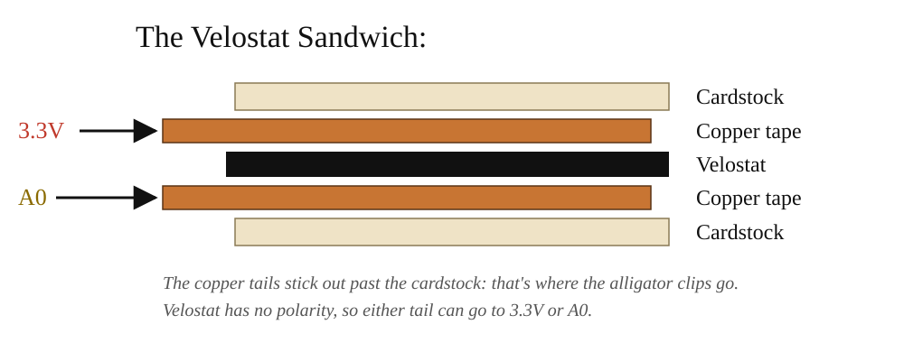
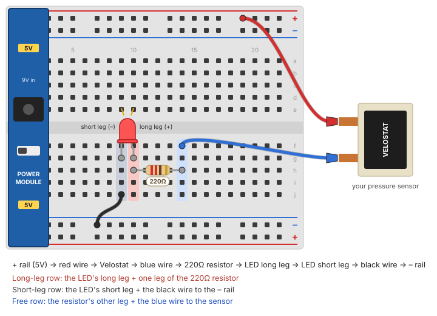

# DIY Pressure Sensor Workshop

](images/cover.jpg)

## Summary

Today we're making our own **pressure sensor** out of Velostat, a thin black plastic that conducts electricity. The harder you press on it, the better it conducts. We'll use it to control the brightness of an LED: press lightly and the LED glows faintly, press hard and it gets bright. Then we'll turn it into a **voltage divider**, the circuit an Arduino uses to read sensors like this one.

This workshop builds on the [Breadboard Circuits Workshop](../Breadboard_Circuits/breadboard_circuits.html): the Velostat is a **variable resistor**, just like the potentiometer and the light sensor, so it drops right into the same circuit.

### Steps

[We will go over the steps together as a class].

1. Build the Velostat sensor.
2. Wire the Velostat sensor, a resistor and an LED together, then press!
3. Turn the sensor into a **voltage divider** and measure it with a multimeter.
4. Wire the sensor to your own Arduino and see it on the projector with everyone else's.

## How Velostat Works

Velostat is plastic filled with tiny carbon particles. When it's resting, the particles are spread apart, so electricity has a hard time getting through. It has a **high resistance**. When you press on it, the particles get squeezed closer together and more paths open up for current, so the **resistance drops**.

That makes it a **variable resistor**, like the potentiometer in your kit, except you control it by squeezing instead of turning a knob.

| | Resting | Pressed |
|---|---|---|
| Carbon particles | Spread apart | Squeezed together |
| Resistance | High | Low |
| Current through the LED | Very little | More |
| LED | Dim / off | Bright |

Because it's a flexible sheet, you can cut it to any shape and hide it inside soft objects, clothing, shoes, cushions or your own sculptures. That's why it shows up so often in e-textiles and wearables.

## Tools & Materials

From your **electronics kit**:

- **Breadboard**, **power supply module** and **9V adapter**, set up as in the [Breadboard Circuits Workshop](../Breadboard_Circuits/breadboard_circuits.html#part-2-powering-the-breadboard)
- **LED** (any color)
- **220Ω resistor** (bands: red, red, brown)
- **10kΩ resistor** (bands: brown, black, orange)
- **Jumper wires**
- **Alligator clips**

Provided by the lab:

- **Velostat** sheet
- **Copper tape** or aluminum foil
- **Cardstock or thin cardboard**
- **Masking tape**
- **Multimeter** (for testing your sensor, and for Part 3)

## Part 1: Build the Velostat Sensor

The sensor is a sandwich: a piece of Velostat between two conductive layers, each with a wire coming off it.



1. **Cut two squares of cardstock**, about 2" × 2" (5cm × 5cm).
2. **Stick a strip of copper tape onto each square.** Leave an extra 1" tail hanging off the edge. That tail is where you'll clip your wire.
3. **Cut a square of Velostat** slightly **bigger** than the copper area. It should fully cover the copper so the two copper strips can never touch each other directly.
4. **Stack them:** cardstock + copper (facing up), Velostat, then copper (facing down) + cardstock. Line the copper strips up in an X or directly on top of each other.
5. **Tape the edges closed** with masking tape so the layers stay lined up.
6. **Clip an alligator clip to each copper tail.** Those are your two sensor leads. It doesn't matter which is which: Velostat has no polarity.

**Optional test:** set a multimeter to resistance (Ω) and touch the probes to the two copper tails. Watch the number drop as you press. If it reads close to 0Ω without pressing, the copper layers are touching; add more Velostat.

## Part 2: The Velostat Circuit

This is the same circuit as the potentiometer and light sensor circuits from the [Breadboard Circuits Workshop](../Breadboard_Circuits/breadboard_circuits.html). Everything goes in **one loop** (a series circuit) from **+** to **–**, with the Velostat sensor as the variable resistor:

**5V (+)** → **Velostat sensor** → **220Ω resistor** → **LED** → **GND (–)**

<svg viewBox="0 -10 510 200" xmlns="http://www.w3.org/2000/svg" role="img" aria-label="Series circuit: 5 volts, Velostat sensor, 220 ohm resistor, LED, ground" style="max-width:510px;width:100%;height:auto;font-family:Inter,sans-serif;font-size:13px">
  <g fill="none" stroke="#2c3f89" stroke-width="3" stroke-linejoin="round">
    <path d="M40 40 H100" />
    <path d="M190 40 H230" />
    <path d="M320 40 H360" />
    <path d="M450 40 H490 V150 H40 V40" />
    <rect x="100" y="22" width="90" height="36" rx="4" fill="#222" stroke="#222" />
    <path d="M230 40 h7 l8 -12 l12 24 l12 -24 l12 24 l12 -24 l12 24 l8 -12 h7" />
    <path d="M360 40 h27 M387 22 V58 L423 40 Z" fill="#f3c95b" />
    <path d="M423 22 V58 M423 40 h27" />
    <path d="M402 14 l10 -10 M412 18 l10 -10" stroke-width="2" />
  </g>
  <circle cx="40" cy="40" r="5" fill="#c0392b" />
  <circle cx="40" cy="150" r="5" fill="#2c3f89" />
  <text x="30" y="20" fill="#c0392b" font-weight="700">5V (+)</text>
  <text x="30" y="175" fill="#2c3f89" font-weight="700">GND (–)</text>
  <text x="145" y="45" fill="#fff" text-anchor="middle" font-weight="700">VELOSTAT</text>
  <text x="145" y="80" text-anchor="middle">pressure sensor</text>
  <text x="275" y="80" text-anchor="middle">220Ω resistor</text>
  <text x="405" y="80" text-anchor="middle">LED</text>
  <text x="405" y="95" text-anchor="middle" fill="#666">(long leg on the left)</text>
</svg>

<a href="images/led_breadboard.svg" target="_blank" title="Open the drawing full size"></a>

*Click the drawing to open it full size.*

With the **power off**:

1. **Place the LED** across two rows on the breadboard. Remember which leg is longer: the **long leg (+, anode)** points toward power, the **short leg (–, cathode)** toward ground.
2. **Connect the LED's short leg to the – rail** with a jumper wire.
3. **Put the 220Ω resistor** so one leg shares a row with the LED's long leg, and the other leg is in a new, empty row.
4. **Clip one sensor lead** to a jumper wire in the + rail.
5. **Clip the other sensor lead** to a jumper wire in the resistor's free row.
6. **Turn the power on and press the sensor.** The LED should get brighter the harder you press.

**Why the resistor?** When you squeeze the Velostat hard, its resistance can get very low. The 220Ω resistor makes sure there's always enough resistance in the loop to keep the LED from burning out.

## Part 3: The Velostat as a Voltage Divider

So far the Velostat has changed how much **current** flows, which is why the LED got brighter. Soon an Arduino will read the sensor, but an Arduino can't measure resistance or current directly. It can only measure **voltage**. A **voltage divider** turns a changing resistance into a changing voltage.

A voltage divider is just **two resistors in a row** between + and –. The 5V gets shared between them, and the point in the middle (**V<sub>out</sub>**) sits somewhere between 0V and 5V, depending on how big each resistor is compared to the other:

- **Velostat resting** (high resistance): it takes most of the 5V, so V<sub>out</sub> is **low**.
- **Velostat pressed** (low resistance): the 10kΩ resistor takes most of it, so V<sub>out</sub> **rises toward 5V**.

You already used one: a **potentiometer's three legs** are a voltage divider, with the middle leg as V<sub>out</sub>. Turning the knob changes how the 5V is shared.

**5V (+)** → **Velostat** → **V<sub>out</sub>** → **10kΩ resistor** → **GND (–)**

<svg viewBox="0 0 360 330" xmlns="http://www.w3.org/2000/svg" role="img" aria-label="Voltage divider: 5 volts, Velostat sensor, the output point, a 10 kilohm resistor, ground. A multimeter measures between the output point and ground." style="max-width:360px;width:100%;height:auto;font-family:Inter,sans-serif;font-size:13px">
  <g fill="none" stroke="#2c3f89" stroke-width="3" stroke-linejoin="round">
    <path d="M110 30 V60" />
    <rect x="90" y="60" width="40" height="80" rx="4" fill="#222" stroke="#222" />
    <path d="M110 140 V170 M110 170 V200" />
    <path d="M110 200 l-12 6 l24 10 l-24 10 l24 10 l-24 10 l24 10 l-24 10 l12 6" />
    <path d="M110 272 V300" />
    <path d="M110 170 H230" />
    <path d="M230 170 V190 M230 260 V300 H110" stroke-dasharray="6 5" />
    <rect x="200" y="190" width="60" height="70" rx="8" stroke="#2c3f89" fill="#fff" />
  </g>
  <circle cx="110" cy="30" r="5" fill="#c0392b" />
  <circle cx="110" cy="300" r="5" fill="#2c3f89" />
  <circle cx="110" cy="170" r="6" fill="#f3c95b" stroke="#2c3f89" stroke-width="2" />
  <text x="125" y="34" fill="#c0392b" font-weight="700">5V (+)</text>
  <text x="125" y="318" fill="#2c3f89" font-weight="700">GND (–)</text>
  <text x="110" y="104" fill="#fff" text-anchor="middle" font-weight="700" transform="rotate(-90 110 104)">VELOSTAT</text>
  <text x="80" y="240" text-anchor="end">10kΩ</text>
  <text x="80" y="175" text-anchor="end" font-weight="700">V<tspan font-size="10" dy="3">out</tspan></text>
  <text x="230" y="222" text-anchor="middle" font-weight="700">V</text>
  <text x="230" y="240" text-anchor="middle" font-size="11">meter</text>
  <text x="240" y="160" font-size="12" fill="#666">(later: Arduino A0)</text>
</svg>

With the **power off**:

1. **Place the 10kΩ resistor** so one leg is in the – rail and the other is in an empty row. That row is **V<sub>out</sub>**.
2. **Clip one sensor lead** to a jumper wire in the + rail.
3. **Clip the other sensor lead** to a jumper wire in the V<sub>out</sub> row.
4. **Set the multimeter to DC volts** (V with a straight line, the 20V range if it has ranges).
5. **Turn the power on.** Touch the **red probe** to the V<sub>out</sub> row and the **black probe** to the – rail.
6. **Press the sensor** and watch the number climb. Write down the reading with no pressure, a light press and a hard press.

**Try it:** swap the 10kΩ resistor for the 220Ω one. Does the range of readings get bigger or smaller? The fixed resistor should be roughly as big as the Velostat's resistance, so the voltage swings as much as possible.

On Wednesday, instead of the multimeter's red probe, a wire will go from V<sub>out</sub> to the Arduino's **A0** pin, and `analogRead()` will turn the voltage into a number from 0 to 1023.

## Part 4: Your Own Arduino on the Class Grid

Now your own Arduino Nano 33 IoT reads your sensor and sends it over **Wi-Fi** to the projector, where it gets its own tile. Everyone uploads the same sketch, so all you change is the Wi-Fi name and password.

### 1. Wire it

This is the voltage divider from Part 3, with the Arduino reading V<sub>out</sub>:

**3.3V** → **Velostat** → **A0** → **10kΩ resistor** → **GND**

<a href="images/nano_breadboard.svg" target="_blank" title="Open the drawing full size"></a>

*Click the drawing to open it full size.*

The circuit gets **three rows of its own**, one for each point in the voltage divider: a **3.3V row**, an **A0 row** (V<sub>out</sub>) and a **GND row**. Everything in the same row is connected, so each wire only has to reach the right row. (The row numbers in the drawing are just an example: any three empty rows to the right of the Nano work.)

With the **USB cable unplugged**:

1. **Take the power module off** your breadboard. The Arduino powers this circuit, so the + and – rails aren't used.
2. **Place the Nano across the middle gap** of the breadboard, USB end facing out so the cable reaches. Push it in evenly until the pins are all the way down.
3. **Pick three empty rows** to the right of the Nano, with a space between each: these are your **GND row**, **A0 row** and **3.3V row**.
4. **10kΩ resistor: GND row ↔ A0 row.** Put one leg in each.
5. **Black wire: GND pin → GND row.** The **GND** pin is on the same side as 3.3V and A0, second from the far end (next to VIN). Plug the wire into a free hole in the GND pin's row and run it to the GND row.
6. **Yellow wire: A0 pin → A0 row.** **A0** is the fourth pin from the USB end.
7. **Red wire: 3.3V pin → 3.3V row.** **3.3V** is the second pin from the USB end.
8. **Sensor: A0 row and 3.3V row.** Put a wire in each row and clip one to each copper tail of your sensor. It doesn't matter which tail goes where.

The pin names are printed on the Nano next to each pin, so check them as you go. **Don't** use the 5V or VUSB pin: the Nano 33 IoT's pins only take **3.3V**.

### 2. Install the Wi-Fi library (once)

In the Arduino IDE, open the **Library Manager** (the books icon on the left, or **Tools** > **Manage Libraries...**), search for **WiFiNINA** and click **Install**.

### 3. Upload the sketch

1. Make a new sketch (**File** > **New Sketch**), delete everything in it, and paste in the whole sketch below.
2. Change `ROUTER_NAME` and `ROUTER_PASSWORD` to the Wi-Fi name and password on the board. Keep the quotes.
3. Choose **Tools** > **Board** > **Arduino SAMD Boards** > **Arduino Nano 33 IoT**, and your board's **Port**.
4. Click **Upload**.

The board's built-in LED blinks while it joins the Wi-Fi and stays on once it's connected.

<a href="station/class_sensor/class_sensor.ino" download>Download class_sensor.ino</a>

```arduino
/*
  Class Sensor (ART 150, DIY Pressure Sensor Workshop)

  Every student uploads this same sketch to their own Arduino Nano 33 IoT.
  It reads one Velostat sensor wired as the top half of a voltage divider:

      3.3V -> Velostat sensor -> A0 -> 10k resistor -> GND

  and sends the reading over Wi-Fi to the teacher's laptop, where it shows
  up as your own tile on the Class Sensor Grid. Pressing the sensor raises
  the number (0-1023).

  The only lines to change are the Wi-Fi name and password just below.

  You can watch your readings in the Serial Monitor or Serial Plotter
  (115200 baud) too, even if the Wi-Fi doesn't connect. Lines starting
  with "#" tell you what the Wi-Fi is doing, including your board's ID.

  The built-in LED blinks while joining the Wi-Fi and stays on once
  connected.

  How it works: every board has a unique hardware address (its MAC
  address), so the last six characters of it become this board's ID and
  nobody has to pick a number. Readings go out as lines like "B3F9A21,412"
  over UDP. The laptop's relay.py announces itself on the network once a
  second; the board sends straight to it once it hears that, and to the
  whole network until then.
*/

#include <SPI.h>
#include <WiFiNINA.h>
#include <WiFiUdp.h>

// ---- change these two lines to the classroom router's 2.4 GHz network ----
const char WIFI_NAME[] = "ROUTER_NAME";
const char WIFI_PASSWORD[] = "ROUTER_PASSWORD";

const int SENSOR_PIN = A0;
const unsigned int UDP_PORT = 9000;     // relay.py listens here
const unsigned int BEACON_PORT = 9001;  // relay.py announces itself here
const unsigned long SEND_EVERY = 66;    // ms: about 15 readings a second

// light smoothing so readings don't jitter (0 = none, closer to 1 = smoother)
const float SMOOTHING = 0.6;
float smoothed;

char boardId[7];  // e.g. "3F9A21"
WiFiUDP udp;
IPAddress broadcastIP;
IPAddress relayIP;             // learned from the relay's announcements
unsigned long lastBeacon = 0;  // when we last heard one
bool relayKnown = false;
unsigned long lastWifiTry = 0;
bool wifiReady = false;

void setup() {
  Serial.begin(115200);
  pinMode(LED_BUILTIN, OUTPUT);
  analogReadResolution(10);  // 0-1023, like an Uno
  smoothed = analogRead(SENSOR_PIN);

  if (WiFi.status() == WL_NO_MODULE) {
    Serial.println("# wifi: no Wi-Fi module found");
    strcpy(boardId, "000000");
    return;
  }
  // the MAC address comes back last byte first: mac[0] is the end of it
  byte mac[6];
  WiFi.macAddress(mac);
  snprintf(boardId, sizeof(boardId), "%02X%02X%02X", mac[2], mac[1], mac[0]);
  printId();

  // an out-of-date Wi-Fi chip makes joining slow or flaky; say so at startup
  String fw = WiFi.firmwareVersion();
  if (fw < WIFI_FIRMWARE_LATEST_VERSION) {
    Serial.print("# wifi: chip firmware ");
    Serial.print(fw);
    Serial.print(" is out of date (Arduino IDE > Tools > Firmware Updater)");
    Serial.println();
  }
  connectWifi();
}

void printId() {
  Serial.print("# board ID: ");
  Serial.println(boardId);
}

// Join the network. Even when WiFi.begin() reports a failure, the Wi-Fi chip
// keeps trying on its own, and on a weak signal that can take 20+ seconds.
// Calling begin() again restarts that attempt from scratch, so we leave it
// 30 seconds between tries (and keep printing readings meanwhile).
void connectWifi() {
  lastWifiTry = millis();
  if (WiFi.status() == WL_NO_MODULE) return;
  Serial.print("# wifi: joining \"");
  Serial.print(WIFI_NAME);
  Serial.println("\"...");
  digitalWrite(LED_BUILTIN, HIGH);
  int status = WiFi.begin(WIFI_NAME, WIFI_PASSWORD);
  digitalWrite(LED_BUILTIN, LOW);
  if (status == WL_CONNECTED) startSending();
  else {
    Serial.print("# wifi: could not join \"");
    Serial.print(WIFI_NAME);
    Serial.println("\" yet. Check the name and password; trying again in 30 s");
  }
}

// Once on the network (whether our WiFi.begin() did it or the Wi-Fi chip
// reconnected by itself), work out where to send and open the socket.
void startSending() {
  // send to the whole network (e.g. 192.168.1.255) until the relay is found
  IPAddress ip = WiFi.localIP();
  IPAddress mask = WiFi.subnetMask();
  for (int i = 0; i < 4; i++) {
    broadcastIP[i] = ip[i] | (~mask[i] & 0xFF);
  }
  WiFi.noLowPowerMode();  // keep the radio awake: steadier, faster sends
  udp.begin(BEACON_PORT);  // listen for the relay; we send to UDP_PORT
  wifiReady = true;
  Serial.print("# wifi: joined, address ");
  Serial.println(ip);
  printId();
}

// The relay sends "RELAY" to BEACON_PORT once a second.
void listenForRelay() {
  while (udp.parsePacket() > 0) {
    char buf[8] = { 0 };
    udp.read(buf, sizeof(buf) - 1);
    if (strncmp(buf, "RELAY", 5) == 0) {
      if (!relayKnown || udp.remoteIP() != relayIP) {
        Serial.print("# wifi: found the class grid at ");
        Serial.println(udp.remoteIP());
      }
      relayIP = udp.remoteIP();
      relayKnown = true;
      lastBeacon = millis();
    }
  }
}

void send(const char *msg, int len) {
  // straight to the laptop if we've heard it lately, otherwise everyone
  bool direct = relayKnown && millis() - lastBeacon < 5000;
  udp.beginPacket(direct ? relayIP : broadcastIP, UDP_PORT);
  udp.write((const uint8_t *)msg, len);
  udp.endPacket();
}

void loop() {
  unsigned long started = millis();

  // keep the Wi-Fi up, and show its state on the built-in LED
  if (WiFi.status() == WL_CONNECTED) {
    digitalWrite(LED_BUILTIN, HIGH);
    if (!wifiReady) startSending();
    // every 5 s, report the signal strength (closer to 0 is stronger;
    // below about -75 dBm, readings start getting lost) as "R3F9A21,-62"
    static unsigned long lastSignal = 0;
    if (wifiReady && millis() - lastSignal > 5000) {
      lastSignal = millis();
      char msg[20];
      int n = snprintf(msg, sizeof(msg), "R%s,%ld", boardId, WiFi.RSSI());
      send(msg, n);
    }
  } else if (WiFi.status() != WL_NO_MODULE) {
    if (wifiReady) {
      udp.stop();  // reopened by startSending() after reconnecting
      wifiReady = false;
      relayKnown = false;
      Serial.println("# wifi: lost the connection, reconnecting");
    }
    digitalWrite(LED_BUILTIN, (millis() / 250) % 2);  // blink
    if (millis() - lastWifiTry > 30000) connectWifi();
  }

  // read the sensor
  int raw = analogRead(SENSOR_PIN);
  smoothed = SMOOTHING * smoothed + (1.0 - SMOOTHING) * raw;
  int value = (int)smoothed;

  Serial.println(value);  // just the number, so the Serial Plotter can graph it
  if (wifiReady) {
    listenForRelay();
    char line[20];
    int len = snprintf(line, sizeof(line), "B%s,%d", boardId, value);
    send(line, len);
  }

  // wait out whatever is left of this reading's time slot
  unsigned long spent = millis() - started;
  if (spent < SEND_EVERY) delay(SEND_EVERY - spent);
}
```

## Troubleshooting

- **Nothing lights up, even when pressing hard.**
  - Is the power module on, with its LED lit?
  - Is the LED backwards? Flip it around.
  - Are the LED, resistor and wires actually in the same rows? Follow the loop from + to – with your finger.
- **The LED is bright even when you're not pressing.** The two copper layers are touching around the edges of the Velostat. Use a bigger piece of Velostat, or add a second layer.
- **The LED barely changes.** Try two layers of Velostat, a bigger sensor, or pressing with your whole palm. You can also try the **3.3V** setting on the module to make small changes easier to see.
- **The LED flickers.** Check that the alligator clips are firmly on the copper tails and not slipping.
- **The multimeter reads 0 or doesn't change.** Check it's on DC volts, the black probe is on the – rail, and the red probe is in the same row as both the sensor lead and the 10kΩ resistor.
- **(Part 4) The Serial Monitor says "could not join".** Check the Wi-Fi name and password, including capital letters, and keep the quotes around them.
- **(Part 4) The LED stays on but there's no tile.** Make sure the Serial Monitor says `found the class grid`. If not, the teacher's laptop isn't on the same network or the grid isn't running.
- **(Part 4) The readings stay at 0.** The sensor isn't reaching A0: check that the sensor and the 10kΩ resistor are both in the row wired to A0, and that the other sensor lead is on 3.3V.
- **(Part 4) Upload fails or the port is missing.** Try another USB cable (some only charge), or double-tap the Nano's reset button and pick the port again.

## Going Further

- **Hide it in something.** A glove, a pillow, a shoe insole, a book cover: where would pressure mean something?
- **Swap the LED for the buzzer** from the Breadboard Circuits Workshop: a pressure-activated alarm.

## Video Walkthrough

<a href="https://www.youtube.com/watch?v=SLRYX879Py0" target="_blank">Watch the Velostat Pressure Sensor Workshop video on YouTube</a>

## Additional Resources

- <a href="https://makeabilitylab.github.io/physcomp/electronics/variable-resistors.html" target="_blank">Makeability Lab - Variable Resistors</a>
- <a href="https://www.instructables.com/Velostat-Homemade-Pressure-Sensor-Mat/" target="_blank">Instructables - Velostat Homemade Pressure Sensor Mat</a>
