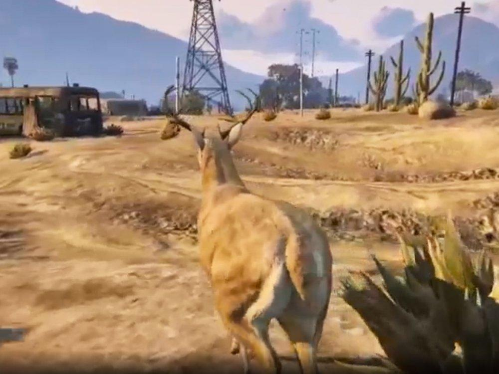
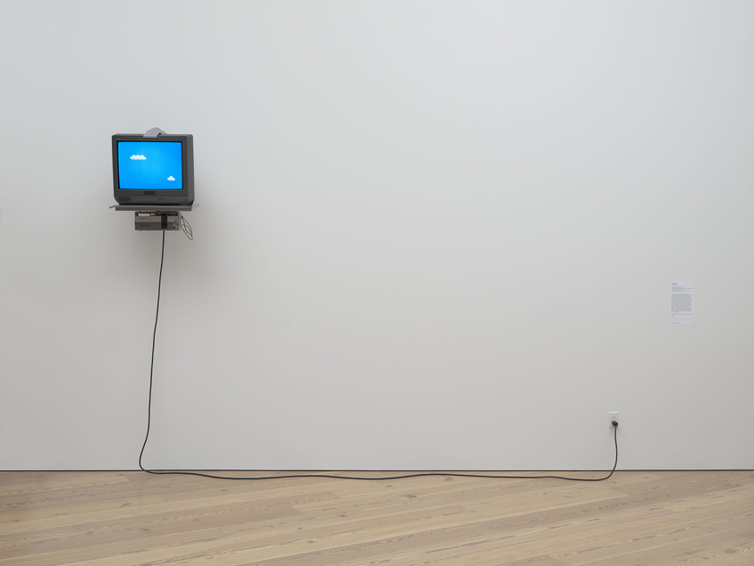

## Week 2 - Video Games, Hacking, Glitch, and Artificial Intelligence
<!-- .slide: class=".uk-width-1-1 uk-height-large" -->  

Note:

---

##### Machinima - Art Within the Machine

###### Artists often deconstruct game-worlds from a distance to see what they reveal about the real one they reflect.

Note:
One of the basic but crucial distinctions made here is that between art that uses digital technologies as a tool for the creation of more traditional art objects - such as a photograph, print, or sculpture - and digital-born, computable art that is created, stored, and distributed via digital technologies.

---

##### Angela Washko: Free Will Mode

<embed type="text/html" src="https://angelawashko.com/section/382929-Free-Will-Mode.html" width="100%" height="500px" />

---

##### San Andreas Streaming Deer Cam

<embed type="text/html" src="http://www.sanandreasanimalcams.com/" width="100%" height="500px" />

---

##### The Demoscene

https://nanogems.demozoo.org/

<iframe width="560" height="315" src="https://www.youtube.com/embed/vIQ74_DRWEM?si=S9TfmT6MXvV0yhvO" title="YouTube video player" frameborder="0" allow="accelerometer; autoplay; clipboard-write; encrypted-media; gyroscope; picture-in-picture; web-share" referrerpolicy="strict-origin-when-cross-origin" allowfullscreen></iframe>

---

##### Nikita Diakur

<iframe width="560" height="315" src="https://www.youtube.com/embed/1zUJzzRu-xs?si=Lt67TZZ7wAQF7K8-" title="YouTube video player" frameborder="0" allow="accelerometer; autoplay; clipboard-write; encrypted-media; gyroscope; picture-in-picture; web-share" referrerpolicy="strict-origin-when-cross-origin" allowfullscreen></iframe>

---

##### Hacked Consoles/Cartridges
###### Cory Arcangel: Super Mario Clouds

---

##### Cory Arcangel : Super Mario Movie - 2005 

<iframe width="560" height="315" src="https://www.youtube.com/embed/JN-WCA5-Qxs?si=eHoM3L3dwtWpaV_N" title="YouTube video player" frameborder="0" allow="accelerometer; autoplay; clipboard-write; encrypted-media; gyroscope; picture-in-picture; web-share" referrerpolicy="strict-origin-when-cross-origin" allowfullscreen></iframe>

---

##### Glitch: Rosa Menkman

[Link to Website](https://beyondresolution.info/ABOUT)

---

##### Glitch: Nick Briz

[Link to Website](https://nickbriz.work/)

