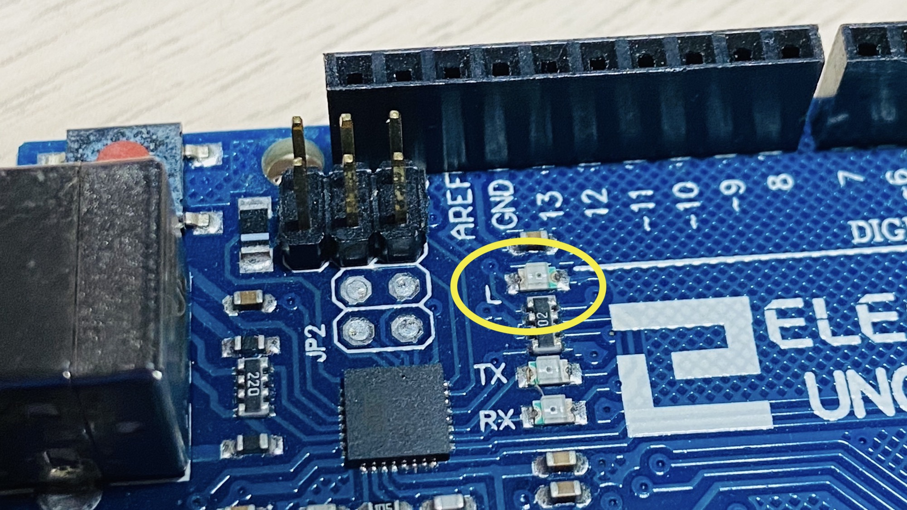
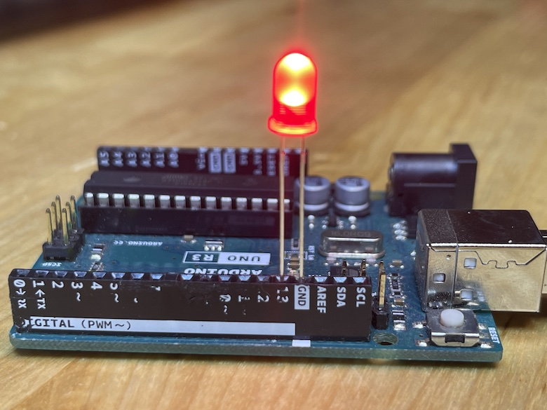

## Sketch Summary

This is considered the <a href="https://en.wikipedia.org/wiki/%22Hello,_World!%22_program">"hello world"</a> of Arduino programming. It is good to start with and to test that your Arduino is working because it does not need any extra electronics.

It takes advantage of the built-in LED on the Arduino. You can program it right away. The LED has the letter `L` next to it.

</img>

## The Sketch
From Arduino "Examples":

Go to the menu bar: `File -> Examples -> 01.Basics -> Blink`


<ul uk-accordion>
<li class=" uk-open">
<a id="code-file" class="uk-accordion-title" href="#">Makefile</a>
<div class="uk-accordion-content">
```c
void setup() {
  // initialize digital pin LED_BUILTIN as an output.
  pinMode(LED_BUILTIN, OUTPUT); // also can be pinMode(13, OUTPUT);
}

// the loop function runs over and over again forever
void loop() {
  digitalWrite(LED_BUILTIN, HIGH);  // turn the LED on (HIGH is the voltage level)
  delay(1000);                      // wait for a second
  digitalWrite(LED_BUILTIN, LOW);   // turn the LED off by making the voltage LOW
  delay(1000);                      // wait for a second
}
```
</div>
</li>
</ul>

### Code Walkthrough

---

`void setup() {};`

```c
void setup() {
  pinMode(LED_BUILTIN, OUTPUT);
}
```

From the <a href="http://engineering.nyu.edu/gk12/amps-cbri/pdf/ArduinoBooks/Arduino%20Programming%20Notebook.pdf">Arduino Programming Notebook:</a>

> The setup() function is called once when your program starts. Use it to initialize pin modes, or begin serial. It must be included in a program even if there are no statements to run.

--- 

`pinMode(LED_BUILTIN, OUTPUT);`

> Used in void setup() to configure a specified pin to behave either as an INPUT or an OUTPUT.

The variable `LED_BUILTIN` in this code is referencing pin 13, which is connected to the built-in LED.

---

`void loop() {}`

> After calling the setup() function, the loop() function does precisely what its name suggests, and loops consecutively, allowing the program to change, respond, and control the Arduino board.

---

`digitalWrite(LED_BUILTIN, HIGH);`

> These constants define pin levels as HIGH or LOW and are used when reading or writing to digital pins. HIGH is defined as logic level 1, ON, or 5 volts while LOW is logic level 0, OFF, or 0 volts.

---

`delay(1000);`

> Pauses a program for the amount of time as specified in milliseconds, where 1000
equals 1 second.

---

### Code Result

If the code uploads to the Arduino successfully, the built-in LED should be turning on for one second, and turning off for one second repeatedly.

### Changing Values

Try changing these values to something smaller, like 100 milliseconds:

```c
void setup() {
  pinMode(LED_BUILTIN, OUTPUT);
}

void loop() {
  digitalWrite(LED_BUILTIN, HIGH);
  delay(100);                      // wait for 100ms
  digitalWrite(LED_BUILTIN, LOW);
  delay(100);                      // wait for 100ms
}
```

Uploading the code should result in a faster blinking LED.

### Connecting a Red LED

You can connect a red LED directly to pin 13 and GND on the board like this:

</img>

This will blink the red LED in sync with the built-in LED. However, you should have a resistor connected in the circuit to prevent the red LED from burning out.

The actual wiring should look like this:

</img>

To answer why that is, check out this source:

<a href="https://eepower.com/resistor-guide/resistor-applications/resistor-for-led/#">Resistors in LED circuits</a>

