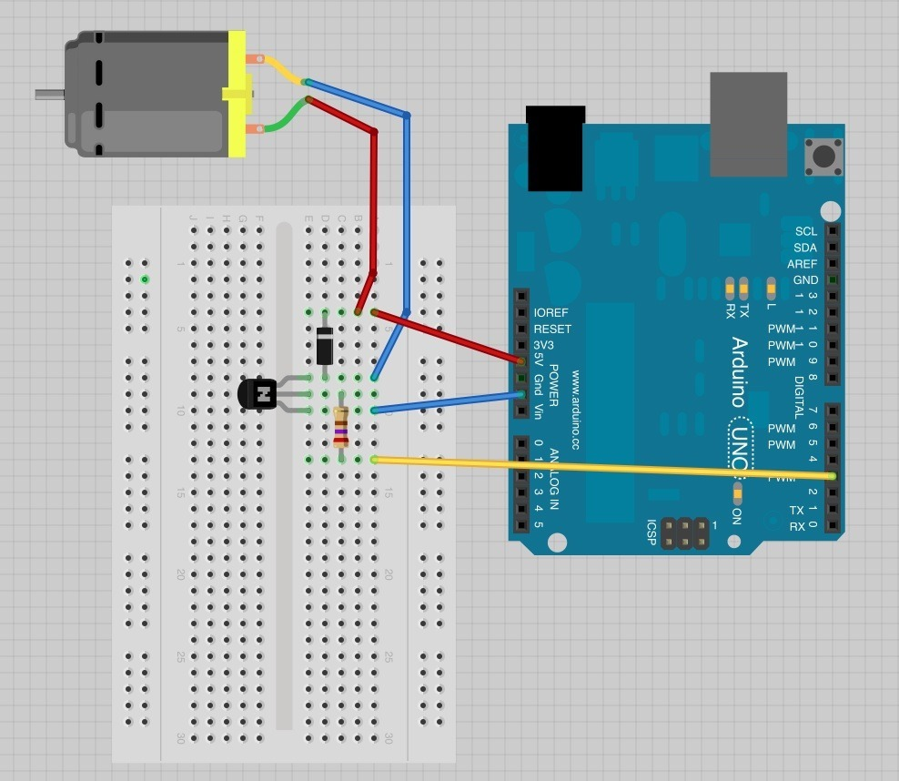

The "Fade" and "Fading" examples showcase the use of Pulse Width Modulation (PWM).

> "Pulse Width Modulation, or PWM, is a technique for getting analog results with digital means."

#### Digital vs Analog Signals

A digital signal is a signal of discrete values, while an analog signal is a continous signal.

PWM is a digital signal, because it has two states, it is either on or off (`HIGH` or `LOW`). This is essentially a square wave.

On some microcontrollers PWM is only available on selected pins. Please consider the pinout diagram of your board to find out which ones you can use for PWM. They are denoted with a tilde sign (~).

`File->Sketchbook->Examples->Basics->Fade`.

```c
int led = 9;         // the PWM pin the LED is attached to
int brightness = 0;  // how bright the LED is
int fadeAmount = 5;  // how many points to fade the LED by

// the setup routine runs once when you press reset:
void setup() {
  // declare pin 9 to be an output:
  pinMode(led, OUTPUT);
}

// the loop routine runs over and over again forever:
void loop() {
  // set the brightness of pin 9:
  analogWrite(led, brightness);

  // change the brightness for next time through the loop:
  brightness = brightness + fadeAmount;

  // reverse the direction of the fading at the ends of the fade:
  if (brightness <= 0 || brightness >= 255) {
    fadeAmount = -fadeAmount;
  }
  // wait for 30 milliseconds to see the dimming effect
  delay(30);
}
```

This example introduces a programming concept called **conditional statements**.

`File->Sketchbook->Examples->Analog->Fading`.

```c
int ledPin = 9;  // LED connected to digital pin 9

void setup() {
  // nothing happens in setup
}

void loop() {
  // fade in from min to max in increments of 5 points:
  for (int fadeValue = 0; fadeValue <= 255; fadeValue += 5) {
    // sets the value (range from 0 to 255):
    analogWrite(ledPin, fadeValue);
    // wait for 30 milliseconds to see the dimming effect
    delay(30);
  }

  // fade out from max to min in increments of 5 points:
  for (int fadeValue = 255; fadeValue >= 0; fadeValue -= 5) {
    // sets the value (range from 0 to 255):
    analogWrite(ledPin, fadeValue);
    // wait for 30 milliseconds to see the dimming effect
    delay(30);
  }
}
```

This example introduces a programming concept called **for loops**.

You could do this with a motor instead of an LED, but a motor requires more current than the Arduino can handle. If we tried to connect the motor straight to an Arduino pin, there is a good chance that it could damage the Arduino.

To hook up a motor to an arduino, use this schematic:

</img>

This is only for low voltage motors, to power higher voltage motors, you will need a different power source.
