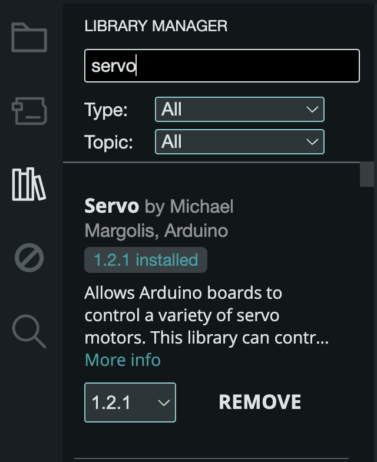

#### The Servo Library

To facilitate the code when working with servo motors, we should use the Servo library. A library is code that someone else wrote to makes it easier to make something happen without knowing the ins and outs of how to program it. It also makes the code a lot more readable.

To install a library, go the left hand side and click on the books icon.

</img>

Next, use the search bar to find the servo library by Michael Margolis, and install it.

</img>

After installing, example sketches should be found in the Examples menu bar under "Examples from Custom Libraries". `File -> Examples -> Servo`.


#### Most Minimal Example

```c
#include <Servo.h>

Servo myservo;  // create servo object to control a servo

void setup() {
  myservo.attach(9);  // attaches the servo on pin 9 to the servo object
}

void loop() {
  myservo.write(180);  // tell servo to go to position in variable 'pos'
}
```

#### Breakdown

---

```c
#include <Servo.h>
```

To include the library, you have to write this statement. `#include` is written followed by the name of the file that has the code for the library written. This Servo.h file is what the library is. It is surrounded by these angle brackets.

<a target="\_blank" href="https://www.arduino.cc/reference/en/language/structure/further-syntax/include/">From the Arduino Website</a>

--- 

```c
Servo myservo;  // create servo object to control a servo
```

For this library, there is an object called Servo, and it is given the variable name `myservo`. 

> In programming, an object is similar to a library, in that it hides a bundle of code that makes it possible to create a reference of a thing with certain attributes. For example, an object called Human might have properties such as age, height, name.. and can perform actions like `human.walk()`, `human.sleep()`, `human.eat()`. In this code's case, there is an object called Servo that has the properties of a servo motor, with actions like `attach()` and `write()`.

---

```c
myservo.attach(9);  // attaches the servo on pin 9 to the servo object
```

As said in the comment, this line tells Arduino that this servo is connected to pin 9.

---

```c
myservo.write(180);  // tell servo to go to position in variable 'pos'
```

The `write()` method changes the position of the servo and takes an angle between 0 - 180 degrees.

#### Play Around

Try changing the number in `write()` to see where the servo moves.
