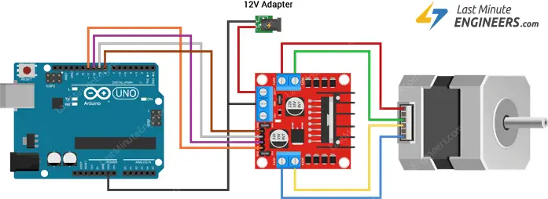

#### Wiring

</img>

#### Arduino Sketch

```C
// Include the Arduino Stepper Library
#include <Stepper.h>

// Number of steps per output rotation
const int stepsPerRevolution = 200;

// Create Instance of Stepper library
Stepper myStepper(stepsPerRevolution, 8, 9, 10, 11);


void setup()
{
  // set the speed at 60 rpm:
  myStepper.setSpeed(10);
}

void loop() 
{
  // step one revolution in one direction:
  Serial.println("clockwise");
  myStepper.step(stepsPerRevolution);
  delay(500);

  // step one revolution in the other direction:
  Serial.println("counterclockwise");
  myStepper.step(-stepsPerRevolution);
  delay(500);
}
```
