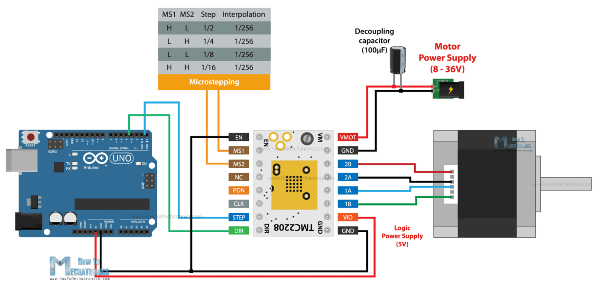

#### Wiring

</img>

#### Arduino Sketch

```C
// defines pins
#define stepPin 2
#define dirPin 5 

void setup() {
  // Sets the two pins as Outputs
  pinMode(stepPin, OUTPUT); 
  pinMode(dirPin, OUTPUT);
}
void loop() {
 // Enables the motor to move in a particular direction
  digitalWrite(dirPin,HIGH);
  // Makes 200 pulses for making one full cycle rotation
  for(int x = 0; x < 200; x++) {
    digitalWrite(stepPin,HIGH); 
    delayMicroseconds(700);    // by changing this time delay between the steps we can change the rotation speed
    digitalWrite(stepPin,LOW); 
    delayMicroseconds(700); 
  }
  
  delay(1000); // One second delay
  
  //Changes the rotation direction
  digitalWrite(dirPin,LOW);
  
  // Makes 400 pulses for making two full cycle rotation
  for(int x = 0; x < 400; x++) {
    digitalWrite(stepPin,HIGH);
    delayMicroseconds(500);
    digitalWrite(stepPin,LOW);
    delayMicroseconds(500);
  }
  delay(1000);
}
```
