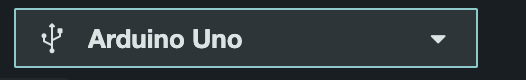
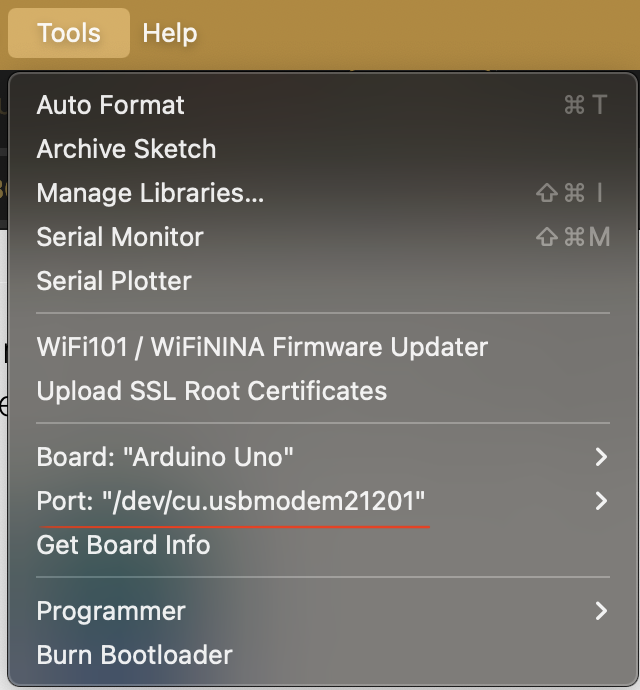
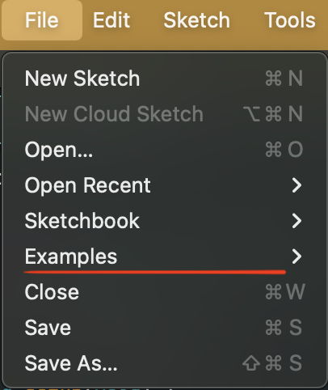
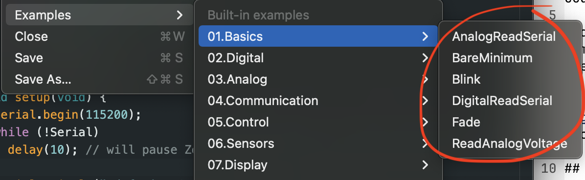

## Get Familiar with the Arduino Software

The programs written in the Arduino Software are called **sketches**.

## Arduino Syntax

Syntax refers to the rules that define the structure of a language. In computer programming, the code must be written a certain way in order for it to be understood by a compiler or interpreter.

Arduino is a C-like language, which follows the convention of using curly brackets `{}` and semicolons `;`, for example. If the software is telling you there is an error, it might mean that there is a missing semicolon or curly bracket.

For more specific rules on the programming language, refer to this <a target="\_blank" href="http://engineering.nyu.edu/gk12/amps-cbri/pdf/ArduinoBooks/Arduino%20Programming%20Notebook.pdf">Arduino Programming Notebook</a> by Brian W. Evans.

## The Arduino Software (IDE)

An IDE is an **integrated development environment**. It is a software that provides a developer with tools to write code efficiently. The Arduino software is specifically for writing and uploading code to your Arduino board. It comes with some features:

### Verify Button

On the top left, there is a button with a checkmark. This is the **Verify** button. When you press this button, the software checks for any errors in your code.

</img>

### Upload Button

The upload button, when pressed, will upload your code to your arduino.

</img>

### Selecting Board & Port

When you connect your Arduino to your computer via USB cable, you should be able to select it from this drop down menu. 

</img>

Another way to select your board, is through the menu bar.

</img>

**Tools -> Port: ""**

A port is referring to the name of the Arduino connected to your USB port. It may look something like this depending on what kind of operating system you are using:

- `/dev/cu.usbmodem14101 (Arduino Uno)`
- `COM3 (Arduino Uno)`
- `/dev/ttyACM0 (Arduino Uno)`

### Example Sketches

To look at some of the examples that come with the Arduino software:

</img>

</img>

Notice the Blink example. This is usually the example that most people start with.

### Other Helpful Resources

- <a href="https://itp.nyu.edu/physcomp/lessons/programming-terms-and-programming-environments/">ITP Physical Computing - Programming Terms</a>
