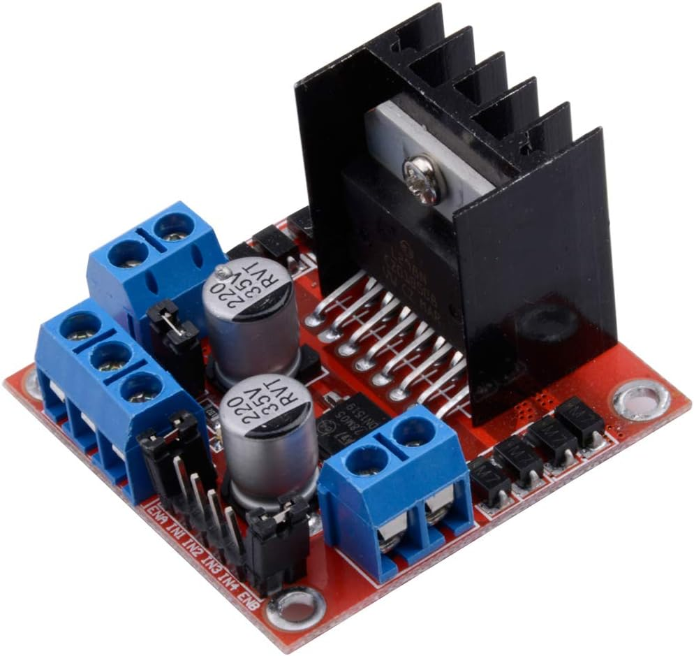
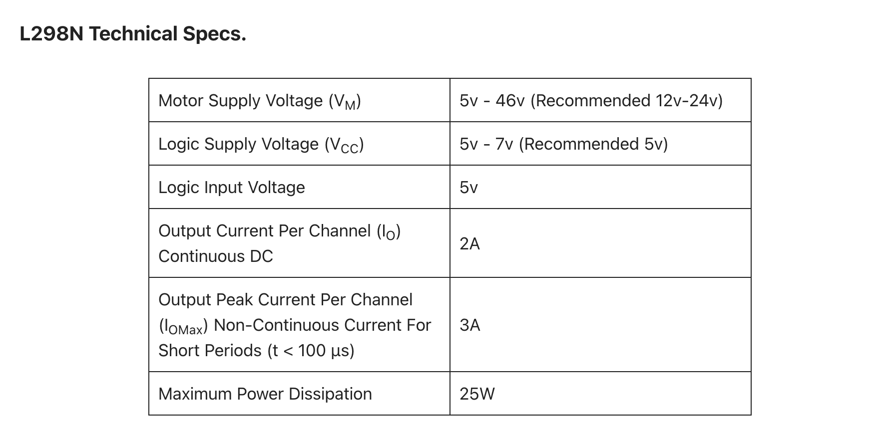
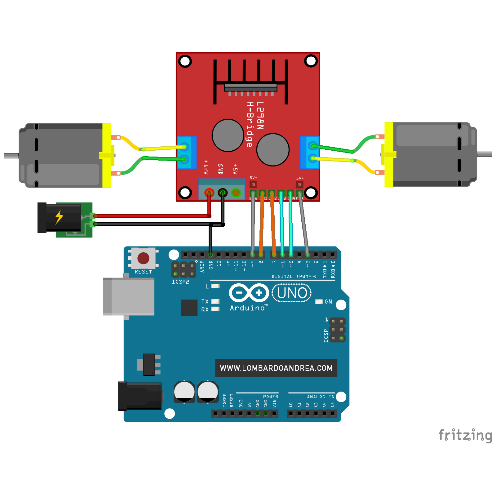

</img>

<a target="\_blank" href="https://a.co/d/4zJtR7R">Amazon Link</a>

</img>

<a href="https://www.sparkfun.com/datasheets/Robotics/L298_H_Bridge.pdf">Datasheet</a>

</img>

```c
#define BTN_PIN 4
#define IN1_PIN 8
#define IN2_PIN 7
#define EN1_PIN 11

int btnState = 0;
bool onAndOff = false;

void setup() {
  pinMode(BTN_PIN, INPUT);
  pinMode(EN1_PIN, OUTPUT);
  pinMode(IN1_PIN, OUTPUT);
  pinMode(IN2_PIN, OUTPUT);
  Serial.begin(9600);
}

void loop() {
  btnState = digitalRead(BTN_PIN);
  delay(100);

  // Read The Direction Control Button State
  if (btnState == HIGH) {
    if (onAndOff == false) {
      onAndOff = true;
    } else {
      onAndOff = false;
    }
  }

  if (onAndOff == true) {
    digitalWrite(IN1_PIN, HIGH);
    digitalWrite(IN2_PIN, LOW);
  } else {
    digitalWrite(IN1_PIN, LOW);
    digitalWrite(IN2_PIN, HIGH);
  }

  // Read The Potentiometer & Control The Motor Speed (PWM)
  int sensorValue = analogRead(A0);
  analogWrite(EN1_PIN, sensorValue / 4);
}
```

Resources:

- <a href="https://deepbluembedded.com/arduino-l298n-dc-motor-driver-interfacing-tutorial/">deepbluembedded tutorial</a>
