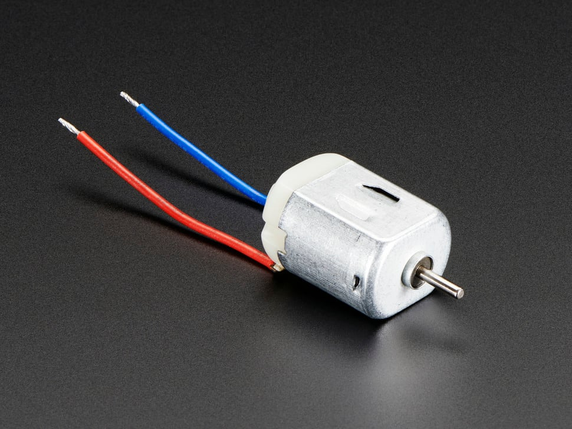

</img>

## What is a DC Motor?

A DC motor converts electrical energy into mechanical (converts direct current into a circular motion). It can also work the opposite way. If you turn the circular motion manually, it will generate electrical energy.

Put a voltmeter or oscilloscope on any two heavy wires and spin the shaft by hand. If it's the two wires on a brushed DC motor, then spinning it one way will generate a positive voltage, and spinning it the other will generate a negative voltage.

(demo)

## Brushed vs. Brushless

### Brushed DC Motor

Brushed DC motors are typically cheaper and simpler, because of this brushed motors are usually found in toys , while brushless motors are usually found in higher-end applications such as power tools.

### Brushless DC Motor

Brushless DC Motor (BLDC) are more efficient, last longer, and require higher voltage.

### How to Identify a Brushed vs. Brushless DC Motor

The biggest clue is the wire count. If the motor has two wires, it is likely a brushed DC motor.

If it is powered by a battery, there is also a good chance that it is a DC brushless motor.

If it has three wires, it might be an AC motor.

## Key Terms

**Torque** - Spinning force. More torque means faster spin.

Parts of a Motor:

- **Stator**: Stationary part of the motor.
- **Shaft**: The spinning rod of the motor.
- **Rotor / Armature**: Attached to the shaft, contain coil windings to create electromagnets. Also rotates with the shaft.
- **Commutator**: Attached to the coils, is a ring with separated segments / plates. These segments are touched by the brushes to complete the electromagnet circuit.
- **Brushes**: The brushes are spring loaded onto the commutator segments and are receiving power from the terminals.
- **Terminals**: The positive and negative terminals are where you supply power to move the motor.

Resources:

- <a href="https://www.youtube.com/watch?v=CWulQ1ZSE3c">How a DC Motor Works (Video)</a>
- <a href="https://www.youtube.com/watch?v=1AaUK6pT_cE">Parts of a DC Motor (Video)</a>
