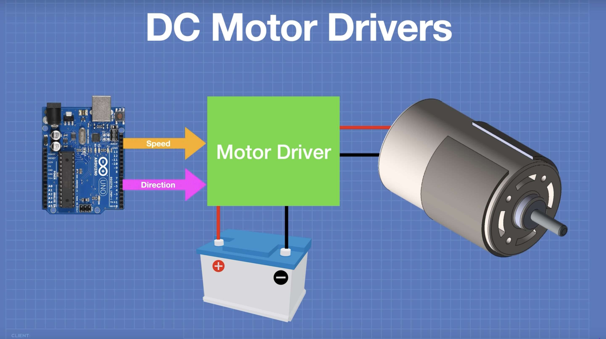

</img>

### What is a Motor Driver?

Saying "to drive a motor", is another way of saying "to control a motor". There are different things you can control:

- Turning it on/off
- Direction
- Speed

A driver, is a way of easily interfacing the motor with the microcontroller (For example, the Arduino). In other words, it is the bridge between the motor and the Arduino.

</img>

The arduino and the motor will need to be powered **separately**.

Not all motor drivers are the same. Some are for specific voltage ranges. When selecting a motor driver, make sure you know what supply voltage and current the motor you have needs. All driver ICs (Integrated Circuits) come with datasheets that have extra information. Be sure to do your research on how to use them.

### Driving a motor

#### Turning on and off

An Arduino sends control signals at a low voltage, this means that it is meant to send signals that control something, not necessarilly to power it.

#### Controlling Direction

Reversing the polarity of the circuit will cause the motor to spin in the opposite direction. Instead of reversing the polarity manually (like reversing the battery) a popular circuit that applies this using switches is called an <a href="/electronic_component_database/h_bridge_circuit/h_bridge_circuit.html">H-Bridge circuit</a>.

#### Controlling Speed

Controlling speed is done by using something called Pulse Width Modulation (PWM). Check out a basic introduction on PWM in the <a href="https://docs.arduino.cc/learn/microcontrollers/analog-output/">Arduino website.</a>

Resources:

- <a target="\_blank" href="https://www.youtube.com/watch?v=ygrsIqWOh3Y">Using Motor Drivers with Microcontrollers</a>
