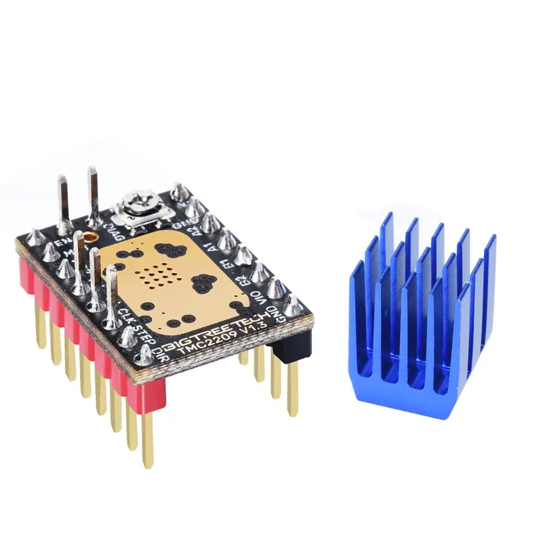
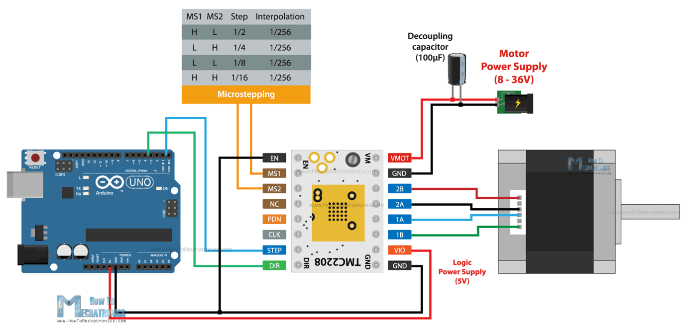

### Stepper Drivers

#### TMC2208

</img>

A "quiet" stepper motor driver.

</img>

##### Decoupling Capacitor

A decoupling capacitor's job is to supress high-frequency noise in power supply signals. They take tiny voltage ripples, which could otherwise be harmful to delicate ICs, out of the voltage supply.
