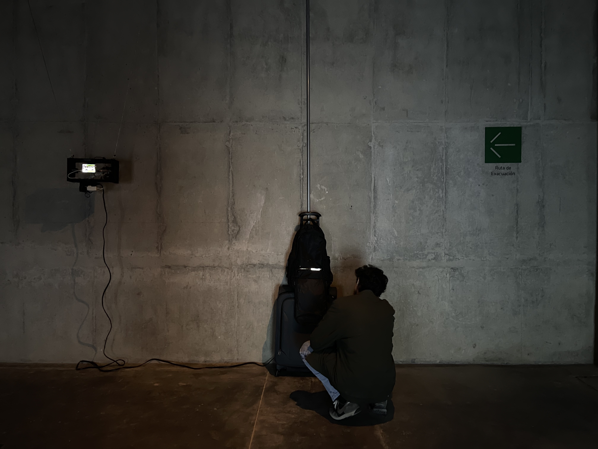
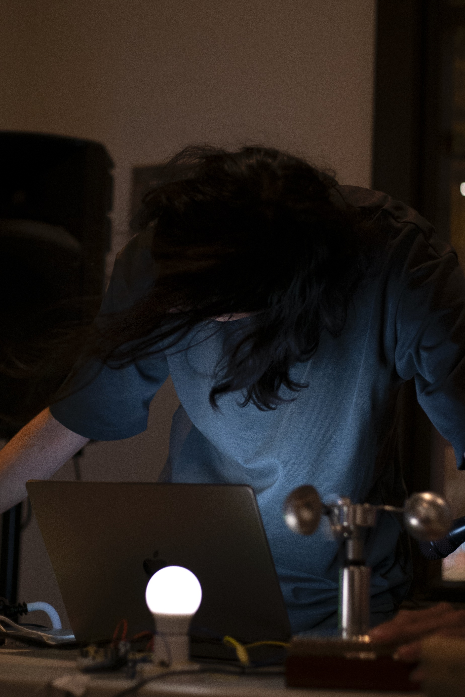
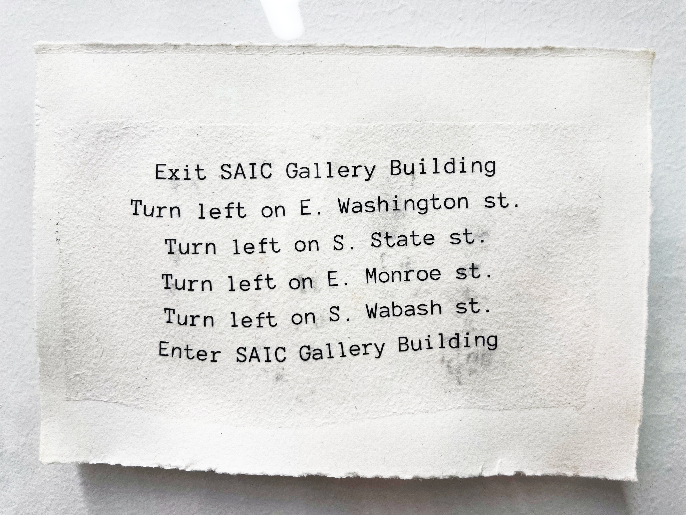
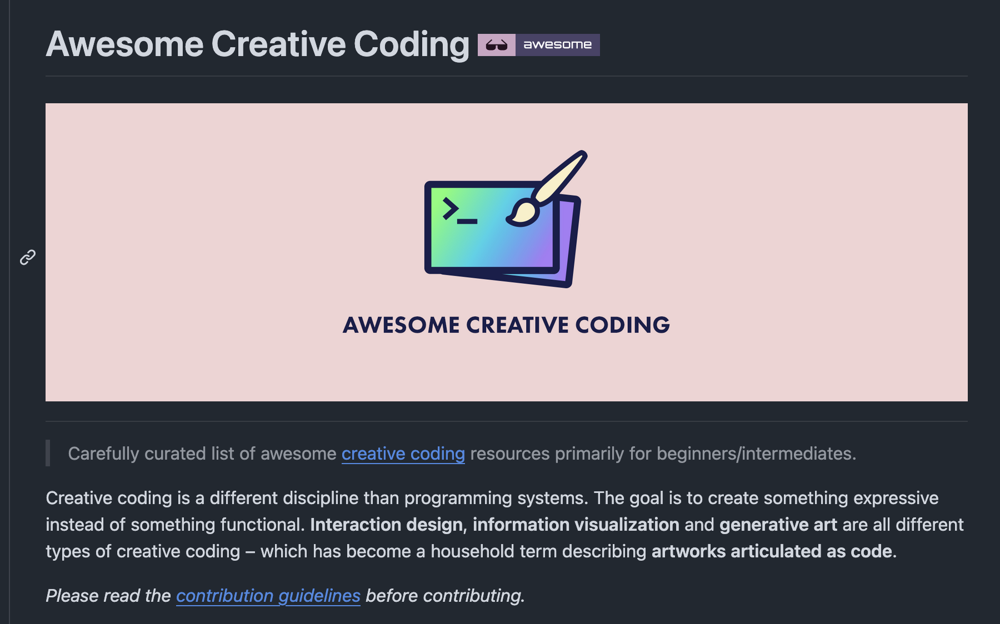
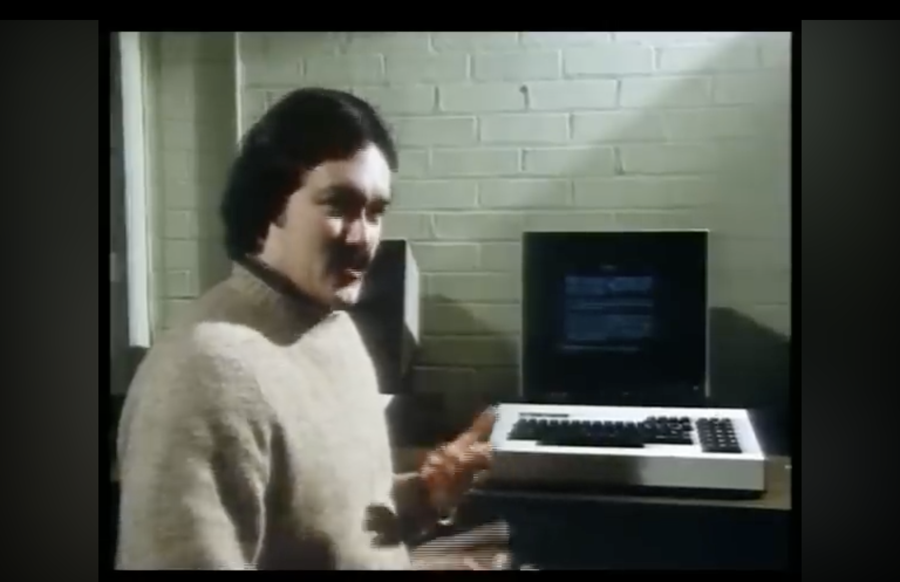
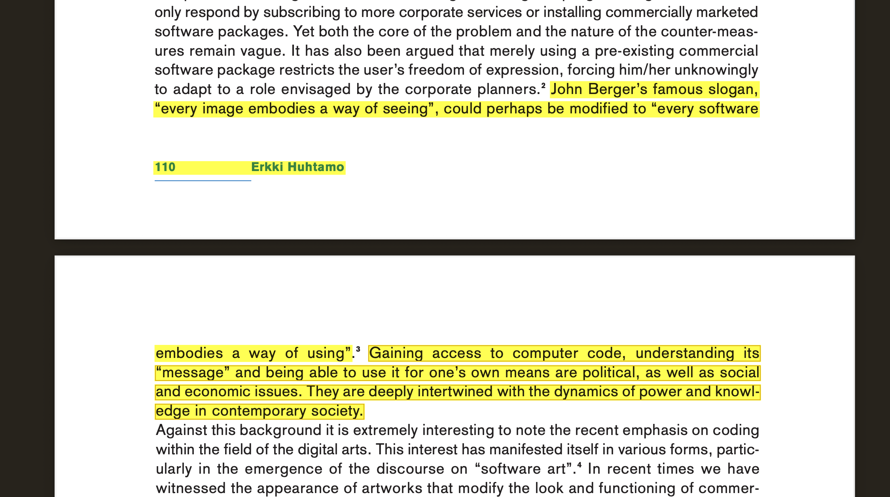

## Week 1 - Welcome to Introduction to New Media Art
<!-- .slide: class=".uk-width-1-1 uk-height-large" -->  

Note:

---

#### Introduction: Where are we?

---

#### Introduction: Where are we?

<embed src="https://drive.google.com/file/d/1MyRKBB3byx7iTgvKjPeehdOYpvGhXSbV/preview" width="70%" height="600px" height="1200px" allow="autoplay"></embed>

---

#### Introduction: Who am I?

<embed type="image/jpeg" src="https://juanedflores.com/" width="1000" height="500" />

---

#### Who am I?

---

#### Who are you?

---

#### Who are you?

Introductions:

- Name, Pronouns, Year
- Why are you here? What interested you about this class?

---

#### Robotics; Telepresence; Surveillance; Live Data/Feeds

<iframe width="720" height="500" src="https://www.youtube.com/embed/6FpkLAWrSQc?si=p0XYqceE1oMxjL25&amp;controls=0" title="YouTube video player" frameborder="0" allow="accelerometer; autoplay; clipboard-write; encrypted-media; gyroscope; picture-in-picture; web-share" referrerpolicy="strict-origin-when-cross-origin" allowfullscreen></iframe>

---

#### Livecoding; Generative Image/Sound

<iframe width="920" height="600" src="https://www.youtube.com/embed/JOIkOTJrUXk?si=7wPxF5-Uvd8s77QT" title="YouTube video player" frameborder="0" allow="accelerometer; autoplay; clipboard-write; encrypted-media; gyroscope; picture-in-picture; web-share" referrerpolicy="strict-origin-when-cross-origin" allowfullscreen></iframe>

---

#### Sound Art

---

#### What this class is & what it is not

---

#### Drawing Bots; First Assignment

<iframe width="560" height="315" src="https://www.youtube.com/embed/0n3dIO6u9yU?si=lp-FKVzBAbjAOzes" title="YouTube video player" frameborder="0" allow="accelerometer; autoplay; clipboard-write; encrypted-media; gyroscope; picture-in-picture; web-share" referrerpolicy="strict-origin-when-cross-origin" allowfullscreen></iframe>

---

#### Background

<!-- .slide: class="uk-column-1-2 uk-column-divider uk-vertical-align-middle" -->  

Walking as a practice

Instruction-based

</img>
</img>

---

#### Programming Languages

<!-- .slide: class=".uk-width-1-1 uk-height-large" -->  

Where to start?

</img>

---

#### Programming Languages

<!-- .slide: class="uk-column-1-2 uk-column-divider uk-vertical-align-middle" -->  

<strong>Scratch</strong>: designed for new programmers, children, educators.

</img>

 
 
 

</img>

---

#### Programming Languages

<!-- .slide: class="uk-column-1-2 uk-column-divider uk-vertical-align-middle" -->  

<strong>Scratch</strong>: designed for new programmers, children, educators.

</img>

 
 
 

</img>

---

#### Arduino; Our Computer

<embed type="image/jpeg" src="https://docs.arduino.cc/learn/programming/reference/" width="1000" height="500" />

---

#### "<a href="https://github.com/terkelg/awesome-creative-coding">Creative Coding Languages</a>"

<!-- .slide: class=".uk-width-1-1 uk-height-large" -->  

Designed for artists turned programmers, programmers turned artists.

</img>

---

#### GRASS (GRAphics Symbiosis System; 1973)

</img>

---

#### Basic Programming Language (1964)

<!-- .slide: class="uk-column-1-2 uk-column-divider uk-vertical-align-middle" -->  

</img>

</img>

---

#### The Computer Programme (1982)

</img>

---

##### PICO-8 Fantasy Console (Released: 2015)

<embed type="image/jpeg" src="https://www.lexaloffle.com/pico-8.php" width="1000" height="500" />

---

#### Computer Lib / Dream Machines (Ted Nelson; 1974)

</img>

---

#### Live Coding as Performance

<!-- .slide: class="uk-column-1-2 uk-column-divider uk-vertical-align-middle" -->  

1970s w/ GRASS

</img>

</img>

Live coding is a new direction in electronic music and video, and is getting somewhere interesting. Live coders expose and rewire the innards of software while it generates improvised music and/or visuals. All code manipulation is projected for your pleasure. Live coding works across musical genres, and has been seen in concert halls, late night jazz bars, as well as algoraves.

---

#### Design By Numbers (John Maeda; 1994)

<!-- .slide: class="uk-column-1-2 uk-column-divider uk-vertical-align-middle" -->  

</img>
</img>

---

#### Processing (Ben Fry & Casey Reas; 2001)

<!-- .slide: class=".uk-width-1-1 uk-height-large" -->  

<embed type="image/jpeg" src="https://processing.org/" width="1000" height="500" />

---

#### Twine

<!-- .slide: class="uk-column-1-2 uk-column-divider uk-vertical-align-middle" -->  

"The Walking Net"

</img>
</img>

</img>

Choose your own adventure style

---

#### Q: What is the point?

<!-- .slide: class=".uk-width-1-1 uk-height-large" -->  

</img>

---

#### Artist Showcase

---

#### <a href="https://johanneslangkamp.com/about">Johannes Langkamp</a>
<!-- .slide: class=".uk-width-1-1" -->  

<embed type="text/html" src="https://johanneslangkamp.com/about" width="900px" height="600px">

Note:

---

#### <a href="https://www.jeff-carter.net/">Jeff Carter - "Earthquake"</a>
<!-- .slide: class=".uk-width-1-1" -->  

<iframe src="https://player.vimeo.com/video/144022350?h=b11942fae6" width="920" height="600" frameborder="0" allow="autoplay; fullscreen; picture-in-picture" allowfullscreen></iframe

Note:
test

---

<!-- .slide: class=".uk-width-1-1" -->  
#### <a href="https://www.jeff-carter.net/">Jeff Carter - "Catalog (Blue Tables)"</a>
<!-- .slide: class=".uk-width-1-1" -->  

<iframe src="https://player.vimeo.com/video/144021352?h=8b7d539ff1" width="920" height="600" frameborder="0" allow="autoplay; fullscreen; picture-in-picture" allowfullscreen></iframe>

Note:

---

<!-- .slide: class=".uk-width-1-1" -->  
#### <a href="https://www.jeff-carter.net/">Jeff Carter - "Untitled #2 (Chicago Tribune Tower)"</a>
<!-- .slide: class=".uk-width-1-1" -->  

<iframe src="https://player.vimeo.com/video/144413083?h=7b3115b2a8" width="920" height="600" frameborder="0" allow="autoplay; fullscreen; picture-in-picture" allowfullscreen></iframe>

Note:

---

<!-- .slide: class=".uk-width-1-1" -->  
#### <a href="https://www.jeff-carter.net/">Jeff Carter - "Untitled #2 (Chicago Tribune Tower)"</a>
<!-- .slide: class=".uk-width-1-1" -->  

<iframe src="https://player.vimeo.com/video/144022099?h=16d69099d9" width="920" height="600" frameborder="0" allow="autoplay; fullscreen; picture-in-picture" allowfullscreen></iframe>

Note:

---

<!-- .slide: class=".uk-width-1-1" -->  
#### <a href="https://www.jimbond.co.uk/">Jim Bond - "Eraser"</a>
<!-- .slide: class=".uk-width-1-1" -->  

<iframe src="https://player.vimeo.com/video/411416104?h=c6ac62afb7" width="920" height="600" frameborder="0" allow="autoplay; fullscreen; picture-in-picture" allowfullscreen></iframe>

Note:

---

#### <a href="https://www.jimbond.co.uk/">Jim Bond - "Atomised"</a>
<!-- .slide: class=".uk-width-1-1" -->  

<iframe title="vimeo-player" src="https://player.vimeo.com/video/409810139?h=7fb70e5535" width="920" height="600" frameborder="0"    allowfullscreen></iframe>

Note:

---
#### <a href="https://www.jimbond.co.uk/">Jim Bond - "Vessel"</a>
<!-- .slide: class=".uk-width-1-1" -->  

<iframe title="vimeo-player" src="https://player.vimeo.com/video/412284169?h=195248d1e3" width="920" height="600" frameborder="0"    allowfullscreen></iframe>

Note:

---

#### <a href="http://johannesvogl.com/johannesvogl.com/Johannes_Vogl_files/Johannes%20Vogl_web_mappe_engl.pdf">Johannes Vogl - "Stroking Machine"</a>
<!-- .slide: class=".uk-width-1-1" -->  

<iframe width="920" height="600" src="https://www.youtube.com/embed/wR6dCVoW6Rw?si=SZhz8YB9BNWoFJxD" title="YouTube video player" frameborder="0" allow="accelerometer; autoplay; clipboard-write; encrypted-media; gyroscope; picture-in-picture; web-share" allowfullscreen></iframe>

Note:

---

#### <a href="http://johannesvogl.com/johannesvogl.com/Johannes_Vogl_files/Johannes%20Vogl_web_mappe_engl.pdf">Johannes Vogl - "Supper"</a>
<!-- .slide: class=".uk-width-1-1" -->  

<iframe width="900" height="620" src="https://www.youtube.com/embed/atM07HyuckA?si=OSCGGuXrw9MnpQZQ" title="YouTube video player" frameborder="0" allow="accelerometer; autoplay; clipboard-write; encrypted-media; gyroscope; picture-in-picture; web-share" allowfullscreen></iframe>

Note:

---

#### <a href="http://johannesvogl.com/johannesvogl.com/Johannes_Vogl_files/Johannes%20Vogl_web_mappe_engl.pdf">Johannes Vogl - "Globe"</a>
<!-- .slide: class=".uk-width-1-1" -->  

<iframe width="560" height="315" src="https://www.youtube.com/embed/s8o0et_4enQ?si=YHdbesF_7zuilrI3" title="YouTube video player" frameborder="0" allow="accelerometer; autoplay; clipboard-write; encrypted-media; gyroscope; picture-in-picture; web-share" allowfullscreen></iframe>

A globe turning backwards with 1100 turns/minute.

Note:

---

#### <a href="http://johannesvogl.com/johannesvogl.com/Johannes_Vogl_files/Johannes%20Vogl_web_mappe_engl.pdf">Johannes Vogl - "Machine to Produce Jam Bread"</a>
<!-- .slide: class=".uk-width-1-1" -->  

<iframe width="700" height="400" src="https://www.youtube.com/embed/eJva6PAPUqo?si=PWbBEdJtcKCRIhUX" title="YouTube video player" frameborder="0" allow="accelerometer; autoplay; clipboard-write; encrypted-media; gyroscope; picture-in-picture; web-share" allowfullscreen></iframe>

Note:

---

#### <a href="http://johannesvogl.com/johannesvogl.com/Johannes_Vogl_files/Johannes%20Vogl_web_mappe_engl.pdf">Johannes Vogl - "Untitled"</a>
<!-- .slide: class=".uk-width-1-1" -->  

<iframe width="700" height="400" src="https://www.youtube.com/embed/et1kJg-pE-A?si=s0N7aRIG_lRzT4fg" title="YouTube video player" frameborder="0" allow="accelerometer; autoplay; clipboard-write; encrypted-media; gyroscope; picture-in-picture; web-share" allowfullscreen></iframe>

Note:

---

#### <a href="https://www.jonathanschipper.com/">Jonathan Schipper</a>
<!-- .slide: class=".uk-width-1-1" -->  

<embed type="text/html" src="https://www.jonathanschipper.com/" width="900px" height="600px">

Note:

---

#### <a href="https://www.arthurganson.com/">Arthur Ganson</a>
<!-- .slide: class=".uk-width-1-1" -->  

<embed type="text/html" src="https://www.arthurganson.com/" width="900px" height="600px">

Note:

---

#### <a href="https://www.lozano-hemmer.com/standards_and_double_standards.php">Rafael Lozanno-Hemmer</a>
<!-- .slide: class=".uk-width-1-1" -->  

<embed type="text/html" src="https://www.lozano-hemmer.com/" width="900px" height="600px">

Note:

---

#### <a href="https://www.ivanabreu.net/#frontpage">Ivan Abreu</a>
<!-- .slide: class=".uk-width-1-1" -->  

<embed type="text/html" src="https://ivanabreu.studio/works/" width="900px" height="600px">

Note:

---

#### <a href="http://www.kenfeingold.com/index.html">Ken Feingold</a>
<!-- .slide: class=".uk-width-1-1" -->  

<iframe src="https://player.vimeo.com/video/742269667?h=44ec368c50" width="640" height="360" frameborder="0" allow="autoplay; fullscreen; picture-in-picture" allowfullscreen></iframe>

Note:

---

#### <a href="https://kristofkintera.com/">Kristof Kintera</a>
<!-- .slide: class=".uk-width-1-1" -->  

<iframe width="560" height="315" src="https://www.youtube.com/embed/qkW2-9fyuGQ?si=EW6IsGIUK1vnBr8T" title="YouTube video player" frameborder="0" allow="accelerometer; autoplay; clipboard-write; encrypted-media; gyroscope; picture-in-picture; web-share" allowfullscreen></iframe>

Note:

---

#### <a href="https://www.kristoffermyskja.com/index.php">Kristoffer Myskja</a>
<!-- .slide: class=".uk-width-1-1" -->  

<embed type="text/html" src="
https://www.kristoffermyskja.com/work.php#work-display
" width="900px" height="600px">

Note:

---

#### <a href="https://mnartists.walkerart.org/held-in-a-corner-materiality-and-maternality-in-liz-larners-corner-pieces">Liz Larner - "Corner Basher"</a>
<!-- .slide: class=".uk-width-1-1" -->  

<iframe src="https://player.vimeo.com/video/32319816?h=e708ae37b6" width="640" height="361" frameborder="0" allow="autoplay; fullscreen; picture-in-picture" allowfullscreen></iframe>
 
Note:

---

#### <a href="https://theimagecentre.ca/exhibition/max-dean-as-yet-untitled/">Max Dean - "As Yet Untitled"</a>
<!-- .slide: class=".uk-width-1-1" -->  

<iframe src="https://player.vimeo.com/video/82133419?h=60db0d91cd&byline=0" width="640" height="360" frameborder="0" allow="autoplay; fullscreen; picture-in-picture" allowfullscreen></iframe>

Note:

---

#### <a href="https://raffaello.name/projects/robotic-chair/">Max Dean - "Robotic Chair"</a>
<!-- .slide: class=".uk-width-1-1" -->  

<iframe width="560" height="315" src="https://www.youtube.com/embed/cgBqSe6PSVA?si=0b1Llifdkap97Xti" title="YouTube video player" frameborder="0" allow="accelerometer; autoplay; clipboard-write; encrypted-media; gyroscope; picture-in-picture; web-share" allowfullscreen></iframe>

Note:

---

#### <a href="https://raffaello.name/dynamic-works/">Raffaello D'Andrea</a>
<!-- .slide: class=".uk-width-1-1" -->  

<embed type="text/html" src="
https://raffaello.name/dynamic-works/
" width="900px" height="600px">

Note:

---

#### <a href="https://www.neilmendoza.com/">Neil Mendoza</a>
<!-- .slide: class=".uk-width-1-1" -->  

<embed type="text/html" src="https://www.neilmendoza.com/" width="900px" height="600px">

Note:

---

#### <a href="https://www.dwbowen.com/">David Bowen</a>
<!-- .slide: class=".uk-width-1-1" -->  

<embed type="text/html" src="https://www.dwbowen.com/" width="900px" height="600px">

Note:

---

#### <a href="https://www.pelang.ch/">Pe Lang</a>
<!-- .slide: class=".uk-width-1-1" -->  

<embed type="text/html" src="https://www.pelang.ch/" width="900px" height="600px">

Note:

---

#### <a href="https://www.zimoun.net/">Zimoun</a>
<!-- .slide: class=".uk-width-1-1" -->  

<iframe title="vimeo-player" src="https://player.vimeo.com/video/7235817?h=3e23495df6" width="640" height="360" frameborder="0"    allowfullscreen></iframe>

Note:

---

#### <a href="https://www.jorgemacchi.com/en">Jorge Macchi</a>
<!-- .slide: class=".uk-width-1-1" -->  

<iframe src="https://player.vimeo.com/video/730416222?h=e4af39a9c9" width="640" height="360" frameborder="0" allow="autoplay; fullscreen; picture-in-picture" allowfullscreen></iframe>

Note:

---

#### <a href="http://www.naamatsabar.com/">Naama Tsabar</a>
<!-- .slide: class=".uk-width-1-1" -->  

<iframe title="vimeo-player" src="https://player.vimeo.com/video/731175862?h=a5f2164f26" width="640" height="360" frameborder="0"    allowfullscreen></iframe>

Note:

---

#### <a href="https://staceyholloway.com/socialdistancing">Stacey Holloway</a>
<!-- .slide: class=".uk-width-1-1" -->  

<embed type="text/html" src="https://staceyholloway.com/socialdistancing" width="900px" height="600px">

Note:

---

#### <a href="https://publicdelivery.org/senseless-drawing-bot-so-kanno-takahiro-yamaguchi/">Yamaguchi & So Kanno</a>
<!-- .slide: class=".uk-width-1-1" -->  

<iframe width="560" height="315" src="https://www.youtube.com/embed/IazEJ0C8flU?si=e6_YzQgisNW433Uo" title="YouTube video player" frameborder="0" allow="accelerometer; autoplay; clipboard-write; encrypted-media; gyroscope; picture-in-picture; web-share" allowfullscreen></iframe>

Note:

---

#### Why are you here? What are you searching for?

<a href="https://wayfinding-project.herokuapp.com/" target="_blank">Wayfinding</a>

---

