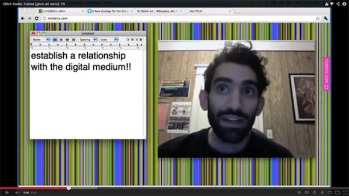

## Week 2 - Video Games, Hacking, Glitch, and Artificial Intelligence
<!-- .slide: class=".uk-width-1-1 uk-height-large" -->  

Note:

---

##### Machinima - Art Within the Machine

Note:
One of the basic but crucial distinctions made here is that between art that uses digital technologies as a tool for the creation of more traditional art objects - such as a photograph, print, or sculpture - and digital-born, computable art that is created, stored, and distributed via digital technologies.

---

##### Hacked Consoles/Cartridges

---

##### Glitch: Rosa Menkman

[Link to Website](https://beyondresolution.info/ABOUT)

---

##### Glitch: Nick Briz

[Link to Website](https://nickbriz.work/)

