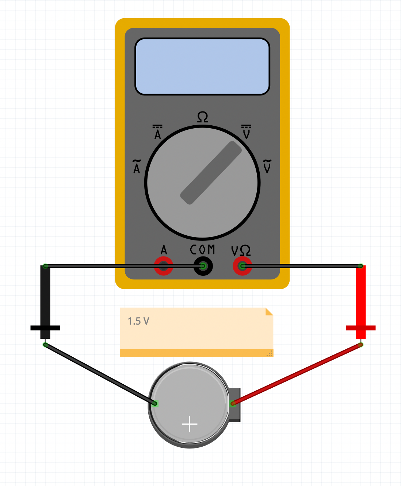

## Week 3 - Introduction to Basic Electronics
<!-- .slide: class=".uk-width-1-1 uk-height-large" -->  

Note:

---

####  Forrest M. Mims III
<!-- .slide: class=".uk-width-1-1" -->  

<a target="_blank" href="https://en.wikipedia.org/wiki/Forrest_Mims"></img></a>

---

#### The Basic Electronic Circuit
<!-- .slide: class=".uk-width-1-1" -->  

- A Power Source
- A Load
- A path for the electrons to travel between the two.

---

#### Measuring Voltage
<!-- .slide: class=".uk-width-1-1" -->  

##### Multimeter

<a target="_blank" href="https://www.amazon.com/s?k=multimeter&crid=HGE2OR3B5RW7&sprefix=multimeter%2Caps%2C79&ref=nb_sb_noss_1"></img></a>

---

#### DC vs. AC Electricity
<!-- .slide: class="uk-column-1-2 uk-column-divider uk-vertical-align-middle" -->  

</img>

</img>

---

#### DC vs. AC
<!-- .slide: class="uk-column-1-2 uk-column-divider uk-vertical-align-middle" -->  

##### DC
</img>

##### AC
</img>

---

#### DC Voltage Plot
<!-- .slide: class="uk-column-1-2 uk-column-divider uk-vertical-align-middle" -->  

</img>

</img>

---

#### DC Voltage Plot
<!-- .slide: class="uk-column-1-2 uk-column-divider uk-vertical-align-middle" -->  

</img>

</img>

---

#### Ohm's Law
<!-- .slide: class=".uk-width-1-1" -->  

Ohm's law mathematically explains the relationship between voltage, amperage and resistance.

---

